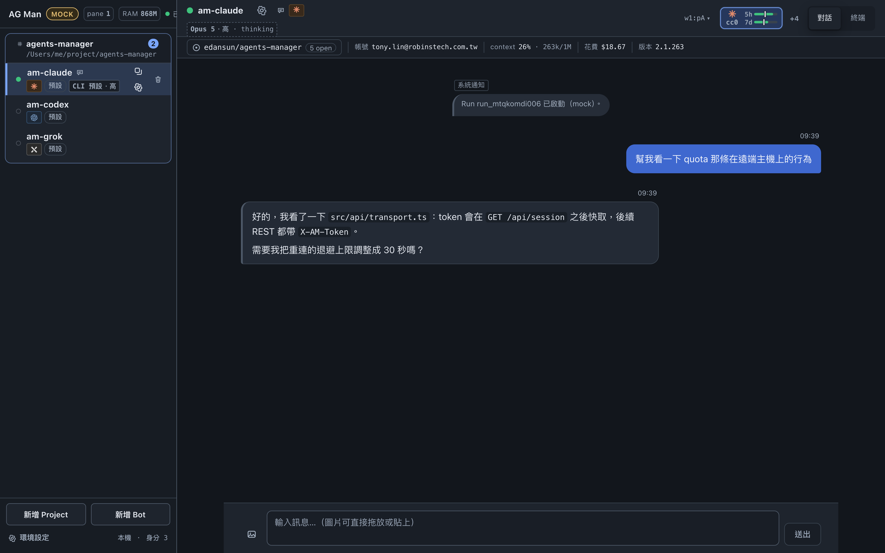
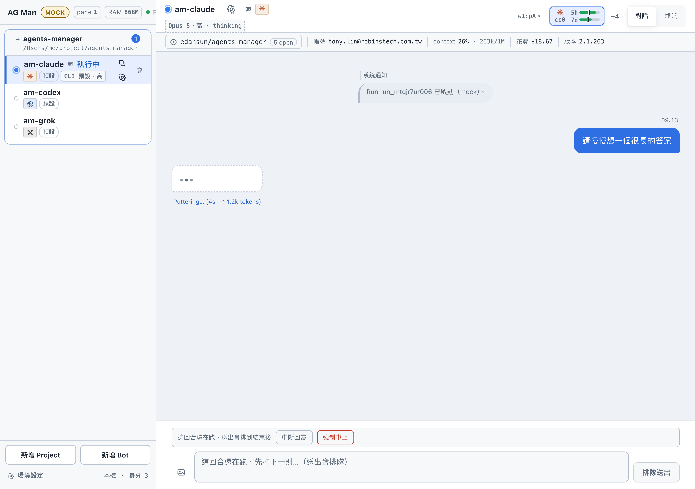
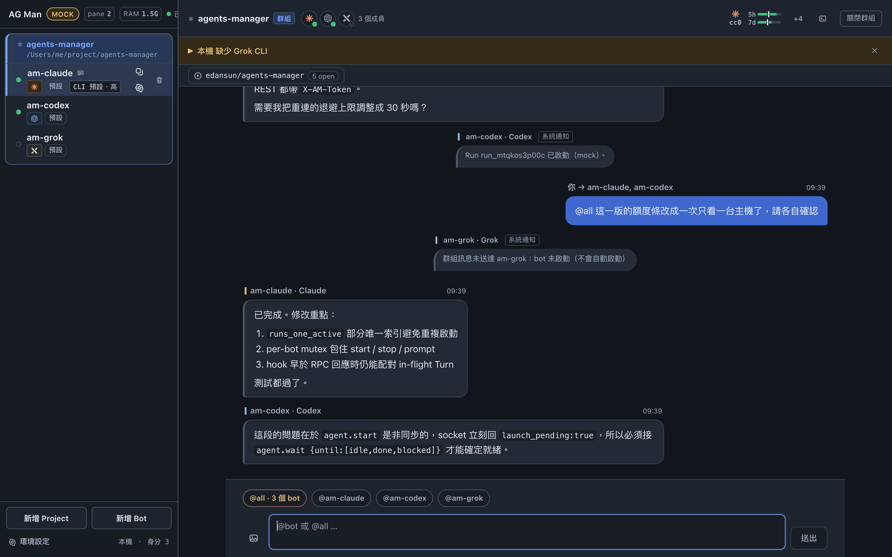
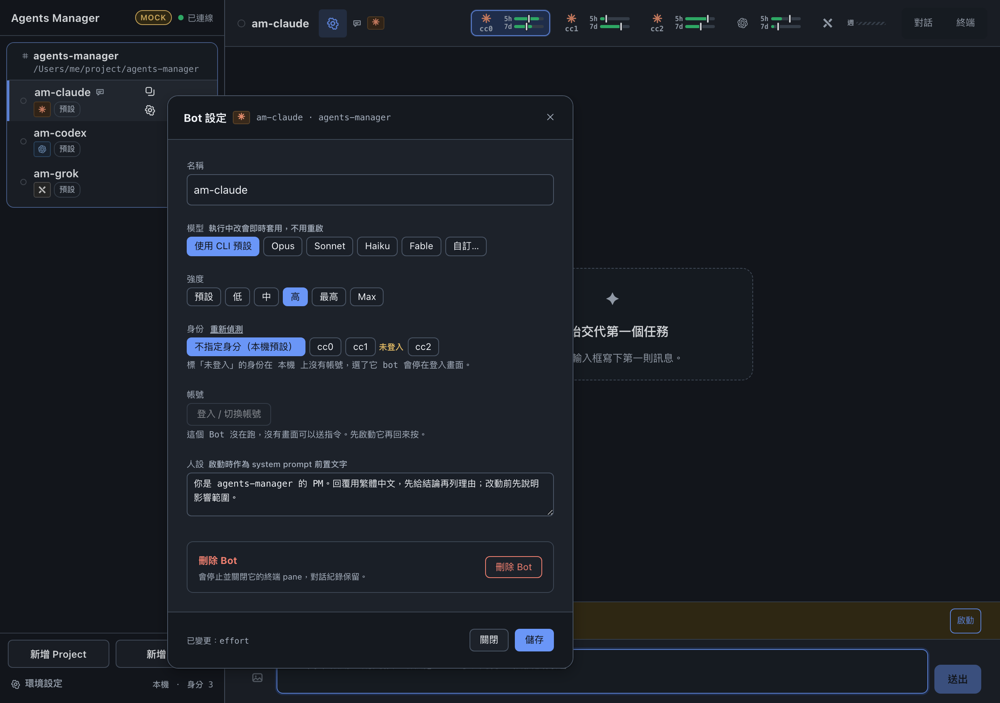
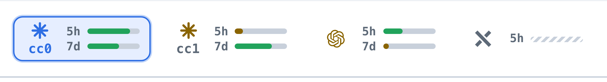
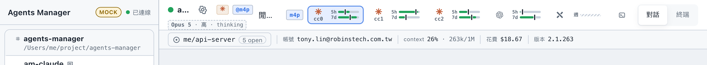
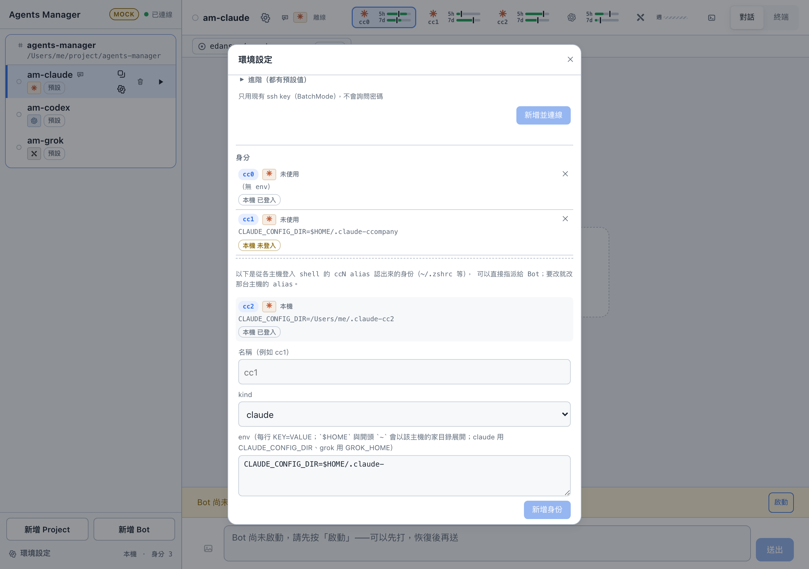
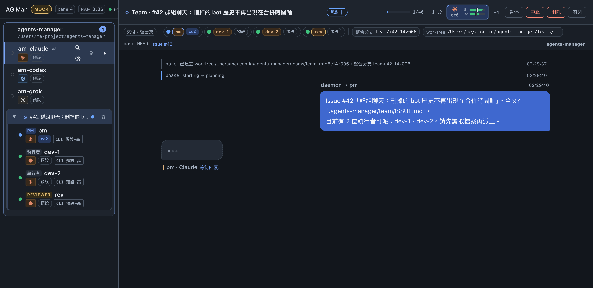

# agents-manager

本機執行的多 agent 管理器。Web UI 把每個跑在 [herdr](https://herdr.dev) pane 裡的 coding agent CLI（**claude** / **codex** / **grok**）呈現成一個「bot」，以目錄為單位分組，用聊天視窗送訊息、看回覆、處理 blocked 提示。

終端裡同時開好幾隻 agent 時，輸出會互相擠、狀態看不清、也沒有跨 bot 的時間軸。這個專案不管 agent 程序本身——那是 herdr 的工作——它負責把它們編成 Project / Bot / Run / Turn，把 hook 回來的回覆收進對話，並在瀏覽器裡操作。

## 架構

```
┌──────────────┐  REST + WebSocket   ┌────────────────────────┐  Unix socket (JSON lines)  ┌─────────────────────┐
│ React 前端    │ ◄────────────────► │ Rust daemon (axum)      │ ◄────────────────────────► │ herdr headless server│
│ (Vite)       │                     │  herdr client           │                            │ session=agents-mgr   │
└──────────────┘                     │  registry + state       │                            └──────────┬──────────┘
                                     │  conversation store     │      hook / notify HTTP               │ panes
                                     │  hook receiver  ◄───────┼───────────────────────────────┐ ┌────▼────────────┐
                                     └────────┬────────────────┘                               └─┤ claude / codex  │
                                              │ SQLite + config.toml                               │ / grok          │
                                     ~/.config/agents-manager/                                     └─────────────────┘
```

三者分工：

| 層 | 做什麼 | 不做什麼 |
|---|---|---|
| **web**（`web/`） | 側欄、對話、群組、設定、額度條、Team 面板 | 不直接碰 agent 程序 |
| **daemon**（`daemon/`，二進位 `agents-managerd`） | 對帳 herdr、注入 hook、配對 Turn、投影 TOML→SQLite、開 HTTP / WS | 不 `spawn` claude / codex / grok |
| **herdr** | 真正的 pane / agent 生命週期、送 prompt、讀畫面 | 不理解 Bot / Turn / 群組 |

設定檔 `~/.config/agents-manager/config.toml` 是 Project / Bot **期望設定**的權威；SQLite 保存 Run / Turn / Message 等執行期狀態。daemon 啟動與每次 TOML 寫回後做投影。

## 畫面

數字越大的檔名通常越新。下面幾張是目前 UI，不是早期 demo。

**主畫面對話** — 側欄依專案列出 bot 與燈號；右側是選定 bot 的氣泡、即時輸出、排隊中的下一則與額度條。回覆來源標在氣泡上（`hook` 或 `terminal_fallback`）。側欄左上角是 `AG Man ｜ pane N ｜ RAM …`：現在開著幾個 herdr pane、所有 herdr 進程樹吃掉多少記憶體。



**回合進行中可以中止** — 回合在跑時輸入框不鎖（可以先打、送出排隊），上面那條給兩個出口：「中斷回覆」請 agent 停手（送 `esc`）；**強制中止**不等 agent，直接把回合收掉、解開輸入框——`esc` 送不進去（pane 沒了、herdr 斷線、agent 不理）時就靠它，不必停掉整個 bot。



**群組聊天** — 一個 Project 就是一個群組。`@<bot>` / `@all` 扇出給成員，每人各自一個 Turn；時間軸把同一次發言折成一顆氣泡。沒寫 mention 不會送出。



**Bot 設定** — 暱稱可隨時改（不必重啟）。模型 / 強度依 kind：claude 有 `--effort`（low…max，2.1+），模型與強度都能靠 TUI 的 `/model` / `/effort` 當場套用；grok 的 reasoning effort 是 per-model（4.6 才有 `xhigh`，4.5 沒有），同樣當場套用；codex 一律重啟。身份（`cc0`～`cc6`）只對 claude。



**額度** — 標題列常駐 claude / codex / grok 的 5h / 7d（grok 只有週視窗）。claude 可依身份拆條（cc0 / cc1 / …）。剩餘低於門檻時顯示數字；更低時側欄 bot 列會警告。門檻由 daemon 計算，前端只讀 `low` / `critical`。

額度是**按主機**分的（[SPEC §14](docs/SPEC.md)）：這條列一次只看一台——預設本機，點進 ssh 主機上的 bot 或專案就換成那台，並掛上主機名牌。遠端的數字同樣是 daemon 去那台讀回來的（codex 走 ssh RPC，claude / grok 在那台開一個用完即丟的 pane 問 `/usage`）。




**身份 cc0～cc6** — 多帳號不必再寫設定：daemon 會讀每台主機登入 shell 裡的 `alias ccN='CLAUDE_CONFIG_DIR=… claude …'`，把 `cc0`～`cc6` 當成可指派的身份（[SPEC §16](docs/SPEC.md)）。同一個 `cc1` 在本機和遠端可以是不同帳號——它跟著那台機器的 alias 走。手寫的 `[[identities]]` 仍然有效，同名時以它為準。



**Team 面板** — 從 Issues 列對某個 GitHub issue 按「組 team」：逐角色選 kind / 模型 / 強度 / **身分**（PM 用 cc2、執行者用預設帳號這種分法很常見），daemon 在資料目錄下建 git worktree 與獨立 herdr workspace，使用者自己的 checkout 不動。側欄出現 team 節點，主區是成員燈號、轉送時間軸、task 清單與暫停 / 插話 / 中止。成員的身分兩邊都標得出來。



實作見 [`docs/SPEC-team.md`](docs/SPEC-team.md)。**Scheduler 是第一刀原型**：會跑、會在預算 / 協定 / 額度觸頂時暫停、daemon 重啟會把它拉回來，但還不穩定，請當實驗功能。

## 安裝與啟動

需要：Rust（`cargo`）、Node.js、已安裝的 [herdr](https://herdr.dev)（本專案實測 0.8.2，socket protocol 20），以及至少一種 agent CLI（`claude` / `codex` / `grok`）。

```bash
git clone git@github.com:Eden-Sun/agents-manager.git
cd agents-manager

# daemon（監聽 127.0.0.1:7788；首次啟動會寫 ~/.config/agents-manager/）
cargo build --release
./target/release/agents-managerd serve

# 另一個終端：前端 dev server（Vite 把 /api、/hook、/ws 代理到 7788）
cd web
npm install
npm run dev          # http://localhost:5173
```

開發期也可以 `cargo run -- serve`（debug build）。`vite.config.ts` 必須 `changeOrigin: true`：daemon 檢查 `Host` 必須是 `127.0.0.1:<port>` / `localhost:<port>`，不改寫 Host 會拿到 403。

沒有 herdr、只想看 UI：

```bash
cd web
VITE_MOCK=1 npm run dev
```

release 二進位預設開 `embed-ui`：先 `cd web && npm run build` 再 `cargo build --release`，之後開 `http://127.0.0.1:7788` 即可，不必另開 Vite。

設定與資料在 `~/.config/agents-manager/`（可用 `AM_DATA_DIR` 覆寫）。`config.toml`、SQLite、`ui-token` 都在那裡，**不要**提交進 git。

## 支援的 agent kind 與 hook

回覆的主要來源是各 CLI 的 hook / notify，終端畫面只是備援。hook 身分是 **per-bot**（`bot_id` + `hook_token`），不改使用者的全域設定。

| kind | 注入方式 | 回覆事件 |
|---|---|---|
| **claude** | 每次啟動 `--settings <daemon 產生的 json>`，內含 `SessionStart` / `Stop` 指到 `agents-managerd hook claude` | stdin JSON；`last_assistant_message` |
| **codex** | 每次啟動 `-c notify=[agents-managerd, hook, codex, …]`（此實例會蓋掉使用者原本的 notify） | argv 最後一個參數是 JSON；`last-assistant-message` |
| **grok** | **沒有**每次啟動的 hook 旗標。daemon 寫入 `<GROK_HOME>/hooks/agents-manager.json` + 固定分派腳本，靠 pane env `AM_BOT_ID` / `AM_HOOK_TOKEN` 找到 bot | stdin JSON，與 claude 同一條子命令 |

三種 hook 子命令的契約相同：wall-clock ≤ 3 秒、永遠 exit 0、永遠空 stdout；失敗就 spool 到該 bot 目錄，daemon 重啟後重放。細節見 [`docs/HOOK.md`](docs/HOOK.md) 與規格書 §4、§12。

`inject_hooks = false` 時不注入（grok 則不給 token），回覆改走終端備援，氣泡會標「可能不完整」。pane 太窄時 TUI 會把字排成一欄，備援會拒絕猜、改提示把 pane 拉寬（或移到自己的分頁）。

## 文件

| 文件 | 內容 |
|---|---|
| [`docs/SPEC.md`](docs/SPEC.md) | 規格書（目前標 v3.6，內文含後續修訂）：目標、資料模型、架構、hook、對帳、遠端主機、grok、群組聊天 |
| [`docs/SPEC-team.md`](docs/SPEC-team.md) | 「以 issue 為單位叫出一整個 team」的設計提案（PM / 執行者 / reviewer）。**提案 + 早期實作**，尚未併入 SPEC.md |
| [`docs/API.md`](docs/API.md) | HTTP / WebSocket 契約（前端以此為準） |
| [`docs/FRONTEND.md`](docs/FRONTEND.md) | 前端結構、mock、與 API 的對齊、已知 UI 決策 |
| [`docs/PROGRESS.md`](docs/PROGRESS.md) | 實作進度、驗收紀錄、**已知問題** |
| [`docs/HOOK.md`](docs/HOOK.md) | hook 子命令契約與時序測試 |
| [`docs/PACKAGING.md`](docs/PACKAGING.md) | 打包成 macOS `.dmg`（Apple Silicon、ad-hoc 簽章）|
| [`docs/screenshots/`](docs/screenshots/) | 歷次 UI 截圖 |

後端 / 前端交接筆記在 `docs/HANDOFF-BACKEND.md`、`docs/HANDOFF-FRONTEND.md`。

## 現況

- 單 bot 對話、群組 `@mention`、遠端 host（SSH + 反向 hook）、額度條、身份、圖片附件，是正在用的路徑。
- **Issue Team 的 scheduler 仍早期**：能組隊、轉送、暫停，但不是穩定產品。協定解析失敗、預算觸頂都會 `paused`，不會自己無限轉。
- 已知問題（Codex hook 未在真帳號驗完、群組時間軸 ULID 同毫秒排序等）寫在 [`docs/PROGRESS.md`](docs/PROGRESS.md) 的「已知問題」。
