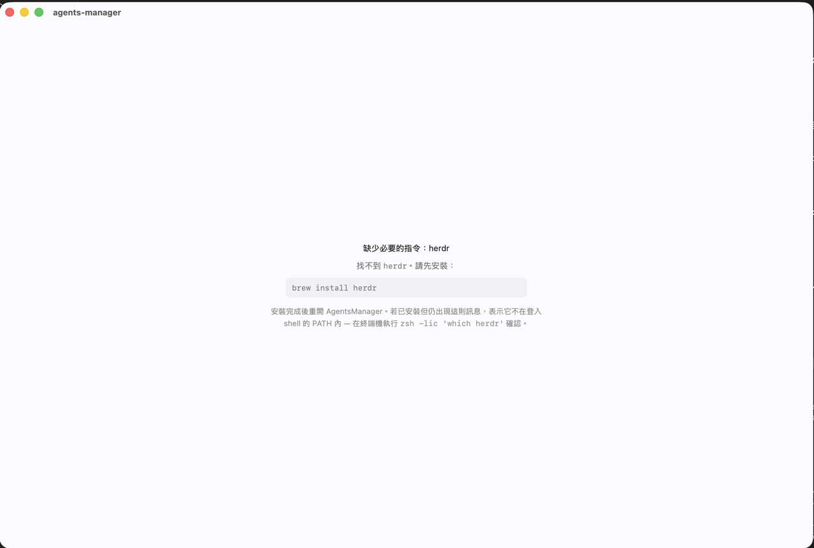

# 打包成 macOS .dmg

目標：把 `agents-managerd` + web UI 包成一個 **Apple Silicon 專用**的 `AgentsManager.app`，
再壓成 `.dmg` 給人安裝。**沒有 Apple Developer 帳號**，所以簽章是 ad-hoc，收到的人要手動放行一次。

```
┌──────────────────────── AgentsManager.app ────────────────────────┐
│ Contents/MacOS/AgentsManager    Tauri 殼：開視窗、啟動 daemon      │
│ Contents/MacOS/agents-managerd  原本的 daemon（sidecar，未改動）   │
│ Contents/Resources/…            splash 頁 + icon                  │
└───────────────────────────────────────────────────────────────────┘
        ↓ 啟動時
   spawn `agents-managerd serve` → 等 127.0.0.1:7788 起來 → webview 導向該網址
```

UI 依然是 daemon 用 `rust-embed` 內嵌後自己 serve 的（`daemon/src/assets.rs`），
Tauri 只負責開視窗，不參與前端 routing，所以瀏覽器裡看到的和 App 裡看到的是同一份東西。

---

## 指令速查

```bash
# 出包（完整）
./scripts/package-dmg.sh

# 出包（前端沒改，跳過 npm build）
SKIP_WEB=1 ./scripts/package-dmg.sh

# 換 logo 後重生 icon
./scripts/make-icon.sh

# 安裝端：清 quarantine（第一次必做）
xattr -dr com.apple.quarantine /Applications/AgentsManager.app

# 看 daemon log（直接跑 bundle 內的主程式，stderr 不會被吞掉）
/Applications/AgentsManager.app/Contents/MacOS/AgentsManager

# 確認必要 CLI 在登入 shell 的 PATH 內（App 用的就是這條 PATH）
zsh -lic 'which herdr claude codex grok'

# 用獨立資料目錄 / 埠號跑一份，不動到正式設定
AM_DATA_DIR=/tmp/am-test /Applications/AgentsManager.app/Contents/MacOS/AgentsManager
```

---

## 一、打包（給要出包的人）

### 前置需求

| 需求 | 檢查指令 | 沒有的話 |
|---|---|---|
| Apple Silicon Mac | `uname -m` → `arm64` | 這份流程不支援 Intel |
| Xcode Command Line Tools | `xcode-select -p` | `xcode-select --install` |
| Rust | `cargo --version` | https://rustup.rs |
| Node.js 20+ | `node -v` | https://nodejs.org |

`aarch64-apple-darwin` target 由腳本自己補裝，不用先處理。

### 出包

```bash
git clone <repo> && cd agents-manager
./scripts/package-dmg.sh
```

結果在 `dist/AgentsManager-<version>-arm64.dmg`。

第一次跑會編整個 Rust workspace 加上 Tauri/wry，大約 5–15 分鐘；之後的增量建置約 1–2 分鐘。

只改了 Rust、前端沒動時可以省掉 npm 那一段：

```bash
SKIP_WEB=1 ./scripts/package-dmg.sh
```

腳本做的事，依序是：

1. `web` → `npm ci && npm run build`，產出 `web/dist`（**必須先於 cargo**，因為 rust-embed 在編譯期讀它）
2. `cargo build --release -p agents-managerd --target aarch64-apple-darwin`
3. 複製成 `desktop/binaries/agents-managerd-aarch64-apple-darwin`（Tauri sidecar 命名規則）
4. `npx tauri build --bundles app` 產出 `.app`
5. `codesign --sign -` ad-hoc 簽章（sidecar → 主程式 → bundle，順序不能反）
6. `hdiutil create` 壓成 `.dmg`，內含 `/Applications` 捷徑

### 改版號

改 `desktop/tauri.conf.json` 的 `version`，dmg 檔名會跟著變。

### 換 icon

`web/public/favicon.svg` 改完後跑 `./scripts/make-icon.sh` 重生 `desktop/icons/icon.icns`
（用 Quick Look 算圖，不需要額外套件）。`.icns` 有進版控，所以出包的人不用跑這支。

---

## 二、安裝（給拿到 dmg 的人）

1. 開啟 `.dmg`，把 `AgentsManager` 拖進 `Applications`
2. **第一次一定要清 quarantine**，否則 Gatekeeper 會說「已損毀，應將其移到垃圾桶」：

   ```bash
   xattr -dr com.apple.quarantine /Applications/AgentsManager.app
   ```

3. 正常開啟

> 這一步是因為沒有 Apple Developer ID 做公證（notarization）。要拿掉這個步驟，
> 需要 $99/年的帳號 + Developer ID Application 憑證，然後把
> `desktop/tauri.conf.json` 的 `bundle.macOS` 補上 `signingIdentity`，
> 並在腳本最後加 `xcrun notarytool submit` + `xcrun stapler staple`。

### 執行前提

App 本身不含 `herdr` 和各家 agent CLI，這些還是要照原本的方式裝在系統上：

- `herdr` 必須能在**登入 shell 的 PATH**裡被找到
- `claude` / `codex` / `grok` 同理

少了 `herdr` 的話 App 開起來會直接告訴你，不會卡在啟動中 — 見〈三、啟動時的環境檢查〉。

---

## 三、啟動時的環境檢查

App 啟動後、spawn daemon 之前，殼會先做一次 preflight（`desktop/src/main.rs`）：

1. 跑 `$SHELL -lic 'printf %s "$PATH"'` 取得使用者終端機的 PATH（6 秒逾時保護，
   避免 rc 卡住整個 App）。從 Finder 開的 `.app` 只會拿到 launchd 的
   `/usr/bin:/bin:/usr/sbin:/sbin`，所以這一步是必要的。
2. 在那條 PATH 上找 **`herdr`**。找不到就**不啟動 daemon**，直接在視窗顯示缺什麼、
   怎麼裝（`brew install herdr`），以及「已安裝卻還是找不到」時該怎麼查。
3. `claude` / `codex` / `grok` 三個一個都沒有時，只在 stderr 印警告，照常啟動 —
   daemon 自己會偵測並回報給 UI，沒有 agent CLI 只是開不了 bot，不是啟動失敗。
4. 若埠上**已經有 daemon 在跑**，整段 preflight 跳過（那隻顯然已經跑起來了），直接接上去。

要新增必檢指令，改 `REQUIRED_CLIS`（`(binary, 安裝指令)` 的陣列）即可，
畫面文案會自動跟著列出來。

失敗畫面長這樣：



---

## 四、行為細節與已知限制

**設定與資料照舊**：`~/.config/agents-manager/`（config.toml、sqlite、ui-token）。
App 版和終端機版共用同一份，不會另開一套。

**已經有 daemon 在跑時**：殼會先探 `127.0.0.1:<port>`，探得到就直接接上去、不再 spawn，
關掉 App 也不會殺掉那個 daemon。只有自己 spawn 出來的才會在退出時收掉。

**Port 從設定檔讀**：`[server] listen`，讀不到就用預設 `127.0.0.1:7788`。

**關掉 App = 關掉 daemon**（自己啟動的那個；正常 Cmd-Q 或「結束」才會收，被 `kill -9` 之類強制中止時 daemon 會留下來變成孤兒，下次開 App 會直接接上去）。herdr 裡的 agent 不受影響，會繼續活著，
下次開 App 由 reconcile 接回來。要 daemon 常駐就用終端機跑 `agents-managerd serve`，
App 會自動附掛上去。

**Hook 路徑綁在 bundle 內**：daemon 用 `std::env::current_exe()` 把自己的路徑寫進各 agent 的
hook 設定（`daemon/src/lifecycle.rs` 的 `hook_cmd_parts`）。從 App 啟動時那條路徑是
`/Applications/AgentsManager.app/Contents/MacOS/agents-managerd`。
因此**移動或刪除 App 會讓既有 bot 的 hook 失效**，重啟一次 bot 讓它重寫設定即可。
同理，App 版和終端機版交替使用時，最後啟動的那一邊會把 hook 路徑改成自己的。

**只有 arm64**。Intel Mac 不支援；要支援得裝 `x86_64-apple-darwin` target 並改用
`universal-apple-darwin`（Tauri 支援，但 sidecar 也要跟著出 universal binary）。

**看 log**：從終端機 `open -a AgentsManager` 沒有 stderr。直接跑主程式
（見〈指令速查〉）daemon 的 tracing 才會轉發到同一個 stderr。
