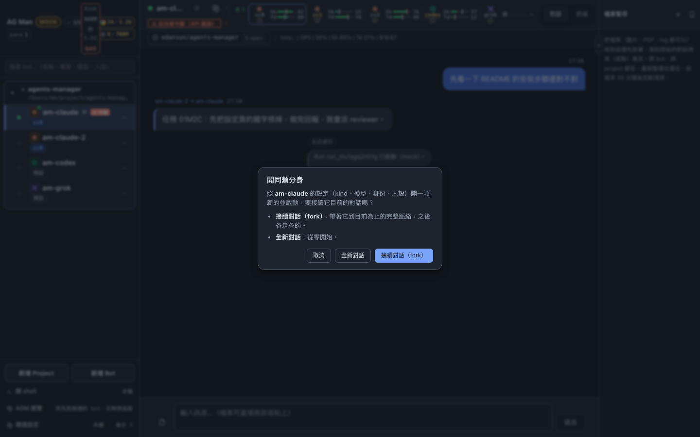
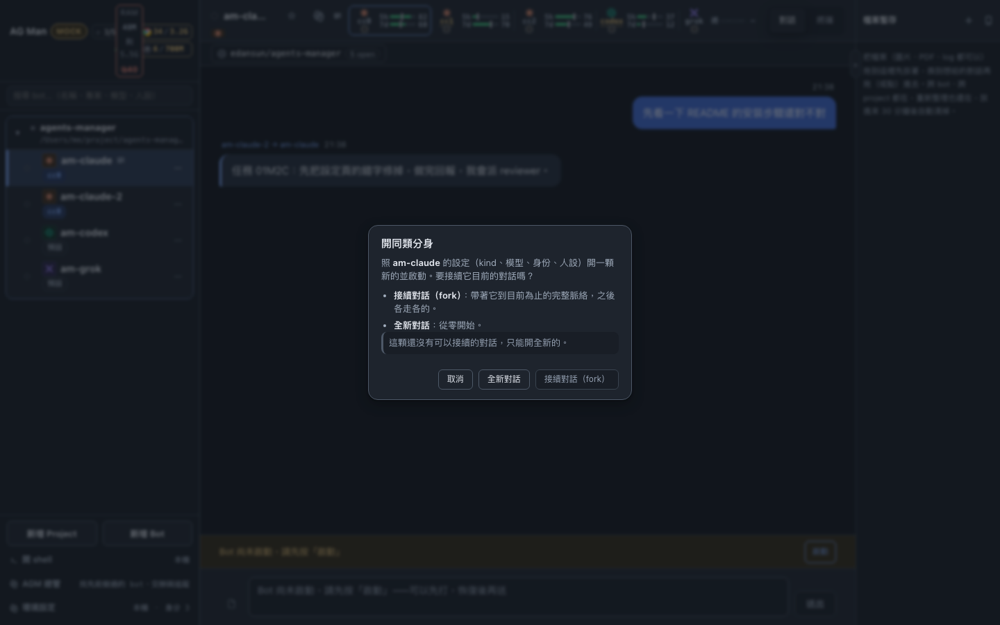
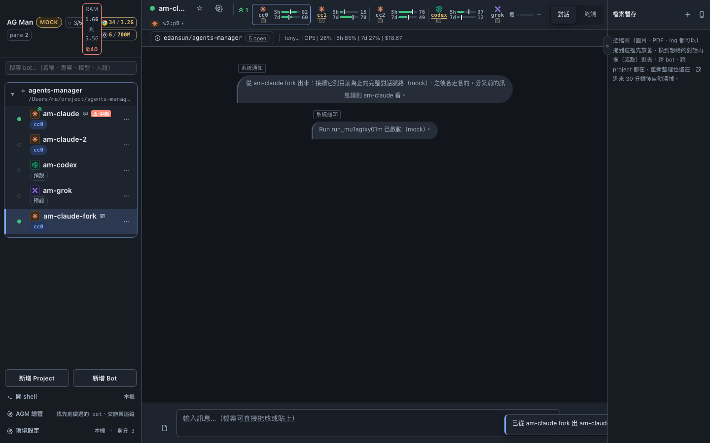
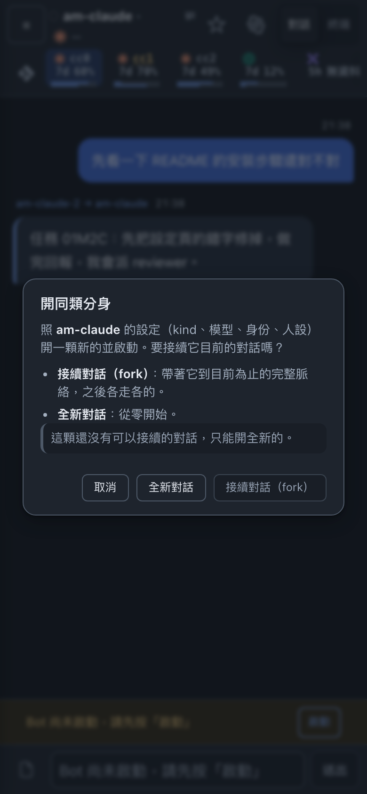
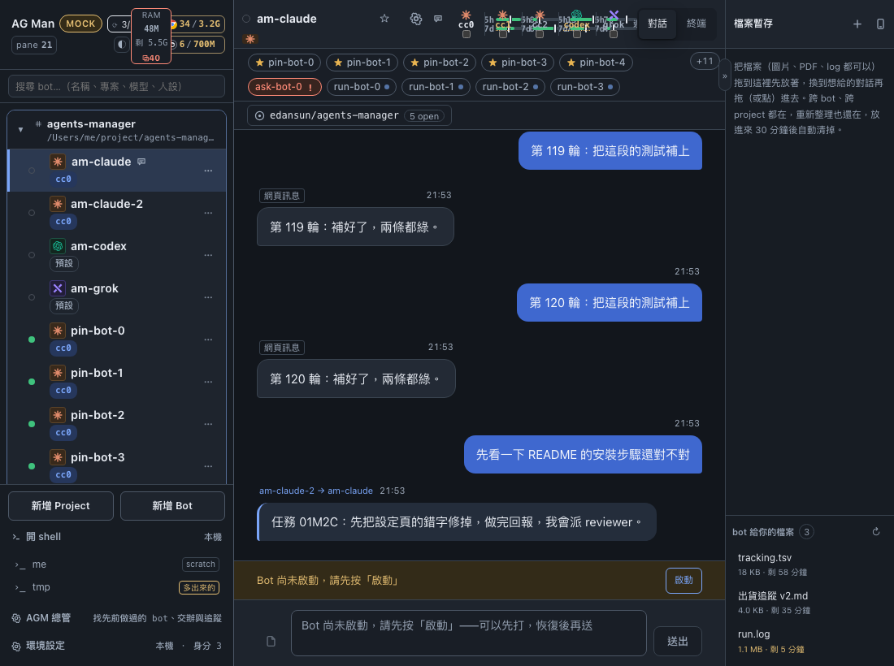
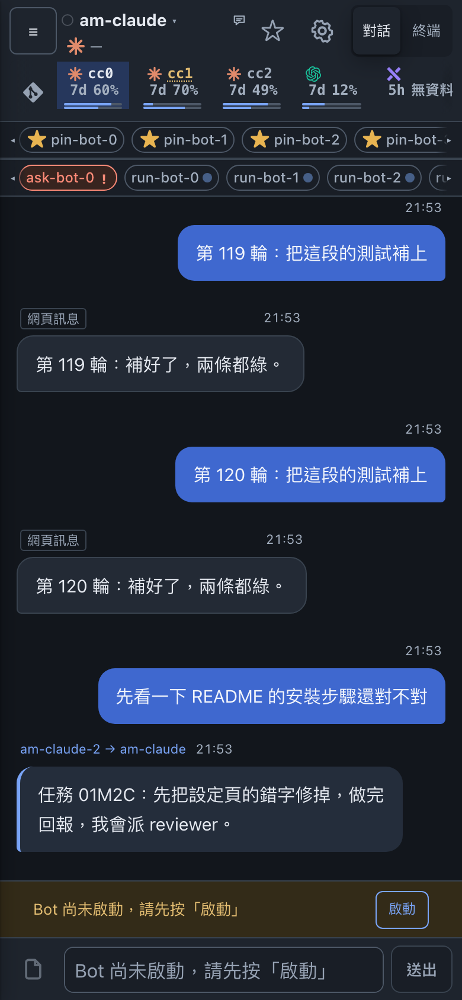
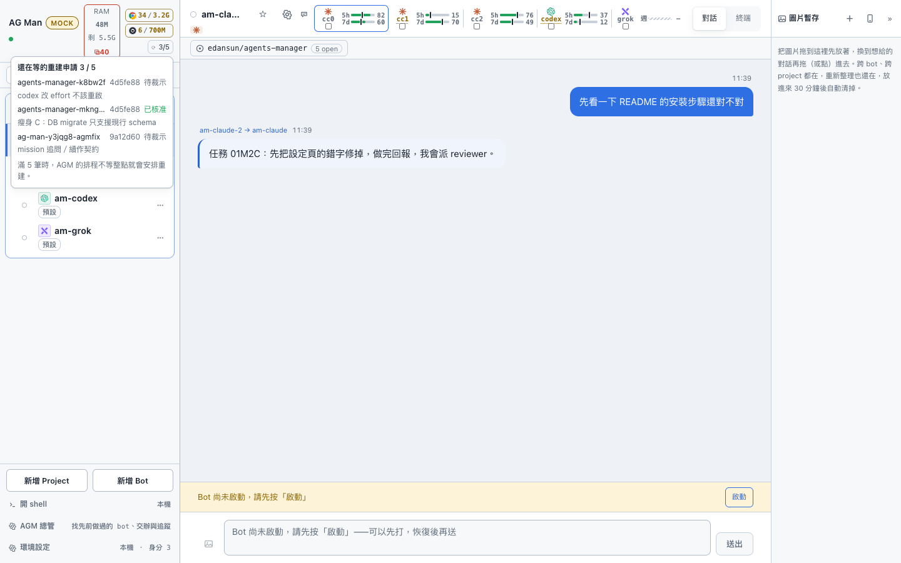
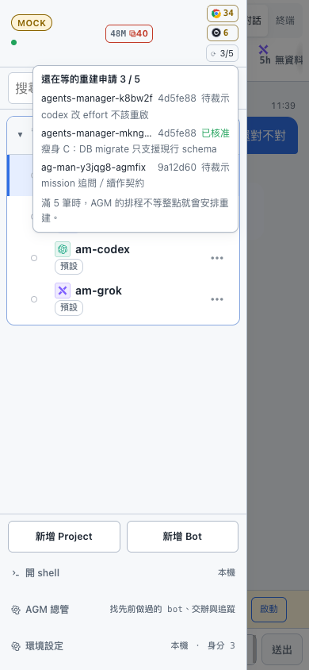

# UI 取捨（現狀）

已定案的 UI 決定與一句理由。**標「使用者指定」的不要自行翻案**，要改先問使用者；其餘改之前也先確認理由還成立。
歷史經過（誰在哪天說了什麼、試過哪些版本）不寫在這裡，要查用 `git log -S`。

## 核心模型與通用原則

- 左側依 project 分組、右側對話；使用者靠右、agent 靠左；聊天／終端分頁。不做卡片牆或三欄 dashboard。
- **靠右的藍泡泡只屬於使用者**（使用者指定）。代發的（AGM relay、bot 轉述、daemon 通知）一律靠左、面板底色加左槓、標來源：
  `AGM → x`（`relay_from` 是 bot id）、`x（轉述）`（沒有 `relay_from` 但第一行是 `AGM …：`／`[AGM …]`／`[來自 <bot> / <agent>]`，
  見 `lib/agmQuote.ts`，只認開頭、寧可漏認）、`daemon 自動觸發`（`relay_from = "daemon"`）、`[AG Man 通知]` 黃槓。
  群組時間軸上 `relay_from` 有值就不再畫「你 →」。CSS 用 `:has(.msg-targets.relay)` 認，不另寫邏輯。
- **紅色只代表「要你本人動手」**（blocked、回合被中斷、需要回應）；黃＝在等（子 agent、額度）；綠＝好消息（有新版、目前使用中外框）；
  藍（accent）＝未讀／可操作。狀態不能只靠顏色：一律還有文字、形狀或記號。
- 燈號說「現在在做什麼」，徽章說「還沒看過幾個回合」——兩個獨立記號，不互相染色。
- 對比：文字 ≥ 4.5:1、純圖示 ≥ 3:1、focus 環對所在面 ≥ 3:1、hover 與常態底色差 ≥ 8 L*。按鈕色票集中在 `styles.css` 的 buttons 區塊（`--btn-*`）；
  ghost hover 用墨色 wash（`color-mix(var(--text) 11%, transparent)`），不用固定灰。
- 真正的 modal（新增 Project／Bot、環境設定、確認框、BlockedModal、MemPaneModal、手機抽屜、圖片放大）才有遮罩並共用
  `useDialogFocus`（Tab 循環、關閉還原觸發元件；確認框先 focus 輸入欄或「取消」）。Bot 設定在桌機是**非模態** popover（背景可點、可拖圖），
  手機是全螢幕 sheet。
- 對話寬度：對話欄 `--chat-max: max(1000px, 90%)`；**每則訊息也吃到 90%**（2026-09-16 使用者：欄放寬了但訊息還卡在 680px，寬螢幕等於沒放寬）。自己打的那一側留 `min(900px, 82%)`，左右分邊還看得出來。
- 「未驗證送達」標記**只給沒人補救的那一種**（2026-09-16 AGM 裁示）：這個標記對使用者的意思是「可能悄悄沒送到，而且沒有人會再試一次」。
  無證據但 `auto_resend=1`（herdr `agent.prompt`）有自動重送的安全網，只放在時間的 hover 說明，不佔注意力——claude 多數 prompt 走這條，全標會讓真正該看的那筆被淹掉；
  無證據且 `auto_resend=0`（打過字、證不明，例如 grok 多行）才畫「未驗證送達」。判斷集中在 `lib/deliveryNotice.ts`，不要在元件裡各自判。
- Composer 只在首次掛載／切換對象時還原選取；自動 focus 前 `activeElement` 必須是 `body` 或同一個 composer 內，手機一律不自動 focus（不彈鍵盤）。
- 每個畫面有自己的 URL（`lib/routes.ts` 純函式 + `store/routeSync.ts`）。網址是 store 的投影：入口照舊走 store，不改成 `<a href>`。
  對話↔終端用 `replaceState`；設定浮窗與手機抽屜用 `pushState`（上一頁＝關掉）。壞連結回首頁並提示；`?token=` 不留在網址上。
- 無障礙：側欄 bot 列是 `listitem`（外層 `<nav>` + `role="list"`，子清單用 `aria-owns` 掛回父列），選取用 `aria-current`；
  分頁多給 ←/→/Home/End 但不做 roving tabindex；模型快速選單是 `menu` + `menuitemradio`（方向鍵只移焦點，Enter 才套用）。
- 斷點只有兩個會改變行為：`≤1024px`（側欄變抽屜、暫存區移到底部，`DRAWER_QUERY`）與 `≤640px`（手機，`PHONE_QUERY`）。其他數字只收邊距。

## 側欄

- 專案卡：第一行名稱、第二行截斷路徑（完整路徑在 tooltip）。拖標題列整個專案一起搬；**排序存 daemon**（`POST /api/order`），手機桌機一致；搜尋中不能拖。
- bot 列操作收成一顆常駐 `⋯`（設定／啟動／開同類分身…／刪除，危險項最後）。
- **開同類分身要問接不接續對話**（使用者 2026-09-14）：不另開「Fork」選單項，「開同類分身…」跳一個三鈕框——`取消`／`全新對話`／`接續對話（fork）`。
  兩者都是「照這顆的設定再開一顆」，差別只在帶不帶脈絡，放在同一個問題裡才比得出來。接續是主按鈕（這個入口多半是想接著做）；
  這顆還沒記到 session（最近一個 run 沒有 `native_session_id`）時接續鈕灰掉並寫原因。焦點照確認框慣例落在取消，Enter 不會直接建。子 agent 列沒有這一項。
  新 bot（兩種都一樣）排在本尊**正下方**，不是專案最底下（使用者 2026-09-15）：fork 由 daemon 插在 config 陣列裡本尊的下一格；全新分身建好後前端存一次排序。
     
- 子 agent：縮排樹，不另貼「子 worker」之類標籤；**子列整段（kind logo＋名字＋chip）可左右滑、同一組子列同步捲**（使用者指定），名字至少 3 字。
- 子 bot 帳號跟母 bot 不同時，把子 bot 的身分標在**母 bot** 上（琥珀色，多個用 `/`）（使用者指定）。
- 父列：收合時收合鈕帶子 agent 最要緊的燈（blocked > working）；收合與展開都在燈號旁畫 7px 黃點——實心＝子 agent 還在跑，空心＝子 agent 回報了還沒人看。
- 未讀：`!N` 方角小標（不是圓點），單位是回合；專案收合時加總掛到標題；分頁標題 `(N)` 只算 bot 那份，且**跟側欄同一條規則**排除總管專案（AGM 的例行往來不顯示未讀，標題照算的話會掛著一個點不掉的 `(N)`）；已讀標記＋數字存 localStorage，刪 bot 時清帳；**bot 的已讀標記與未讀數以 daemon 為準、跨裝置共用**（2026-09-15：手機分頁凍結收不到回合完成、在桌機讀過手機不知道，兩邊主力區不一致），本機標記與 daemon 標記取較新者。群組未讀仍是各瀏覽器自己的。
  「在看」＝選中＋分頁可見＋視窗有 focus，回到前景時把正在看的標成已讀。
- 「可更新」記號：kind icon 右上角綠色雙 chevron，無底色（使用者指定）。
- 標題列三欄：左 `AG Man`＋`pane N`＋連線燈（文字在 title）、中 RAM（已用＋剩，同一行）、右 Chrome／ego。RAM 點開的清單 portal 到 `body`、`position: fixed`。
- RAM 清單：只列每棵子樹最上層（≥ 8 MiB 的 shell／CLI），大小是子樹加總；bot 那幾列走「停止 bot」不給 kill；kill 是 TERM → 再按才 KILL；
  「自己開的 pane」點了開唯讀終端視窗；關著就不抓。

## 標題列（桌機）

- **收縮優先序**：分頁不讓 > 名字 > 附屬 chip／遠端記憶體。**額度量表不在可讓的名單裡：桌機每個帳號都畫完整量表**（使用者指定「額度顯示很重要，不要省空間」）。
  名字 `flex: 1 0.25 auto`、下限 3em、上限 22em；中間空白要真的被名字與 pane id 用掉。
- 第一行：燈號、名字、★、⚙、更新 chip 等；第二行：`● 需要回應`（blocked 時，排第一）、kind logo（無框、有底色、貼近 model）、model／effort chip、pane id（擠不下只剩 `▾`）。
- 顏色：kind 品牌色 `--kind-claude` 橘、`--kind-codex` 綠、`--kind-grok` 紫（使用者選的）；model chip 吃該 kind 色；⚙ 與 ▾ 吃 accent；★ 釘起來實心黃、沒釘淡黃空心。
  kind 圖示 tooltip 寫「這是哪個 CLI、哪家模型」，`aria-label` 只有 kind 名。codex 顯示時去掉 `gpt-` 前綴（完整 id 在 tooltip）（使用者指定）。
- 更新 chip 只寫 `${kind} 有更新`；額度列的更新 chip 有列到當前 bot（閒置或在忙那組都算）就不畫，免得同一個 ⌃⌃ 出現兩次（2026-09-19 使用者：「logo 重工了」）；只剩非 claude 的會畫。這顆自己要套用走 context bar 版本號旁的「升級」。
- 「回合被 API 中斷」：側欄紅記號＋標題列紅 chip（點開原文＋「重送上一則」，走一般送出路徑）；沒有「知道了」。
- context bar：不顯示花費；版本貼右；commit／push／pull 桌機 hover 才彈出、打 commit 訊息時常駐；CLI 可升級時版本旁出現「⌃⌃ 升級」。

## 標題列下面那一列（★ 主力與 bot 晶片）

- 主力（★ 釘選）常駐在這一列，不寫「主力」兩字；釘了就一直在，正在看的那顆也在（使用者指定：固定並標成 focus，不要消失）。
- 編碼通道分開：**顏色＝該去看**（未讀實心 accent、要你回答紅填色＋`!`、等子 agent 黃填色＋點），**形狀＝你在這裡**（6px 方角＋石墨左條＋粗體＋ 1px 綠外框）。
- 桌機：依緊急度排序（要回答 → 未讀 → 等子 agent → 正在看 → 其餘），★ 主力一組、其餘一組各自換行；收合時**兩組都有東西就各佔一行**，只有一組時那組最多兩行，其餘收進 `+N`
  （整列一起裁兩行的話，主力占滿兩行就把沒釘的「要你回答」擠進 `+N`——跟 09-12 錯過 blocked bot 同形）。`+N` 的提示照實際藏起來的等級寫，不寫死「都是比較不急的」。
  
- 手機：★ 主力一排、在跑／剛完成的另一排（2026-09-16 使用者：「已完成放下一排，方便我點選」），兩排各自橫捲、各有 ◂ ▸；排內順序仍不重排（肌肉記憶）。哪一排空了就不畫。
  
- 手機：每一排都是單行橫捲、**位置固定照側欄順序，不照緊急度重排**（使用者指定），有 ◂ ▸ 與 scroll shadow，正在看的那顆自動捲進畫面。
- 狀態 class 不叫 `blocked`（`styles.css` 有一條裸的 `.blocked` 會撞到），用 `needs-reply`／`quota-blocked`。

## 額度

- 按主機看；焦點那格桌機只加 1px accent 外框。格與格之間不用 gap，改 1px 細線；條與數字之間保留內距（使用者指定不能黏在一起）。
- 斷點量的是標題列寬（`ResizeObserver` 量父節點），不是視窗寬。身分名欄固定寬，五格的 bar 起點對齊。
- 「claude 有更新」在額度列最左邊，綠色裸 chevron。
- 身分可在額度格上「暫時停用」：底下 bot（含執行中與有未讀的）從側欄收起，留「N 個 Bot 已隱藏（額度不足）」；到該組 reset 時間自動解除；
  停用中的格子半透明、身分名劃線；新增 Bot 的 chip 同步標停用。
- `limit_hit`（CLI 擋住）：紅色圓角外框，量表與數字灰階退色，名字前**不畫紅點**（2026-09-16 使用者：紅框要留、紅點不要）；kind logo 永遠是品牌色（嚴重程度不畫在 logo 上）。
- 彈出層用跟條上同一根量表，`↻` 後寫「還有多久」（絕對時刻在 tooltip）。
- **彈出層要一眼看完**（使用者 2026-09-19）：本機常有 claude×3＋codex＋grok，固定 `max-height: 420px` 會把最後一兩個
  供應商切在捲軸外，得捲才知道有沒有用盡。改成 `min(78vh, 640px)` 並收緊行距（列間距 10→6、每組 padding 10→6、
  列高 1.35、`quota-pop-head` 保底 22px）。實測同一份資料：**505px（要捲）→ 404px（不用捲）**，五個供應商與頁尾一次看完
  （`docs/screenshots/quota-popup/after-fits-one-view.png`）。內容再多還是會捲，這是上限不是保證。
- 手機：純文字 chip（不改成桌機 bar，使用者指定）；一格一個數字，預設 7d（grok「週」），別的窗口被標 low／critical 且更急時才取代；
  每一格都畫兩條邊框量表、**兩條都在底部**（5h 上、7d 貼底）（使用者指定）；格子上下貼齊。

## 對話

- 訊息結構：18px metadata 列＋氣泡；hook／系統輸出有左 rail 與 monospace 來源標；來源標只在非 `hook` 時畫。
- 輸出中的半成品預設收著（「輸出中…」＋「看目前內容」）；回合進行中輸入框不鎖，送出會排隊。
  排隊只有一格：再排一則時前一則接回輸入框最前面（附件要重加）；取消排隊、或「中止並取代」「併行送入」送的是排隊那則時，輸入框裡正在打的字都不清。
- 「這回合的提問」浮窗：只在提問被捲出畫面時才浮，釘在訊息列下緣，夾三行（手機兩行），兩段點擊（展開 → 捲到那則並閃一下），關閉只管這一回合。
- Codex 啟動畫面不進對話，只留一行帳號提示。

## blocked（agent 在等回答）

- 標題列第二行常駐紅 `● 需要回應`（任何分頁都在，點了開全畫面終端，離開 blocked 才消失，沒有「知道了」）。
- 認得出選單時（`lib/tuiChoices.ts`：至少兩項、連號、剛好一個游標、在畫面底部；認不出就整塊不長、退回終端快照＋按鍵面板）：
  - 畫面只留問題＋選項＋`Esc 取消`＋「終端原文與更多按鍵」；除錯資訊收進 tooltip。一列一行（編號＋標題），說明收在 ▸ 後面，展開不跳位。
  - 單選送 ↓／↑ × n ＋ Enter（送前重讀畫面，選項變了就不送）；單選問卷用 radio。
  - **多分頁／複選問卷走草稿模式**（`lib/choiceDraft.ts`，使用者指定「先讀完、離線作答、最後一次送出」）：只用導覽鍵預載每一頁 →
    本地作答不碰終端 → 送出時逐頁比對、只送差集、對不上就停。review 頁畫分頁列與「每題 → 答案」，點題目回那頁改。換頁送 ←／→，不送會改答案的鍵。
  - `Type something.`：選到就展開多行輸入，送出時 paste → 對帳 → Enter。**只限單選頁**（真機只驗過單選）：複選頁的 `[ ] Type something` 在面板裡勾不起來、不給打字框，
    提示到終端打——複選頁按 Enter 可能直接交卷，而只 toggle 會交出一個空白的自訂答案（review3 c1 M8）。終端上已經勾好的照舊顯示、准取消。
  - 面板認出選單時自己成為捲動容器（`max-height: 70svh`）；全畫面視窗只有一條主捲軸，問題釘在上緣。
- 終端快照在手機預設折行（可切換，選擇存 `am.term.wrap`，三個終端面板共用）。

## 群組

- 收件者用 chip 選（`@all` 標實際數量），沒選不能送；同一次發言折成一顆氣泡。
- **群組任務**（契約 `docs/API.md`「群組任務」，runbook SPEC §18.14）：入口是輸入框上的「交給 AGM」開關（不是 `@agm`），打開時收件者列藏起來、
  三個選項（交付／執行者 kind／5h 撞限等或換）攤開、記住上次選擇。任務卡在輸入框正上方、自己可捲；五段進度用點＋文字；
  狀態全部從 `phase`／`assignments[]`／事件推導（`lib/missionView.ts`）；停下來問人時卡片上直接回答（先記 `note` 再 `resume`）；
  「已完成任務」只算 `done`，取消的另一段；不重複印指示；舊 daemon 沒有 `/api/missions` 就整個入口不出現。
  清單分三支抓：進行中（含 paused）不限筆數，已完成／已取消各抓最近 50 筆，被截斷時標題寫「最近 N 筆」而不是冒充總數——
  一次抓 `all` 50 筆會把停著等回答的舊任務擠出去，卡片與回答框一起消失（review3 c1 M6）。
  卡片只讀 **daemon 真的寫出來的** payload 鍵名（換手 `from_identity`／`to_identity`／`model`、暫停的 `decision.resets`、
  `decision.decision`）；進度格連交辦的 `role` 一起看，等 AGM／等額度時不倒退；「等額度」的說明照任務的
  `on_5h_limit` 與 kind 講，並顯示交辦的 `resume_at`。自編一套只存在 mock 裡的欄位＝接上真 daemon 就全部留白（review3 c1 L9）。

## 其他元件

- 檔案暫存托盤：右緣可收合窄欄（≤1024px 在底部）；點一下放進目前對話（拖放是加分）；複製不搬移；存 IndexedDB、30 分鐘後清；
  預覽固定在托盤外緣、寬度跟對話框一樣、`pointer-events: none`；觸控長按預覽；手機預設收合、打字時收起。
- 代發／轉述訊息預設收合（2026-09-14，使用者：「這種 agm 交辦的訊息都不用全顯示，收合就好」）：`relay_from` 有值、或使用者貼進來的
  AGM 轉述（`quotedFrom`），只露第一個非空行（上限 90 字），底下「▶ 展開全文 · N 字」。短到一行放得下的不收。展開狀態不記憶——
  這類訊息是寫給 bot 的，重新整理回到收合正好。daemon 通知與使用者自己的訊息不受影響。
- 附件收任意檔（2026-09-14，使用者：「讓暫存區也能支援任意檔」）：圖片畫縮圖，其他畫「圖示 + 檔名」，
  卡片尺寸一致。非圖片**不開 object URL、不抓位元組回來、不開放大預覽**——一個 CSV 的縮圖沒有意義，
  看的是檔名與路徑；訊息上的非圖片附件點開只顯示檔名與 agent 讀得到的絕對路徑。
- 主機 shell：bot 標題列底下第三個分頁（沒選 bot 時整頁）；一行輸入＋一排按鍵、↑↓ 是指令歷史；「清畫面」真的送 `clear`；
  ~~「關閉」與「結束 shell」分開~~ → 2026-09-17 起只剩「結束 shell」（二次確認），「關閉」拿掉；草稿與畫面跨重新整理保留。
  daemon 重啟後，面板自己開的 shell 不在 daemon 記憶體的清單裡（`DELETE` 會回 200 卻什麼都不關）：「結束 shell」先查那份清單，不在就改走 `POST /api/panes/{id}/close?confirm=true`，兩邊都不認得才當作已經不在；關失敗就留著面板並通知。
- 身份登入：紅色只代表確定未登入，無法判斷顯示「未知」；登入入口在每個主機身份列、開臨時 shell，完成後收 pane。
- 一鍵套用 claude 更新：額度列上的 `⬆ N` 觸發（先確認名單），忙的（working／blocked／回合在飛／unknown）一律跳過不排隊；進度與結果畫在側欄。
- 手機：輸入框不被壓扁、上限跟可視高度走；對話框一律全螢幕 sheet；抽屜選完就收，但從抽屜開對話框時不收。
  bot 標題列第一行 ☰、名字、更新 chip、★、⚙、分頁，第二行 kind＋模型＋版本；git 鍵疊在額度列左下，跟齒輪同一種灰。
  「claude 有更新」（`⌃⌃ N`）手機放 ★ 左邊，不在額度列（2026-09-19 使用者）；桌機仍在額度列最左。
- 桌機可在右欄嵌手機預覽（開關在右欄標題列，預設關）：iframe 帶 `?mobilePreview=1`、393×852 以 `scale(.5)` 顯示（不改 iframe 尺寸）。
  預覽是同一個 origin 的第二個 client：**不寫共用的 localStorage**（草稿、游標、選取、未讀——各自拿整份 map 覆寫會洗掉主畫面的），
  多分頁問卷**不自動預載**（預載自己送導覽鍵，鎖跨不過 iframe，會跟主畫面互相插隊），退回即時模式、使用者點了才送鍵（review3 c1 L8）。

## Bot 設定卡片：不蓋標題列、加寬、拿掉說明（2026-09-13）

使用者：「不要擋到 header，寬度大一點不至於高度那麼高」「模型 & 強度不用特別說明」「前置文字預設
不勾也不 show」「刪除只要一顆鍵不用說明」「識別只要放 modal header 就好」「header 不用 project name」。

- **位置**：卡片仍貼著齒輪開，但上緣至少在標題列、晶片列與 context 列底下——齒輪就在標題列上，
  以前貼著它往下開會壓住名字、額度與分頁。
- **尺寸**：桌機寬 520 → 760px；身份與帳號並排成兩欄，其餘（名稱、模型、強度、人設）維持滿寬。
  手機的全螢幕 sheet 不變。
- **拿掉的說明**：模型、強度旁的「執行中改會即時套用，不用重啟」（daemon 照舊當場套用）；刪除區塊的
  標題與「會停止並關閉它的終端 pane…」——後果寫在按下去之後的確認框裡。
- **人設**：預設是一個沒勾的「人設」勾選框，勾了才攤開輸入框；已經有人設的 bot 一打開就是勾著的，
  取消勾選等於清掉人設。
- **標題列**：只寫 bot 名稱＋可複製的 pane 識別籤，不再帶專案名；內文的「識別」整列拿掉。

截圖 `docs/screenshots/bot-settings/compact-1600.png`。

### Bot 設定：claude 的「專案指示檔」（issue #213）

- **只有 claude 的 user bot 才有這一格**：codex／grok 沒有 `agents-md` plugin；child bot 不是 daemon 帶 `--settings` 起的，daemon 會拒絕，所以不顯示（不是灰掉）。
  daemon 沒給這欄（舊版）時也不顯示，不猜預設。
- **四選一的按鈕列**（跟身份、模型同一種 `opt-group`，不用下拉）：值就是 CLI 的四個選項，預設 `claude-md` 排第一。選中的那項底下顯示一行說明；
  「兩份都讀」的說明點出用途（跟同專案的 codex 共用 `AGENTS.md`）。改值要重啟才讀到，所以說明尾巴寫明，這一點跟模型／強度的當場套用不同。
- 位置在身份／帳號之後、人設之前（都是「這顆 bot 讀到什麼」的設定）。截圖 `docs/screenshots/instruction-files/`。
## 晶片列：daemon 自己的雜務 bot 跑完不出現（2026-09-13）

使用者：「w8WM:pC 屬於 daemon 的，完成不需要在 header 列標示」。那顆是 `agm-pxf2pv-browser-gc`
（AGM 開出去清 Chrome 殭屍的工人），跑完會進標題列下面那條「剛跑完」。

根因不是規則錯，是**比對太窄**：那條列排除總管環境時寫的是 `project.label === 'AGM'`，但 daemon
把總管開出去的工人放在 `AGM-DM-GRUP` 底下；那顆又 `parent_bot_id = null`、不是 team 成員，
其他排除條件也攔不到，於是被當成使用者自己的 bot。

**改成認 `GET /api/supervisor` 的 `project_id`**（AGM 2026-09-13 裁示）。第一版改成比對名字前綴
（`AGM` / `AGM-…`）是錯的：那個專案的名字**使用者改得動**——它本來叫 `AGM`，就是被改名成
`AGM-DM-GRUP` 才露出這個洞的；再改一次就又壞。id 不會變，而且總管本人與它開出去的工人
（build／race／sup／browser-gc）本來就全在那一個專案底下。

- store 開機時讀一次 `supervisorProjectId`（模組層旗標擋掉 `refreshState` 那幾輪的重複請求，
  實測從 2 次降到 1 次）；讀不到就是 `null`，排除規則退回「不排除」——多顯示幾顆晶片，
  不會把使用者自己的 bot 弄不見。
- 晶片列的 `tracked` 判斷式抽成純函式 `chipTracked(bot, supervisorProjectId)` 一起測，
  免得下次再改排除規則時只有肉眼能驗。
- 不靠 `managed_by`：那顆的 `managed_by` 是 `user`（daemon 現在只有 `user` / `child` 兩種）。

截圖 `docs/screenshots/unread/supervisor-hidden-*.png` 是改完之後的晶片列（真 daemon）。
**看不出前後差別是正常的**：那一列只列「有未讀」的 bot，那顆當下未讀是 0；真正釘住這個洞的是
`supervisorProject.test.ts`，尤其「專案改名之後仍然排除」那一條。

## 額度用完的那一格：寫重置時刻並自動倒數（2026-09-14）

使用者：「當已 0 且 reset 天數 < 3 小時，標示 3:25 的重置時間且自動倒數」。

額度還有的時候，要看的是「還剩多少」；歸零之後那個 0 不會再變，唯一還在動、也唯一有用的是
「還要等多久」。所以某條視窗**剩餘 0% 且重置在三小時內**時，量表右邊那個百分比換成 `2h41`
（每分鐘跟著跳，沿用原本那個一分鐘的計時器）。手機的緊縮列同一條規則，換掉的是 `0%` 那個數字。

寫法是同一天三次對話收斂出來的：先是「重置時刻＋倒數」，接著「不需要重置時間，只要 xhym」，
最後「不需要 ↻ 不要 m」。所以現在就是**裸的 `<小時>h<分>`**，沒有圖示、沒有單位字母；不到一小時
寫 `0h42` 而不是裸的 `42`——那一格旁邊全是百分比，只寫數字會被讀成 42%。完整時刻留在滑鼠提示裡。

門檻為什麼是三小時：重置在更遠的地方時寫鐘點沒有意義（那是明天的事，量表旁邊的刻度已經說了），
三小時內才是「等一下就回來、值得等」的範圍。已經過了重置時刻（輪詢還沒把數字更新回來）就不畫
——那時候該說的是「回來了」，不是倒數負數。

**週窗口改成 24 小時**（2026-09-17 使用者：「7d 是 < 24hr 就出倒數字」）：7d／週／Fable 用完要等的單位是天，
「三小時內」幾乎碰不到，倒數等於沒做；剩不到一天就已經是「明天就回來、值得等」。5h 維持三小時。
寫法一樣是 `23h30`（24 小時內不會出現天數）。
同日再補：週窗口**不必等到 0%，剩不到 10% 就寫倒數**（「低於 10% 也 show」）——快見底時該看的也是還要撐多久；百分比移到滑鼠提示（`剩 9%，還有 4h00 重置`）。5h 仍是用完才寫。
**寫倒數的那一列不畫量表條**（同日使用者：「< 10 的狀態進度條就不要了，很小更不易看，只要數字」）——剩不到一成的條只有幾個像素，用完的條是空的，都看不出東西；倒數放在條原本的位置，**百分比照樣印**在最右那一欄（同日使用者：「雖然除去條，但也要數字」），例如 `7d 22h12 8`。手機緊縮列維持只寫倒數（寬度不夠放兩個數字）。門檻在 `lib/quotaReset.ts`（`RESET_SOON_MS`／`RESET_SOON_WEEKLY_MS`）。

截圖 `docs/screenshots/quota-reset/`。
## 左上角的重建申請計數（2026-09-14，使用者指定）

AGM 的重建排程原本只在整點檢查；使用者要它**集滿門檻筆重建申請就不等整點**（2026-09-14 訂 5，2026-09-16 改成 3），並要「這個 counter 標在左上角」。

- **位置**（使用者 2026-09-14 指定）：側欄標題列的**右欄，瀏覽器晶片下面**。先試過放 `AG Man`
  底下那一列與 RAM 那格旁邊，都被使用者退掉：那兩處不是擠成兩行就是跟 pane／連線燈混在一起。
  下拉靠右對齊、寬 260px——側欄只有 287px，左錨或更寬都會掉出畫面。
- **樣子**：`⟳ 3/5`。一筆都沒有時整顆不出現——常態是 0，畫一顆永遠寫 0 的 chip 只是噪音。
  到門檻時邊框與數字轉警示色：那一刻的意思是「下一輪檢查就會重建」，使用者該看得出來。
- **點開**：列出申請者、commit、待裁示／已核准、scope 一句話，底下寫明滿幾筆會提前重建。
- **資料**：唯讀的 `GET /api/supervisor/approvals`，計數規則在 `web/src/lib/rebuildCount.ts`，
  與 `scripts/ops/daemon-update-kick.sh` 同一套：`purpose=rebuild`、狀態 `pending`／`approved`、
  **`expires_at` 還沒到**（daemon 不會把過期的核准改狀態）、**不算腳本自己提的那筆**（requester `daemon-update-kick`），
  同一個 requester 對同一個 commit 算一筆。每 30 秒重讀一次（申請是人在動的）。
- **上次上線之前的申請不算**：時間取 `GET /api/supervisor` 的 `last_deploy.at`（daemon 960ba06 起，
  SPEC §18.15）＝這顆 binary 第一次上線的時間，跟腳本讀 `daemon-update.built` mtime 是同一個意思
  （binary 沒換的重啟不會把它往前推，review 2026-09-16 c3 L3）。舊 daemon 沒有這個欄位就不濾
  時間——寧可多算一筆，也不要把真的在等的申請藏起來。
- **門檻**：腳本吃 `AGM_REBUILD_THRESHOLD`（預設 3）；daemon 沒有這個欄位，所以前端是常數 3
  （`web/src/api/rebuildRequests.ts`）。兩邊要一起改。
- **等太久也提前**（使用者 2026-09-15）：最早一筆申請等超過 30 分鐘（`AGM_REBUILD_MAX_WAIT_MIN`，前端常數
  `REBUILD_MAX_WAIT_MIN`）也不等整點。chip 在這種時候同樣轉警示色，提示寫出最早那筆等了幾分鐘。
- **「請 AGM 現在重建」**：送一則使用者 prompt 給 AGM（`lib/rebuildAsk.ts`）。AGM 回合進行中 daemon 必回 409、不替人排隊，
  所以明講「AGM 正在忙，等它這一輪結束再按」；`delivery` 是 `failed`／`unknown` 不說「已請 AGM 開始重建」。
  沒送出（409、回應斷在路上、`unknown`）重按沿用同一個 `client_request_id`，送到了（或那一回合確定 failed）才換新的。

## 身份列的登出與停用（2026-09-16，使用者指定）

環境設定裡的 `ccN` 是從 `~/.zshrc` 認出來的唯讀列，先前只有「登入／切換」，所以偵測到但用不到的身份（例如 cc2）沒有任何處置方式。使用者要的是「能對它做登出登入或標為停用」。

- **每台主機一組動作**：`登入／切換`、`登出`（只在已登入時出現）、`停用／啟用`。身份是每台主機各一份（SPEC §16.2），所以三個動作都綁在那一台的晶片旁，不做全域按鈕。
- **列以 `(host, name)` 為鍵**：同名的 `cc1` 可以本機一筆、m4p 一筆。每列只查自己那台那一筆；刪除確認框寫出主機、帶那一列自己的 host；「N 個 Bot」與停用標籤只算那一台；明寫 host 的列只顯示那台的登入晶片；shell 認出來的 `ccN` 只被**同一台**的 config 同名蓋掉。
- **登出先問一次**：它會清掉那個帳號的憑證，對話框寫明有幾顆 bot 綁著它、以及「正在跑的不受影響，下次啟動才會停在登入畫面」。登入不問——登入不會弄壞任何東西。
- **停用不是刪除**：alias 還在、登入狀態不動，只是到處都不再出現它。列上掛一枚「停用」晶片，按鈕翻成「啟用」。
- **「不再出現」是字面意思**（使用者 2026-09-16）：標題列額度條、快速新增 Bot、Bot 設定的身份選單、側欄的身分計數、群組任務挑身分全都濾掉，連它自己那把孤兒額度 key 也不列；daemon 也不再花探測去問它的額度（還有 run 在跑的例外）。只有環境設定這一頁留著它，否則沒有地方把它按回來。額度落點（誰認領裸 `claude` key）也只在沒停用的身分裡挑，頂端與側欄吃同一份清單（`quotaClaimantsOf`），挑法不看清單順序（cc0 優先，其次名字排序第一個 env 沒設的）。
- **跟額度條上那顆「停用」不是同一件事**：額度條的停用是「這個帳號沒額度了，先把它的 bot 從側欄收起來，reset 後自動回來」（純瀏覽器偏好）；這裡的停用是「這個身份我不用了」，存在 daemon，要自己按「啟用」才回來。
- **已經綁著的那一個永遠看得見**：Bot 設定的身份選單會把停用的濾掉，但**保留這顆 bot 目前選的那一個**，否則設定看起來像沒選過，使用者會以為被改掉了。
- 狀態存在 daemon（`identity_prefs`），不是瀏覽器 localStorage：手機與桌機看到的是同一份，daemon 自己挑身分時也照這份。

## 額度格不要整圈外框（2026-09-16）

桌機 grok 選取是一圈藍框、limit_hit 的 codex 是一圈紅框，看起來像兩張卡片，旁邊的 cc0／cc1 卻沒有。

- 目前那格：桌機不畫淡底圓角卡；名字加黑當選取。手機仍用上下邊框量表。
- 擋住／沒額度：**紅框要留、不用紅圓點**。只有這一格用圓角外框，隔壁格 `border-radius: 0`。

## shell 的鍵盤同步（2026-09-16，使用者指定）

shell 面板本來只有「打一行、Enter 送出」：TUI（`top`、`vim`、互動式安裝程式）根本沒辦法用，只能靠下面那排 ctrl+c／Esc／Tab 按鈕慢慢按。

- ~~開關而不是預設~~ → **預設開，叫「鍵盤直通」**（2026-09-17 使用者）：打開 shell 就是要打字；只想看一眼的人點別處焦點就離開，不會誤送。開關還在，localStorage 只記「被關掉的」pane。
- **拿掉下面那排虛擬鍵（ctrl+c／Esc／Tab／↑／Enter／清畫面）**（2026-09-17 使用者）：直通時實體鍵盤就是那排鍵。輸入框只在關掉直通時出現（手機沒有實體鍵盤靠它）。
- **閃爍游標**（2026-09-17 使用者）：herdr 0.8.2 讀 pane 不回游標位置，從畫面推——最後一行有字的行尾，提示字元（`%`、`$`、`#`、`>`、`❯`）後補一格（`lib/termCursor.ts`）。焦點在終端上才閃，不在時是淡色靜止塊；`prefers-reduced-motion` 不閃。只在「畫面」檢視畫，「含捲動歷史」的最後一行不是游標所在。
- **面板上不再有「關閉」（只關畫面）**（2026-09-17 使用者）：留下「結束 shell／關閉 pane」一顆；要離開面板點側欄別的東西就好。
- **焦點就是開關的第二層**：鍵只在終端有焦點時送出。點別處就停，不必找「離開」快捷鍵；沒有焦點時下面那行提示會直說「點一下畫面才會收你的鍵盤」，不然使用者會對著沒反應的畫面打字。
- **⌘ 系列不攔**：`herdrKeyFromEvent` 對 metaKey 回 `null`，所以 ⌘C 複製、⌘R 重整、⌘V 貼上照常。herdr 不收的 Delete／Home／End／PgUp 也一樣留給瀏覽器（送了只會拿到 `invalid_key`），提示裡明講。
- **貼上不拆成鍵**：一段多行貼上如果拆成 `enter`，會直接被執行。改走 `text` + `enter:false`，跟真終端的括號貼上一致。
- **順序 > 批次**：每一下按鍵一個 POST 會同時在路上，抵達順序不保證。同一時間只送一個請求，飛的期間累積、下一輪一次送完（`keyQueue`）；一批失敗就丟掉後面排著的，不要接在一段沒進去的輸入後面。
- **同步時輪詢 0.25 秒**：自己打的字要等一秒才看得到的話，使用者會以為沒送出去而重打。

## 檔案暫存的下半段＝bot 給你的檔案（outbox）（2026-09-16，使用者指定；同日改讀 outbox）

一開始是「scratchpad 讓我可以在檔案暫存裡點選下載」，當天就暴露了私鑰與正式 DB 複本——scratchpad 是 bot 的工作桌，什麼都有。使用者裁示：**scratchpad 不再給使用者**，改成專用的 outbox（`$AM_OUTBOX`，SPEC §6.5f）。

- **只讀 outbox，不讀 scratchpad**：bot 要交給使用者的檔案自己放進去，放進去的就是要給人的，所以不再做「對話裡提過才列」那層過濾（那是為了在 scratchpad 的雜物裡挑出成品，outbox 用不到）。
- **同一個托盤、兩個方向**：上半段是拖進來、要**送進**對話的暫存；下半段是**從** bot 拿出來的檔案。所以下半段點一下是下載，不是放進對話。
- **每個檔案標剩多久**（`剩 42 分鐘`）：outbox 只保留 1 小時，由 AGM 清掉。剩不到 10 分鐘改用警告色（清理每 10 分鐘跑一次，下一輪可能就不在了）；到期講「即將清除」。倒數從讀清單那一刻往下扣，手機時鐘偏了也不會算錯。
- **唯讀**：不刪檔、不改檔、沒有上傳。
- **跟著選取的 bot 走**：換 bot 在 render 當下就清空清單，不然中間那一格會先畫出上一顆 bot 的檔名。子 pane 繼承母 bot 的 `AM_OUTBOX`，所以子 agent 放的檔案也在母 bot 這裡。
- **不自動輪詢，給一顆重整**：bot 放檔的時機不可預測，每秒去掃目錄只是白費。倒數字 30 秒自己走一次。
- **但 bot 的回合一結束就重讀一次**（2026-09-16 使用者：「為何沒有馬上出現／要切換頁面後才看見」）：放檔一定發生在回合裡，bot 回「放好了」的同時清單就該出現。這是跟著回合結束的事件，不是輪詢；↻ 仍然留著，給回合外手動放進去的檔案用。
- **資料庫、金鑰一律不列也不給下載**：規則本來就禁止放進 outbox，daemon 還是看檔名與檔頭擋第二道。
- **一律附件下載**：`Content-Disposition: attachment` + `nosniff`，白名單外的型別一律 `application/octet-stream`。
- **最高佔暫存欄的 60%**：檔案一多整欄會被它吃掉，上半段的暫存就看不到。超過就在清單裡捲。641–1024px 的底部暫存條只有 `max-height: 46vh`（不是確定高度，百分比失效），改用 `46vh × 60%`；≤640px 本來就不顯示暫存區。

## 選單裡的 shell pane 點得進去（2026-09-16，使用者裁示）

使用者：「這 shell pane 要在 menu 可點選進入」。專案頁已經有「其他 pane」區塊（看細節、聚焦、關閉），但它的「聚焦」是 herdr `pane.focus`——只動得了跑 daemon 那台機器的 TUI，手機上按了什麼都看不到。

- **掛在側欄專案的 Bot 清單底下**，點一下在 app 裡打開（沿用主機 shell 面板，不另做一個看 pane 的畫面）。跟專案頁那塊分工：這裡只負責「進去」，細節與關閉留在專案頁。字比 Bot 列小一號、沒有燈號——它是交代，不是主角。class 用 `side-pane*`，不跟專案頁的 `project-pane*` 撞。
- **名字**：用途 > 前景程式執行檔名 > cwd 最後一段 > pane id，永遠有字——空字串的按鈕點不到。路徑、port、是不是你手開的放在滑過去的提示。
- **有 port 的 pane 只能看**：看 daemon 給的 `read_only`（舊 daemon 沒這欄時退回看 `listen_ports`），**不看 `kind`**——掃描一看到 vim／less／sudo 就把 pane 分成 service，照 kind 鎖會讓人卡在 vim 裡出不來。進去後輸入框鎖住、鍵盤同步不算數（localStorage 記著「開」也一樣）、按鍵列整列拿掉並寫明原因。送一個 Ctrl-C 給 dev server 就是把它關掉；讓人按下去才被 403 更糟。打到一半 daemon 才回 403（`read_only_pane`／`agent_pane`）時，面板當場鎖成唯讀、關掉同步，顯示 daemon 的說明。按鍵列用條件渲染而不是 `hidden`——`.keypad{display:flex}` 會把 `hidden` 蓋掉，按鈕照樣按得到（實走時抓到的）。
- **側欄與專案頁是同一份清單**（store 的 `sidePanes`，`GET /api/panes` 一次讀完依 `project_id` 分，30 秒重讀）：專案頁關掉的，側欄同時不見；點到已經不在的 pane（面板讀到 404）收掉面板並講一聲「這顆 pane 已經關掉了」，不是閃一下就沒了。
- **沒歸屬的不掛在專案底下**：放側欄底部「開 shell」正下方一組。scratch 由 daemon 標（`GET /api/panes?unowned=1` 的 `scratch: true`），固定第一列、標「scratch」；其他標「多出來的」。舊 daemon 沒這欄就全部列、一個都不標——前端不自己猜哪顆是 scratch。
- **關閉時才發現是服務 pane**：清單讀到時還是 shell、之後才跑起 dev server，daemon 回 409 並附上最新那列；專案頁拿那一列直接跳確認框，不是只顯示「關閉失敗 (409)」。
  mock 實走：`docs/screenshots/side-panes-unowned/`（側欄底部那組、跑 vim 的 pane 打得進去、dev server 唯讀）。
- ~~不給「結束 shell」~~ → **給「關閉 pane」**（2026-09-17 使用者：直接在面板裡關 pane）。當初不給是因為面板那顆只認面板自己開的 shell；後來「結束 shell」不在清單裡會改走 `POST /api/panes/{id}/close`，原因已經不成立。按鈕叫「關閉 pane」（不是這裡開的，叫「結束 shell」會誤導），一樣二次確認；服務 pane 由 daemon 先 409，第二道確認框列出 port；pane 已經不在（例如裡面打了 `exit`）當作關好、面板收起。
- **重整回得來、唯讀照現況**：`shellView` 連 `readOnly` 一起存；深連結查不到自己開的 shell 就查 daemon 的 pane 表。原本會直接丟回首頁。從 `/` 進來（只走 `restoreShellView`）時一樣照 daemon 當下的 pane 列重算 `readOnly`／`traced`，不沿用 localStorage 的舊值。

## 「結束 shell」遇到服務 pane 要再問一次（2026-09-16，AGM 驗收 9f05b03）

第一個確認框只講「裡面正在跑的指令會結束」，沒講「裡面是 dev server」。所以前端**不預設帶 confirm**：daemon 對在 listen 的服務 pane、或讀不到它在跑什麼的 pane 回 409 `service_pane`，面板接著跳第二個確認框，寫出 port（或「讀不到狀態」），按「仍要關掉」才帶 `confirm=true` 重送。這一步不是錯誤，不跳紅字、面板也不收掉。

## 識別列的「進 herdr」一行指令（2026-09-17，使用者指定）

使用者：「在 pane name show 出一行字，可以 resume 後進去至該 pane 的 herdr shell」。點標題列的 pane id 展開識別列，最後一顆是
`herdr --session <session> agent focus <pane> >/dev/null && herdr --session <session>`，點一下複製。

- **先 focus 再開 TUI**：herdr CLI 的 `pane focus` 只收方向，沒有「focus 某個 pane id」；`agent focus <target>` 收 pane id，
  而且會連 workspace 一起切過去（0.8.2 隔離實測）。所以先把 server 的焦點移到那顆 pane，接著開 TUI，一進去就是它。
  `agent focus` 會印整段 JSON，丟進 `/dev/null`。
- **全文顯示、不截斷**：其他識別晶片 280px 就截；這一顆是要貼進終端執行的指令，看不到全文就不知道會跑什麼。放得下一行，放不下才折行。
- **只給本機**：遠端要先 ssh 過去、focus 得在那台跑，這裡組不出保證對的指令，不給。
- 注意：focus 會移動 server 的焦點——同時有別的 herdr TUI 接著時，它的畫面也會跟著跳到這顆 pane。

## 子 bot 用別的帳號的標示（2026-09-18 使用者）

使用者：「以這圖我分不清 cc1 表示 child，讓字更小且 cc2 不要有 border」。母 bot 的身分徽章原本會描一圈琥珀色，
看起來像另一種狀態；真正要說的是它後面那個小字＝**子 bot 用的帳號**。

- 母 bot 的身分徽章不再描邊（`.identity-diverged .identity-badge` 的 border 透明）。
- 子帳號那顆從 10px 縮到 9px：它是附註，不是第二個身分。顏色維持琥珀（額度分開算的提醒），完整說明留在滑鼠提示。
- 截圖 `docs/screenshots/identity-diverged/`。

## 額度見底那一列的 ⋯ 選單被蓋住（2026-09-18 使用者截圖）

額度 critical 的列會把 `.bot-actions` 調淡（`opacity: 0.5` + `filter: saturate(0.35)`）提醒它快不能用了。但這兩個屬性會**開一個 stacking context**：
⋯ 選單的 `z-index: 40` 只在那一格裡算數，下面幾列照 DOM 順序畫在選單上面，選單自己也跟著半透明——看起來就是一個空白框卡在列中間。

- 選單開著時那一格不調淡（`.bot-actions:has(.head-menu-pop)`），列本身抬到 `z-index: 40`（`.bot-row` 本來就是 `position: relative`）。
- 調淡本身保留：它是「這顆 bot 快沒額度」的提示，只有在選單開著的那一刻讓位。
- 驗法：`document.elementFromPoint` 取選單中心，修好前回下面那列的 `model-tag`，修好後回 `head-menu-item`。截圖 `docs/screenshots/row-menu-overlap/`。

## 回合中的「立刻送出」（插隊）放在鎖條上（2026-09-18，issue #103）

回合還在跑時輸入框那條鎖條已經有「中斷回覆／中止並取代／併行送入／強制中止」。插隊送出（claude 2.1.275 的 send-now 鍵）
是第五顆，排在「中止並取代」與「併行送入」之間——三顆都是「回合中我還是想說話」，由左到右是打斷得愈來愈輕：
取代（先中止再送）→ 插隊（CLI 自己收掉那一輪再收下這句）→ 併行（不建新回合，併進目前這一輪）。

- **預設仍是排隊**：送出鍵不變（`排隊送出`），插隊是次要動作，要多按一顆才會打斷別人的回合。
- **不擋**：這顆不看版本就顯示。前端猜不準 pane 跑的是哪一版（statusLine 才知道），猜錯會變成「按鈕明明在卻不能用」；
  不合資格時 daemon 回 409 並附中文原因，前端原樣顯示，比灰掉一顆沒有說明的按鈕清楚。
- **手機標「插隊」**：390px 的鎖條本來剛好一行；多一顆四個字的按鈕會把「強制中止」擠到第二行。短標籤讓第一行多塞得下一顆，
  第二行還是只剩「強制中止」——**多出一行是接受的**（`docs/screenshots/send-now/before-390-dark.png` 對照
  `after-390-dark.png`）：把插隊藏在手機外更糟，使用者本來就常從手機插話。
- **灰字不模擬**：CLI 自己會把 sent／queued 的訊息畫成灰色直到模型收到，前端不重畫一份。

## 沒在跑的 bot 按送出：訊息先交給 daemon（2026-09-19，issue #122）

- **輸入框上方一條，說實話**：交給 daemon 之後顯示「啟動中，起來後自動送出：<那一則>」＋「取消」；啟動失敗改成
  「沒能啟動（原因），還沒送出：」＋「重新啟動」「取消」。狀態從 daemon 的 turn 推出來，重整、換裝置看到的一樣。
- **不重複**：有這一條時不再顯示對話底下那條「Bot 未在執行中＋啟動」——同一句話兩條、兩顆啟動鈕，按第二顆只會撞上正在進行的啟動。
- **取消＝放回輸入框最前面**（跟取消排隊同一個規則，附件要重加）；已經送出去的撤不回來，照實說「撤不回來」，不把字塞回輸入框。
- **再打一則**：排在它後面（瀏覽器那一格），提示寫「bot 起來、前一則送出後才輪到它」，不寫「這回合還在跑」。
- 截圖：`docs/screenshots/start-send-122/`（啟動中、沒能啟動、手機 390px、重新啟動後送出）。
- **沒在跑的 bot 的輸入框與送出鍵不借用「回合還在跑」的字**：`composerState` 的 `queued` 有三種來源（回合在跑、已有一則在等 bot 起來、bot 沒在跑），
  字分開（`lib/composerLabels.ts`）。沒在跑：輸入框「輸入訊息…（bot 沒在跑，送出會先啟動它）」、送出鍵「啟動並送出」（手機「啟動送出」）；
  對一顆停著的 bot 說「這回合還在跑」「排隊送出」是說謊。截圖：`docs/screenshots/composer-stopped-labels/`。

## 送出結果「欠著／不明」時前端怎麼說與怎麼收（2026-09-19，#161 #162 #173 #176）

daemon 這幾天把「寫不進 DB」改成 fail closed：外面的副作用做了、DB 那一半欠著，回 503 而不是假裝成功或失敗。前端的判準是**字有沒有進 bot**，不是 HTTP 成不成功：

- **`503 delivery_state_uncommitted`／`send_now_state_uncommitted` 且 `sent` 不是 `false`＝已送出**：`sendPrompt` 回 `true`（輸入框清掉、排隊的不放回去）、鎖上那一回合、通知「已送出…不要重送」。回 `false` 會讓輸入框留著同一段字、flush 又用新的 client_request_id 送一次（API.md §5）。`sent:false`（herdr 拒收）才維持沒送出。「請 AGM 現在重建」同理，落在「已送出但送達不明」，不說「送給 AGM 失敗」。
- **插隊送出 200 的 `send_now`**：`interrupted`／`idle` 是成功；`not_sent`＝送出鍵沒生效，這一則沒送出、字可能還留在終端輸入框（輸入框保留、通知指向終端）；`unknown`＝不知道生效沒有，說結果不明、先別重送，不記進行中的本地回合（那一則已是 failed，沒有回合可「放棄」）。不再一律說「claude 太舊、照一般方式送出」。
- **可重試的 409／503 顯示人話**：`composer_busy`／`resume_unverified`／`transcript_*` 等打字前擋下的 409 有固定說法（沒送出、怎麼辦）；帶 `retryable:true` 與人話 `message` 的（維護窗口、`interrupt_unconfirmed`…）直接顯示 daemon 的 `message`，不顯示 `reason` 代碼。
- **外部 Cargo「測試連線」先存再測**：`POST /api/build/remote/test` 測的是已儲存的設定；表單有沒存的改動就先存，結果寫明測的是 `user@host`。
- 截圖：`docs/screenshots/remote-cargo-test-saves-first/`。
