# UI 取捨（現狀）

已定案的 UI 決定與一句理由。**標「使用者指定」的不要自行翻案**，要改先問使用者；其餘改之前也先確認理由還成立。
歷史經過（誰在哪天說了什麼、試過哪些版本）不寫在這裡，要查用 `git log -S`。

## 核心模型與通用原則

- 左側依 project 分組、右側對話；使用者靠右、agent 靠左；聊天／終端分頁。不做卡片牆或三欄 dashboard。
- **靠右的藍泡泡只屬於使用者**（使用者指定）。代發的（AGM relay、bot 轉述、daemon 通知）一律靠左、面板底色加左槓、標來源：
  `AGM → x`（`relay_from` 是 bot id）、`x（轉述）`（沒有 `relay_from` 但第一行是 `AGM …：`／`[AGM …]`／`[來自 <bot> / <agent>]`，
  見 `lib/agmQuote.ts`，只認開頭、寧可漏認）、`daemon 自動觸發`（`relay_from = "daemon"`）、`[AG Man 通知]` 黃槓。
  群組時間軸上 `relay_from` 有值就不再畫「你 →」。CSS 用 `:has(.msg-targets.relay)` 認，不另寫邏輯。
  `relay_unverified`（寄件端自稱那顆 bot、沒帶它的 bot token，issue #339 相容期）在來源後面加「（未驗證）」文字、tooltip 講原因；
  不另上色——位置照舊靠左（本來就不是使用者），靠文字分辨，免得跟「紅＝要你動手」混在一起（`lib/relaySource.ts`）。
  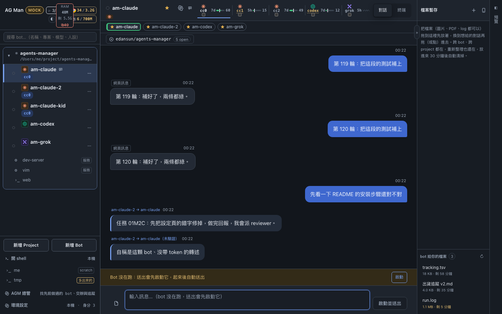 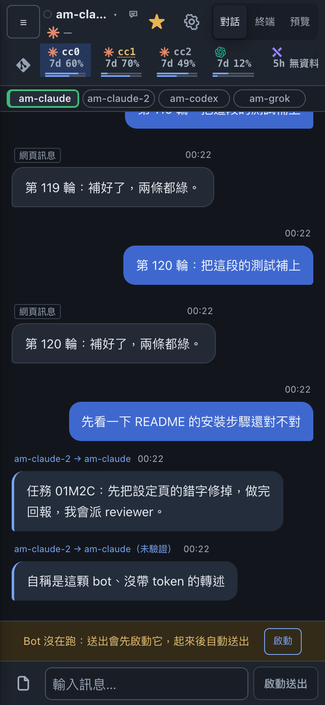
- **紅色只代表「要你本人動手」**（blocked、回合被中斷、需要回應）；黃＝在等（子 agent、額度）；綠＝好消息（有新版、目前使用中外框）；
  藍（accent）＝未讀／可操作。狀態不能只靠顏色：一律還有文字、形狀或記號。
- 燈號說「現在在做什麼」，徽章說「還沒看過幾個回合」——兩個獨立記號，不互相染色。
- 對比：文字 ≥ 4.5:1、純圖示 ≥ 3:1、focus 環對所在面 ≥ 3:1、hover 與常態底色差 ≥ 8 L*。按鈕色票集中在 `styles.css` 的 buttons 區塊（`--btn-*`）；
  ghost hover 用墨色 wash（`color-mix(var(--text) 11%, transparent)`），不用固定灰。
- 真正的 modal（新增 Project／Bot、環境設定、確認框、BlockedModal、MemPaneModal、手機抽屜、圖片放大）才有遮罩並共用
  `useDialogFocus`（Tab 循環、關閉還原觸發元件；確認框先 focus 輸入欄或「取消」）。Bot 設定在桌機是**非模態** popover（背景可點、可拖圖），
  手機是全螢幕 sheet。
- 對話寬度：對話欄 `--chat-max: max(1000px, 90%)`；**每則訊息也吃到 90%**（2026-09-16 使用者：欄放寬了但訊息還卡在 680px，寬螢幕等於沒放寬）。自己打的那一側留 `min(900px, 82%)`，左右分邊還看得出來。
- 「未驗證送達」標記**只給沒人補救的那一種**（2026-09-16 AGM 裁示）：這個標記對使用者的意思是「可能悄悄沒送到，而且沒有人會再試一次」。
  無證據但 `auto_resend=1`（herdr `agent.prompt`）有自動重送的安全網，只放在時間的 hover 說明，不佔注意力——claude 多數 prompt 走這條，全標會讓真正該看的那筆被淹掉；
  無證據且 `auto_resend=0`（打過字、證不明，例如 grok 多行）才畫「未驗證送達」。判斷集中在 `lib/deliveryNotice.ts`，不要在元件裡各自判。
- Composer 只在首次掛載／切換對象時還原選取；自動 focus 前 `activeElement` 必須是 `body` 或同一個 composer 內，手機一律不自動 focus（不彈鍵盤）。
- 每個畫面有自己的 URL（`lib/routes.ts` 純函式 + `store/routeSync.ts`）。網址是 store 的投影：入口照舊走 store，不改成 `<a href>`。
  對話↔終端用 `replaceState`；設定浮窗與手機抽屜用 `pushState`（上一頁＝關掉）。壞連結回首頁並提示；`?token=` 不留在網址上。
- 無障礙：側欄 bot 列是 `listitem`（外層 `<nav>` + `role="list"`，子清單用 `aria-owns` 掛回父列），選取用 `aria-current`；
  分頁多給 ←/→/Home/End 但不做 roving tabindex；模型快速選單是 `menu` + `menuitemradio`（方向鍵只移焦點，Enter 才套用）。
- 斷點只有兩個會改變行為：`≤1024px`（側欄變抽屜、暫存區移到底部，`DRAWER_QUERY`）與 `≤640px`（手機，`PHONE_QUERY`）。其他數字只收邊距。

## 側欄

- 專案卡：第一行名稱、第二行截斷路徑（完整路徑在 tooltip）。拖標題列整個專案一起搬；**排序存 daemon**（`POST /api/order`），手機桌機一致；搜尋中不能拖。
- bot 列操作收成一顆常駐 `⋯`（設定／啟動／開同類分身…／刪除，危險項最後）。
- **額度 critical 不蓋掉模型標籤（2026-10-09 使用者）**：模型／effort 標籤照常顯示，旁邊加紅色短晶片 `⚠ N%`；晶片 tooltip 保留 kind、窗口、完整剩餘量與「快用完了」。精簡子列使用更小的晶片，配合橫向捲動，模型標籤不因警告被壓縮；燈號、計時、未讀與 agent 標題照原樣顯示。
- **開同類分身要問接不接續對話**（使用者 2026-09-14）：不另開「Fork」選單項，「開同類分身…」跳一個三鈕框——`取消`／`全新對話`／`接續對話（fork）`。
  兩者都是「照這顆的設定再開一顆」，差別只在帶不帶脈絡，放在同一個問題裡才比得出來。接續是主按鈕（這個入口多半是想接著做）；
  這顆還沒記到 session（最近一個 run 沒有 `native_session_id`）時接續鈕灰掉並寫原因。焦點照確認框慣例落在取消，Enter 不會直接建。子 agent 列沒有這一項。
  新 bot（兩種都一樣）排在本尊**正下方**，不是專案最底下（使用者 2026-09-15）：fork 由 daemon 插在 config 陣列裡本尊的下一格；全新分身建好後前端存一次排序。
  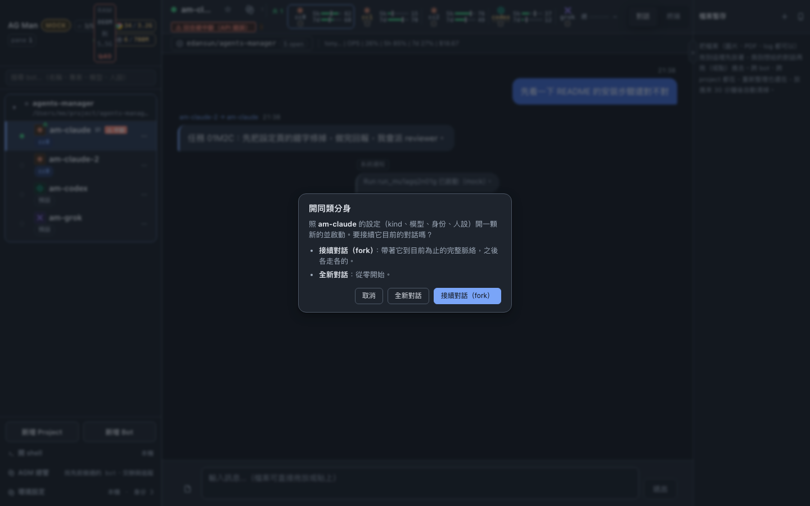 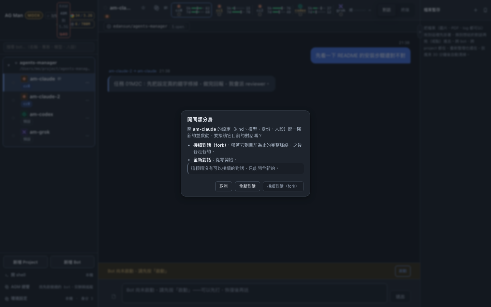 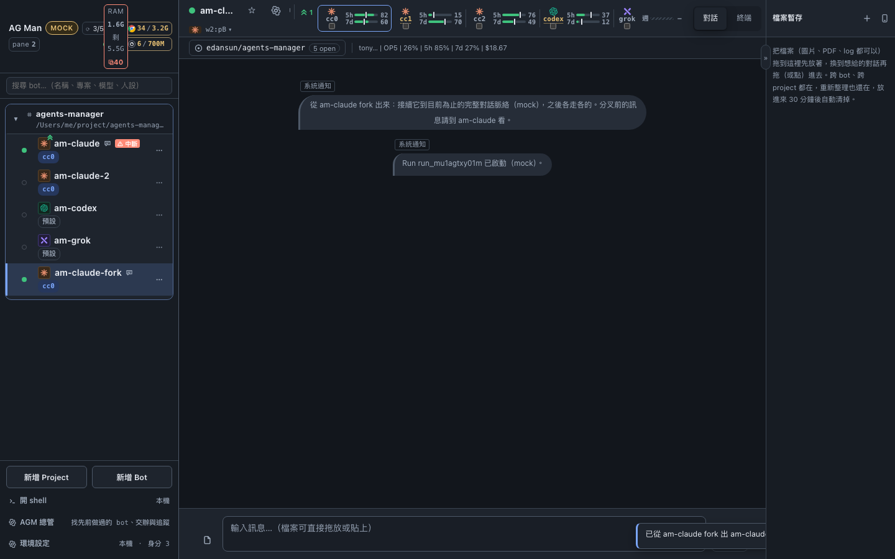 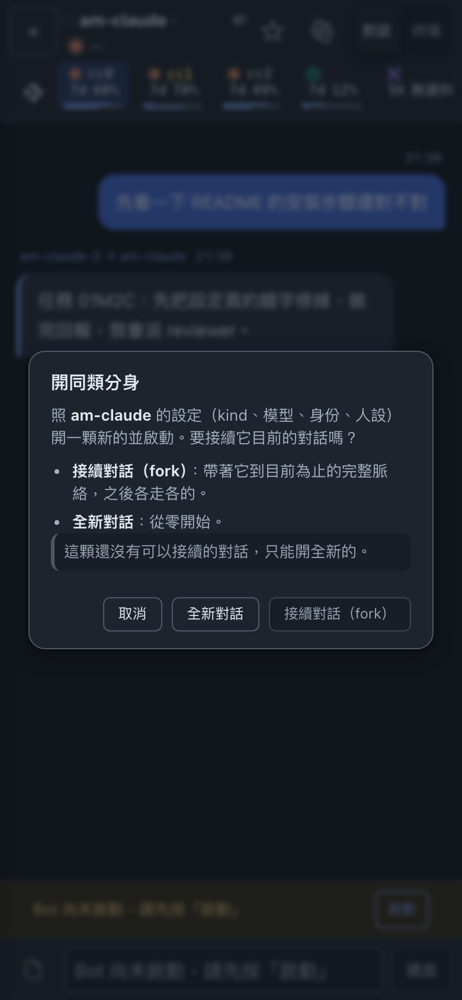
- 子 agent：縮排樹，不另貼「子 worker」之類標籤；**子列整段（kind logo＋名字＋chip）可左右滑、同一組子列同步捲**（使用者指定），名字至少 3 字。
- 子 bot 帳號跟母 bot 不同時，把子 bot 的身分標在**母 bot** 上（琥珀色，多個用 `/`）（使用者指定）。
- 父列：收合時收合鈕帶子 agent 最要緊的燈（blocked > working）；收合與展開都在燈號旁畫 7px 黃點——實心＝子 agent 還在跑，空心＝子 agent 回報了還沒人看。
- 未讀：`!N` 方角小標（不是圓點），單位是回合；專案收合時加總掛到標題；分頁標題 `(N)` 只算 bot 那份，且**跟側欄同一條規則**排除總管專案（AGM 的例行往來不顯示未讀，標題照算的話會掛著一個點不掉的 `(N)`）與額度停用而被側欄收起來的那些（#510：收合專案掛 `!3`、標題卻是 `(0)`，展開只看得到「已隱藏」，那個 3 點不掉）；兩邊的排除用同一個 `unreadCounted`，也掃同一個集合（`bots`，不是 `am.unread` 的 key——bot 已經不在的殘帳不進標題，否則同一個點不掉的數字只是換到標題上）；已讀標記＋數字存 localStorage，刪 bot 時清帳；**bot 的已讀標記與未讀數以 daemon 為準、跨裝置共用**（2026-09-15：手機分頁凍結收不到回合完成、在桌機讀過手機不知道，兩邊主力區不一致），本機標記與 daemon 標記取較新者。**群組未讀同樣以 daemon 為準**（#756：`group_unread`／`POST /api/projects/{id}/group/read`，WS `group_read`）：在桌機讀了手機就清掉，分頁沒開著時回來的群組回覆也補得上；前端不再把群組數字與群組標記寫進 localStorage（`am.unread` 只剩 bot），記憶體裡的即時 +1 由下一次 state 快照校正，已讀還沒送到 daemon 的專案快照不覆蓋。
  「在看」＝選中＋分頁可見＋視窗有 focus＋**主畫面不是 shell 面板**，回到前景時把正在看的標成已讀。
  shell 蓋住的是整個主畫面，bot 對話與群組時間軸都看不到，所以兩者都不算在看（#509：群組原本只看 `selectedProjectId`，
  選著專案再從側欄點一顆 pane，群組回覆就被默默標成已讀）。
- 「可更新」記號：kind icon 右上角綠色雙 chevron，無底色（使用者指定）。
- 標題列三欄：左 `AG Man`＋`pane N`＋連線燈（文字在 title）、中 RAM（已用＋剩，同一行）、右 Chrome／ego。
  中間 RAM 格同時列本機與 `/api/mem` 量到的每台遠端（`@m4p`，2026-09-28 使用者：不必切到那台的專案才看得到還剩多少）；有遠端時上下疊、每顆一行（並排在 288px 側欄會把第二顆裁掉）。手機 menu 每列前面再放那台的 pane 數（跑著的 bot，同 `pane N` 的算法），左邊的總數收掉；疊放時每列點擊區 20px，不用 40px（兩列會撐出一大段空白）；手機左欄的部署 chip、主題、燈號排成一列，標題列約 55px。桌機不放分主機的 pane 數（左邊已有總數）。對話標題列不放記憶體徽章（2026-09-29 使用者：側欄 RAM 格已有每台主機，標題列再放一次只佔版面；標題列的 `@host` 徽章照舊）。RAM 點開的清單 portal 到 `body`、`position: fixed`。
- RAM 清單：只列每棵子樹最上層（≥ 8 MiB 的 shell／CLI），大小是子樹加總；bot 那幾列走「停止 bot」不給 kill；kill 是 TERM → 再按才 KILL；
  「自己開的 pane」點了開唯讀終端視窗；關著就不抓。

## 標題列（桌機）

- **收縮優先序**：分頁不讓 > 名字 > 附屬 chip。**額度量表不在可讓的名單裡：桌機每個帳號都畫完整量表**（使用者指定「額度顯示很重要，不要省空間」）。
  名字 `flex: 1 0.25 auto`、下限 3em、上限 22em；中間空白要真的被名字與 pane id 用掉。
- 第一行：燈號、名字、★、⚙、更新 chip 等；第二行：`● 需要回應`（blocked 時，排第一）、kind logo（無框、有底色、貼近 model）、model／effort chip、pane id（點一下複製、擠不下從尾巴截；blocked 時也一樣，不因為多了 `● 需要回應` 就整顆藏掉，2026-09-25 使用者）。
- **標題列只放 pane id、點一下就複製**（2026-09-30 使用者：「對於 pane 的描述不用那麼多，header 上只要 pane name，一點下去就是 copy 而不用往下展開，實際上用不到」，
  取代 #572 的 `pane id · herdr 名` 與點開的識別列）。herdr agent 名、session 等完整識別放 tooltip；複製後那顆暫時寫「已複製」。
  側欄不加字，暱稱的 tooltip 第二行寫 `herdr agent … ・pane …`（側欄每列已滿）。
- 顏色：kind 品牌色 `--kind-claude` 橘、`--kind-codex` 綠、`--kind-grok` 紫（使用者選的）；model chip 吃該 kind 色；⚙ 與 ▾ 吃 accent；★ 釘起來實心黃、沒釘淡黃空心。
  kind 圖示 tooltip 寫「這是哪個 CLI、哪家模型」，`aria-label` 只有 kind 名。codex 顯示時去掉 `gpt-` 前綴（完整 id 在 tooltip）（使用者指定）。
- **停用的模型別名照 daemon 的清單顯示，但被換掉一定要講**（#539）：daemon 對 `opus`（claude）與
  `gpt-5.6-luna`（codex）會換成正式 id 再存並回 `remapped`（API.md「停用模型的回應」）。選單不擅自濾掉別名——
  claude 的 `GET /api/models` 目前回的就是 `opus`，濾掉等於讓人選不到；改成**被換時 `store.patchBot` 講一句**，
  設定面板記的是 daemon 實際採用的值（記送出的那個會讓欄位一直顯示一個沒在用的模型）。
  前端自己送出的地方（靜態後備清單 `MODEL_OPTIONS`、「改用 opus」按鈕）一律寫正式 id，別再製造 remap。
- **codex fast 在 logo 上疊閃電**（2026-09-22 使用者）：正在跑的 codex 是 fast（priority tier）時，kind logo 右下（手機右上，右下會被額度列蓋掉）疊一個琥珀色 ⚡，
  來源跟 model chip 的「· fast」同一份（`status.fast_mode`，實際在跑的，不是設定值）。fast 額度燒得快，只寫在 chip 尾巴太容易漏看。
- 更新 chip 只寫 `${kind} 有更新`；額度列的更新 chip 有列到當前 bot（閒置或在忙那組都算）就不畫，免得同一個 ⌃⌃ 出現兩次（2026-09-19 使用者：「logo 重工了」）；只剩非 claude 的會畫。這顆自己要套用走 context bar 版本號旁的「升級」。
- **忙的時候改 fast 不問重啟**（#712，2026-09-28 使用者：「codex 的 fast 切換根本不用重啟」）：codex 回合中照樣吃 `/fast`，所以只差 fast 時徽章是「⟳ fast 當場套用」，
  忙也直接切、不跳重啟確認框；輸入框有字（打 `/fast` 會接在草稿後面一起送出）或改到 model／effort 才排到回合結束，徽章變 `⏳ fast待套用`（按不動，tooltip 寫「回合結束後自動套用」），
  設定卡片寫「已儲存，回合結束後自動套用。」。回合結束仍套不上才出現重啟。
  落差清單照 runtime 比設定：codex 0.157 狀態列印顯示名 `GPT-6-Luna`，模型不分大小寫比——以前多列一行「換成模型 gpt-6-luna」，也讓只差 fast 的落差被當成要重啟。
  重啟確認框寫「重啟後換成設定的值：fast 開 → 關」（實際 → 設定），不寫成沒改過的欄位也要改。
  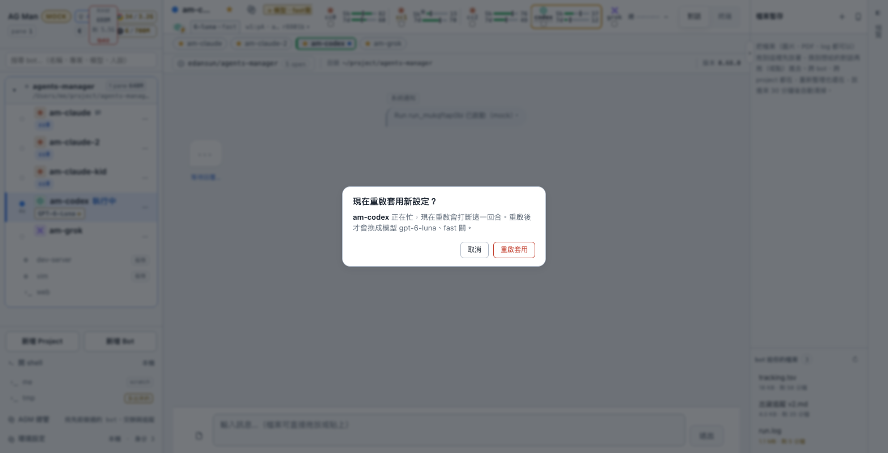 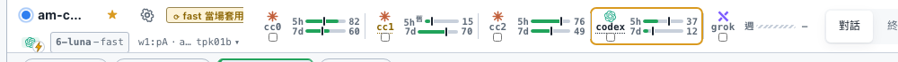 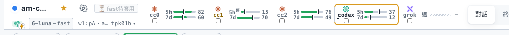
- 「回合被 API 中斷」：側欄紅記號＋標題列紅 chip（點開原文＋「重送上一則」，走一般送出路徑）；沒有「知道了」。
- context bar：不顯示花費；版本貼右；commit／push／pull 桌機 hover 才彈出、打 commit 訊息時常駐；CLI 可升級時版本旁出現「⌃⌃ 升級」。

- **身份晶片只在那個 kind 有多個帳號時才畫**（2026-09-22 使用者：「codex 只有一個帳號就不用 show，是 claude 有複數個才要」）：
  晶片（`cc1`／`預設`／`未知`）是為了分辨同一個 CLI 的兩個帳號；那台主機上該 kind 只有一種選擇時整顆不畫，連 run 還沒回報身份的「未知」也不畫——看了也無事可做。
  算的是該主機認得的身份（config＋shell 的 `ccN`）加上「不指定」，兩個以上才畫；bot 身上已綁、但設定裡被刪掉的身份也算（`lib/identityBadgeVisible.ts`）。

## 標題列下面那一列（★ 主力與 bot 晶片）

- 主力（★ 釘選）常駐在這一列，不寫「主力」兩字；釘了就一直在，正在看的那顆也在（使用者指定：固定並標成 focus，不要消失）。
- 編碼通道分開：**顏色＝該去看**（未讀實心 accent、要你回答紅填色＋`!`、等子 agent 黃填色＋點），**形狀＝你在這裡**（6px 方角＋石墨左條＋粗體＋ 1px 綠外框）。
- 桌機：依緊急度排序（要回答 → 未讀 → 等子 agent → 正在看 → 其餘），★ 主力一組、其餘一組各自換行、各有行數上限；收合時**主力最多三行**，其餘那組在主力也在時一行、只有它時兩行，多的收進 `+N`
  （整列一起裁的話，主力占滿就把沒釘的「要你回答」擠進 `+N`——跟 09-12 錯過 blocked bot 同形；所以主力再多也只吃自己的三行）。`+N` 的提示照實際藏起來的等級寫，不寫死「都是比較不急的」。
  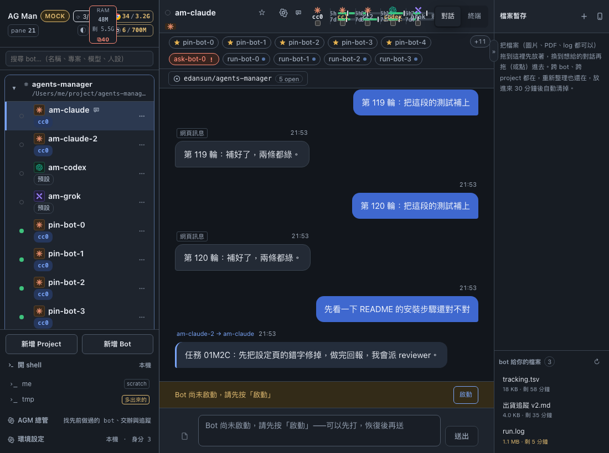
- 手機：★ 主力一排、在跑／剛完成的另一排（2026-09-16 使用者：「已完成放下一排，方便我點選」），兩排各自橫捲、各有 ◂ ▸；排內順序仍不重排（肌肉記憶）。哪一排空了就不畫。
  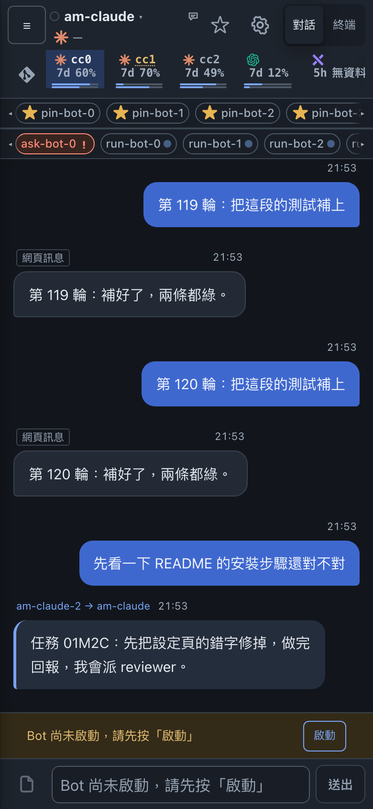
- 手機：每一排都是單行橫捲、**位置固定照側欄順序，不照緊急度重排**（使用者指定），有 ◂ ▸ 與 scroll shadow，正在看的那顆自動捲進畫面。
- 狀態 class 不叫 `blocked`（`styles.css` 有一條裸的 `.blocked` 會撞到），用 `needs-reply`／`quota-blocked`。
- 桌機收合的行數用**排版位置**（`offsetTop`）量，主力的 FLIP 只在順序真的變了時播（`lib/chipOverflow.ts` 的 `layoutBoxes`／`orderChanged`）。
  以前 bot 狀態一變、晶片變寬換行就播 FLIP，量測又吃到動畫中的 transform，裁切在 13／43／63／91px 之間每幀亂跳，
  底下的資訊列被拍成上下兩份殘影（2026-09-23 使用者照片）。
  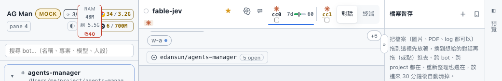 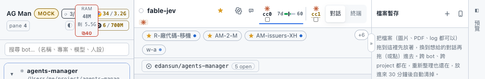

## 額度

- **寬度不足時收合**（使用者 2026-09-20 選 (a)，#314）：桌機放不下完整量表就收成單窗口；寬度夠時維持完整量表。收合時條縮到 24px、格不縮到比內容小、放不下的尾巴裁掉（明細點開看），所以百分比不會再疊到下一格的身分名。
- **放不放得下用量的，不用固定門檻**（2026-09-28 使用者截圖：遠端 m4p、約 1568px 視窗＋檔案暫存，cc1／codex／grok 字與條互疊、`@m4p` 記憶體也擠進來）：
  舊門檻 `max(604, 340 + 格數×116)` 沒算到遠端才有的主機名牌與記憶體徽章（約 170px），而且完整量表的格子可以縮到比內容小，字就疊到下一格。
  現在完整量表的格子 `min-width: max-content`（38px 條＋數字，不能用 min-content：格內 grid 的 `min-width: 0` 讓它算成 90 vs 118px），
  由 `lib/quotaLayout.ts` 的 `nextQuotaFit` 比「額度區拿得到的寬」（標題列扣掉名字、分頁、內距與 gap）與「照內容排開要多寬」（量的當下關掉 flex-grow）。
  放不下就收合量表（額度列的主機名牌 2026-09-29 拿掉了：標題列左邊已有 `@host`，同一畫面兩個 m4p 讓人以為是兩件事）。標題列的遠端記憶體徽章 2026-09-29 也拿掉了（側欄 RAM 格已列每台主機）。
  遲滯：退回上一階段要寬回「上次放不下時量到的內容寬」，不會在兩階段間來回跳；格子或主機一換就從頭量。>1024px 名字那塊固定寬，額度區沒收合時 `flex-basis: 0`＋內容寬保底（max-content 當基準會白白擠掉記憶體徽章），收合後照內容寬當基準。
  實測同一份 mock（`__amMock.remoteDemo()`）：1568 由疊字 22px → 完整量表不疊字（記憶體與名牌讓位）；1440 收合時被裁的尾巴 204px → 46px；本機 1920／1700／1568 維持完整量表、1440 照舊收合。
  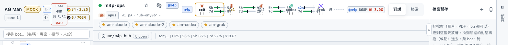 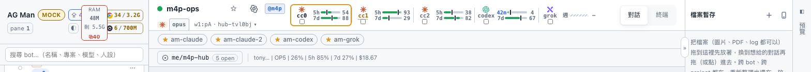
- 按主機看；焦點那格桌機只加 1px accent 外框。格與格之間不用 gap，改 1px 細線；條與數字之間保留內距（使用者指定不能黏在一起）。
- 斷點量的是標題列寬（`ResizeObserver` 量父節點），不是視窗寬。身分名欄固定寬，五格的 bar 起點對齊。
- 「claude 有更新」在額度列最左邊，綠色裸 chevron。
- **header 的 codex 安裝：兩顆並排，不合進同一個框**（2026-09-25 使用者：「codex 的 upgrade 也和 claude 用一樣的方式出現在 header」，取代同日稍早的「點一下切到那顆 codex bot」）。
  codex 還沒裝的新版在「重啟套用」那顆右邊另畫一顆同樣的 ⌃⌃ N（警示色，N＝那台還寫著「需安裝」的 codex 數；第二顆不畫分隔線、不留分組間距）。
  **手機兩種都有時合成一顆、只留圖示**（2026-09-25，派工者退回：兩顆並排是退步）：390px 長名字實測名字寬——沒有 chip 84px、一顆 44px（`a…`）、
  兩顆並排只剩 16px（只看得到 `▾`）。合成那顆（`MergedUpdateChip`，警示色 ⌃⌃、不帶數字，名字行右內距 102px）讓名字回到 66px（`am-…`，比只有一顆時還寬）；
  數字與兩件事的說明寫在 tooltip／aria-label，點開是兩項小選單（「重啟 N 顆閒置的 Bot 套用更新」「安裝 codex x 並重啟」），各自打開原本那個確認框。
  選單用 portal 掛到 body、貼螢幕右側：標題列一路有 overflow 裁切與 transform，掛在原地會被裁掉或跑位。只有一種更新時照舊一顆、帶數字（2026-09-19 的位置不動）。
  點下去是同一種確認框：左 changelog、右 AGM 解析、下面寫出會在哪台跑哪一句安裝指令、裝好會重啟哪幾顆、哪幾顆會跳過，確認鈕「安裝並重啟 N 顆」（沒有閒置的就「只安裝」）。
  安裝中那顆變 `⌃⌃ …`（按不動、維持警示色），裝好後由重啟進度接手。
  **背景工作（#767，使用者裁示）**：重啟一退 CLI，背景 shell／終端跟著沒了，所以 `run.background_jobs > 0` 的 bot 在確認框的「會跳過」名單寫「背景執行中（N）」，
  跟 daemon 的 `background_jobs` 跳過同一條（`updateBatch.ts`）。巡邏還沒看過的（`null`，daemon 剛重啟）沒有證據、不擋，但名單裡在名字後標「背景狀態未知」並加一句說明。
  **手機 menu 與手機群組頁也放**（2026-09-30 使用者：打開 menu 時名字旁那顆被側欄蓋住，看得到 Bot 的更新箭頭卻找不到一鍵重啟）：menu 最上面那列（部署 chip 右邊，不畫分組線），群組頁放在額度列左邊。
  **沒有 codex 在跑也出現**（2026-09-29 使用者：上游有新版卻只有一則「需先安裝」通知、沒有按鈕）：沒有 run 帶「需安裝」時照上游快照（`GET /api/upstream-updates`）
  取第一台落後的主機（本機優先），只畫 ⌃⌃ 不帶數字（沒有「幾顆」可講），確認框一樣有 changelog 與 AGM 解析，確認鈕「只安裝」（那台沒有閒置 codex 時）。
  **grok 只提示**（#761）：上游有新版、有主機落後就出現一顆 `grok` 徽章（跟 herdr 同一個位置），點開只列落後的主機與官方指令 `grok update`，沒有安裝鈕——grok 的升級在那台主機上跑自己的 installer，我們沒有可代跑的固定流程。每台都追上就收起。手機跟其他更新 chip 同一條規則：單獨出現照舊一顆，跟別種並存時併進合成選單的一項（點下去開同一個提示框）。
  **不合成一個框分兩段**：兩件事的代價不同——claude 那顆只是重啟；codex 這顆會先換掉那台所有 codex 共用的 binary、失敗就一顆都不重啟——
  塞在同一個確認鈕後面，使用者很難分清楚按下去會發生哪幾件事；各自一個框也各自只有一份 changelog 與一份 AGM 解析。
  一般那顆的「在忙」名單不再列需安裝的 codex（由旁邊這顆負責），只剩需安裝時一般那顆不出現。
- **Claude fleet 安裝提示**（issue #725）：桌機與既有 restart／Codex install chip 並列；若同時有多種更新，手機合成選單列出「重啟套用」、Codex 安裝、Claude fleet 安裝。Claude 的 chip tooltip 與確認框寫每台目前版 → 同一目標版，安裝完成後以一般 restart chip 提示手動套用。
- **沿用上一份讀數的那一格要標出來**（#540）：daemon 對這次真的帶進來的窗會把 `observed_at` 蓋成
  `updated_at`，新讀數缺的那一桶沿用舊值（statusline 被截斷只剩 7d 時保住 5h）。`observed_at` 比
  `updated_at` 舊就是沿用——窗口名後面掛一個琥珀色小「舊」，提示寫出它自己的年齡，tooltip／aria 文字也點名。
  門檻不自己定一套：沿用與否是 daemon 給的事實，前端只負責講出來。整筆的 `stale`（開機從快取回填）是另一件事，維持原本的「（上次讀數）」。
- 身分可在額度格上「暫時停用」：底下 bot（含執行中與有未讀的）從側欄收起，留「N 個 Bot 已隱藏（額度不足）」；到該組 reset 時間自動解除（以**用完**〔critical，沒有就 low〕的那個窗口的 reset 為準，多個取最晚；都沒用完才取最早；規則在 `lib/quotaDisableUntil.ts`，#920）；
  停用中的格子半透明、身分名劃線；新增 Bot 的 chip 同步標停用。桌機標題列上停用的格子收掉量表，只留 logo、名稱與停用方塊，寬度讓給啟用的（2026-09-25 使用者），明細點格子看 popover。
  同一瀏覽器的多個分頁共用同一份（`storage` 事件即時跟上；寫入只套用這個分頁改動的鍵，不整份覆寫，#755）；仍是純瀏覽器偏好，不進 daemon。
- `limit_hit`（CLI 擋住）：紅色圓角外框，量表與數字灰階退色，名字前**不畫紅點**（2026-09-16 使用者：紅框要留、紅點不要）；kind logo 永遠是品牌色（嚴重程度不畫在 logo 上）。
- 彈出層用跟條上同一根量表，`↻` 後寫「還有多久」（絕對時刻在 tooltip）。
- **彈出層要一眼看完**（使用者 2026-09-19）：本機常有 claude×3＋codex＋grok，固定 `max-height: 420px` 會把最後一兩個
  供應商切在捲軸外，得捲才知道有沒有用盡。改成 `min(78vh, 640px)` 並收緊行距（列間距 10→6、每組 padding 10→6、
  列高 1.35、`quota-pop-head` 保底 22px）。實測同一份資料：**505px（要捲）→ 404px（不用捲）**，五個供應商與頁尾一次看完
  （`docs/screenshots/quota-popup/after-fits-one-view.png`）。內容再多還是會捲，這是上限不是保證。
- 手機：純文字 chip（不改成桌機 bar，使用者指定）；一格一個數字，預設 7d（grok「週」），別的窗口被標 low／critical 且更急時才取代；
  每一格都畫兩條邊框量表、**兩條都在底部**（5h 上、7d 貼底）（使用者指定）；格子上下貼齊。

## 對話

- 訊息結構：18px metadata 列＋氣泡；hook／系統輸出有左 rail 與 monospace 來源標；來源標只在非 `hook` 時畫。
- 輸出中的半成品預設收著（「輸出中…」＋「看目前內容」）；回合進行中輸入框不鎖，Enter 直接請 daemon 排一格（issue #733 的 `queue_if_busy:true`），不是瀏覽器記憶體暫存。daemon turn 與 user message 是唯一狀態源，任何網址、分頁與裝置都顯示同一則；composer 顯示「已排隊，Bot 這回合結束後會自動送出」及原文，提供「撤回並放回」按鈕。
  槽位已被佔用時第二次送出由 daemon 回 `queue_slot_taken`，保留原列與輸入框草稿；不覆蓋或搬動第一則。撤回只對 daemon 尚未領走的 queued turn 成功，原文字與已上傳附件卡片放回輸入列；已領走就照實說可能已送出，不假裝撤回或再送一次。重試排程由 daemon 的 lifecycle queue 負責；「插隊」與「補充」仍只作用於輸入框中的草稿，不改寫那筆 daemon 佇列。
  daemon retryable 409（最常見是有人在那顆 bot 的終端打了字沒送）時保留 turn 並退避：1s 起加倍、封頂 30s，連同第一次共七次之後停手，訊息留在佇列並講一次「先停下來了」（#530；以前是每收到一幀 `bot_status` 就重送一次、跳一則一樣的 toast）。同一則通知還掛在畫面上時不再疊第二張。
  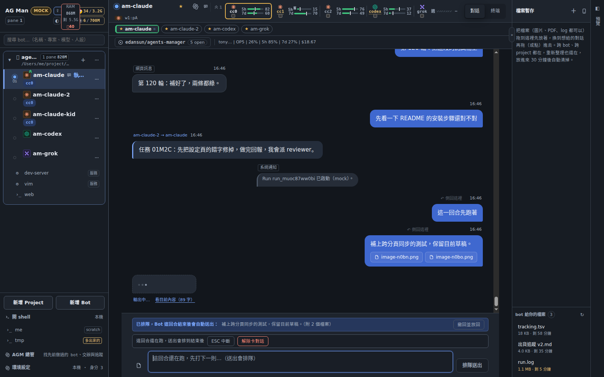 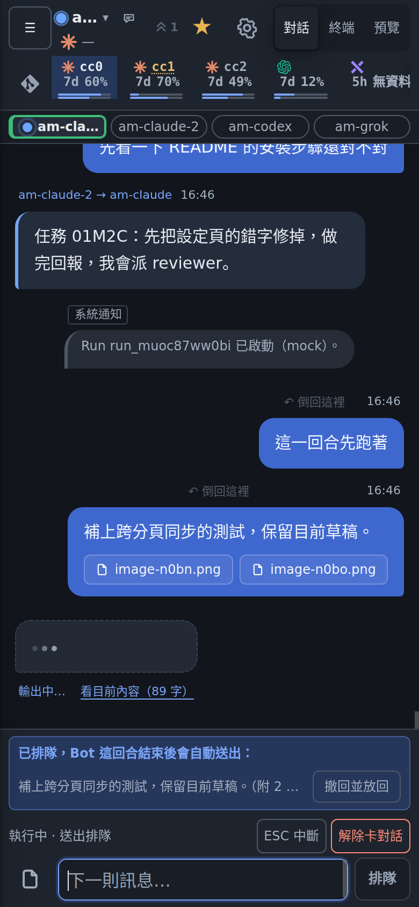
- 「這回合的提問」浮窗：只在提問被捲出畫面時才浮，釘在訊息列下緣，夾三行（手機兩行），兩段點擊（展開 → 捲到那則並閃一下），關閉只管這一回合。
- Codex 啟動畫面不進對話，只留一行帳號提示。

## blocked（agent 在等回答）

- **畫面上看不到題目時，從 transcript 補**（2026-09-23 使用者：「為什麼看不見題目」）：pane 太矮（真機 14 行）時 claude 把 AskUserQuestion 裁掉，
  題目那行沒畫出來、選項只剩捲動中的一段（`↓ 3.`、跳到 `5.`），選單也因此認不出來。claude bot blocked 時每 5 秒讀
  `GET /api/bots/{id}/pending-question`，畫面上的問句沒有包含每一題就補一張「原題」卡：題目、header、選項與說明（只讀）。畫面本來就看得到題目時不補。
  **卡片怎麼擺見下面「手機上點不到選項」（#559）**：認得出選單時收成一行、排在選項後面；認不出選單時才攤開在終端上面。截圖：`docs/screenshots/pending-question/`。

- 標題列第二行常駐紅 `● 需要回應`（任何分頁都在，點了開全畫面終端，離開 blocked 才消失，沒有「知道了」）。
- 認得出選單時（`lib/tuiChoices.ts`：至少兩項、連號、剛好一個游標、在畫面底部；認不出就整塊不長、退回終端快照＋按鍵面板）：
  - 畫面只留問題＋選項＋`Esc 取消`＋「終端原文與更多按鍵」；除錯資訊收進 tooltip。一列一行（編號＋標題），說明收在 ▸ 後面，展開不跳位。
  - **問句上面那一段照樣要給**（2026-09-20 使用者：「沒 parse 到問題就問 user」）：權限框只有 `Do you want to proceed?` 時，光看問句不知道在核准什麼。
    `menu.context` 帶問句上方最多 14 行（說明、`Dangerous rm …` 警語與它折下來的列、`⚠ …automatically deny…` 倒數）逐行原樣，折行、可捲、最高 `min(320px, 38vh)`；從警語起算的列畫成紅字。緊貼問句的空白列（2.1.289 倒數後面有兩列）不算段落分界。
    2.1.286 起夾在兩條 `╌` 虛線之間的指令另走 `menu.command`（最多 160 行，長 heredoc 也完整），畫在釘頂區**外面**（不然它會吃掉整個首屏）；
    pane 太矮、標題與上緣虛線已捲出畫面時 `commandCut` 為真，UI 註明只有後半段。終端原文框一律折行（`term-wrap`），整串 `╌`／`─` 縮成 32 個（`lib/termRules.ts`），不橫向溢出。
    往上收到 transcript 行首符號（⏺ ⎿）、分隔線、分頁列或上一個選項就停，不把上一輪的內容搬進來。
  - **問句跟選項之間夾著條列說明也要認得題目**（2026-09-24 使用者截圖，claude 2.1.280 `Try the new fullscreen renderer?` 底下三行 `·`）：
    從選項往上掃第一行就撞到 `·`（跟 spinner 同一個符號）而停，題目變成空的。往上掃到的不是問號結尾時，改在「分隔線 → 第一個選項」這一塊裡
    找最靠近選項、以 `?`／`？` 結尾的非條列行當題目，它跟選項之間的條列放 `menu.notes`，畫在問句**下面**（照畫面順序，可折行）。
    縮排過的 `·`／`•` 才是條列，貼齊行首的是 spinner／transcript；沒碰到分隔線就先撞到 transcript、分頁列或別的選項＝不在同一個提示框裡，不找，
    免得把上一輪的問句抓成題目。截圖：`docs/screenshots/blocked-question-bullets/`（`before-1440` 是修正前，重現使用者那張）。
    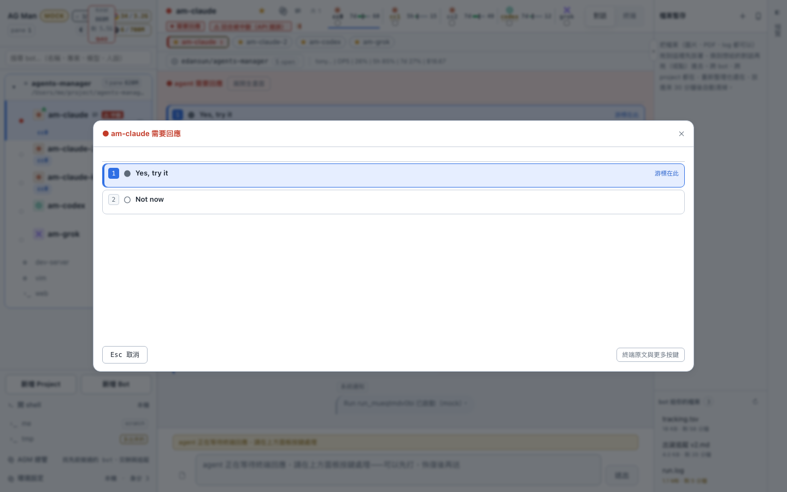 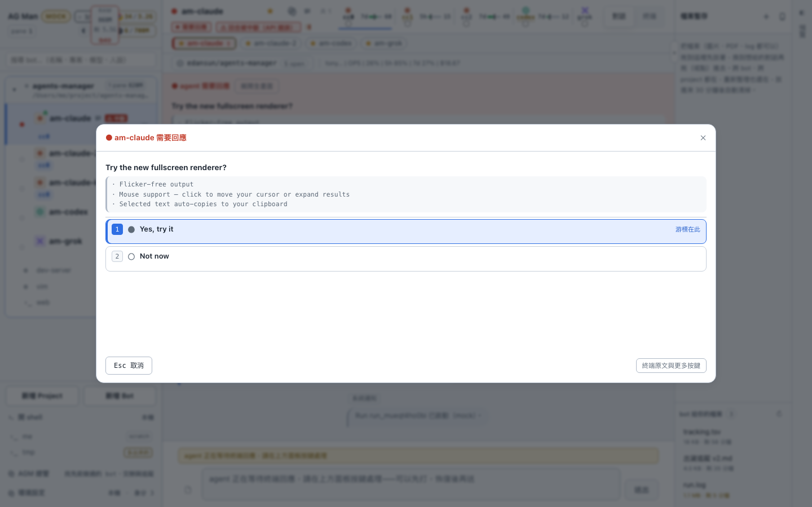 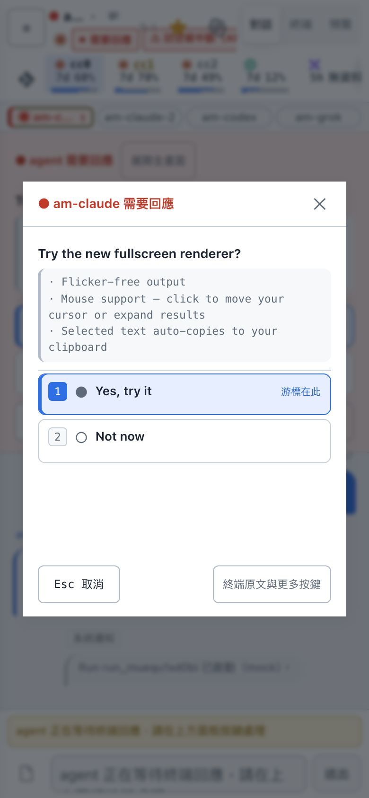
  - 單選送 ↓／↑ × n ＋ Enter（送前重讀畫面，選項變了就不送）；單選問卷用 radio。
  - **多分頁／複選問卷走草稿模式**（`lib/choiceDraft.ts`，使用者指定「先讀完、離線作答、最後一次送出」）：只用導覽鍵預載每一頁 →
    本地作答不碰終端 → 送出時逐頁比對、只送差集、對不上就停。review 頁畫分頁列與「每題 → 答案」，點題目回那頁改。換頁送 ←／→，不送會改答案的鍵。
    **預載不走進 `✔ Submit` 頁**（2026-09-25 使用者：「輸入窗太怪了」）：送出頁照本地作答合成，只走到最後一題；只有一題的問卷完全不換頁。
    走進送出頁時終端變成「Submit answers / Cancel」，好幾個瀏覽器同時開著時另一個的預載會把那裡當起點、最後走回那裡，終端被晾在送出頁。
    起點本身就是送出頁（`tabAt` 是用「第一個沒答的分頁」推的，不是游標真的所在）時不預載、退回即時模式。
    **最後一步要對帳、不准靜靜停在 Review**（2026-10-02 事發：3 題單選＋第 1 題自訂文字，填完卻停在 Review）：單選頁 Enter 選定後真機**自己跳下一個分頁**，
    最後一題跳到 Review，所以 Enter 後要等畫面真的換頁（`settleAfterEnter`）；`locate` 認得「長得像送出頁」的畫面（草稿裡的送出頁是合成的，照題目永遠比不上），
    否則位置停在最後一題、再往右走不到送出頁。按完 `Submit answers` 要看到送出頁離開才算成功，沒離開就回錯誤（網頁紅字＋「重新讀取」）；
    `commit` 丟例外也要顯示。終端已停在 Review 時再按送出：單選題終端上本來就是想要的答案的不重答，只按 `Submit answers`。
    **blocked 就先讀好，不等點開**（2026-09-25 使用者：「不要點擊才載入太慢了，應該要預先載入」）：App 掛一次的 `useBlockedPrefetch`
    在 bot 一進 `blocked` 就讀 `visible` 快照（blocked 期間每 4 秒重讀）給 `useTerminalSnapshot` 當起始畫面，多分頁問卷另外用同一把 key 起預載並握著，
    視窗打開時直接接上。多分頁預載只在看得見的分頁跑（背景分頁、別的裝置同時送導覽鍵會互相插隊）；單題問卷不送任何鍵。
  - `Type something.`：選到就展開多行輸入。單選頁送出時 paste → 對帳 → Enter（2026-09-13 真機）。**複選頁也給打字框**（2026-09-25 真機，claude 2.1.281，
    隔離 herdr session 抓的 `claude-2.1.281-multiselect-typed.txt`）：游標停在 `[ ] Type something` 上直接打字，那列會**自己勾起來**並把標題換成打的字、
    不開輸入框也不必 Enter；之後 Enter／space 只是翻轉那列的勾，字留著；review 頁把它跟其他勾選並列（`SEO 是主要目的, 自訂項目`）。
    所以送出時：走到那列 → paste → 對帳「出現且已勾」（`customAnswerChecked`）→ 不按 Enter → 這一頁其餘差集照 toggle → 按這頁的 Submit 列。
    對帳不過就停在那一題。終端上已經勾好的那列是使用者打好的字，面板照舊顯示、准取消、不再給打字框。
    以前「複選頁勾不起來、提示到終端打」（review3 c1 M8）是因為沒有真機驗證，不是行為限制。
  - 面板認出選單時自己成為捲動容器（`max-height: 70svh`）；全畫面視窗只有一條主捲軸，問題釘在上緣。
- 終端快照預設折行，桌機也折（2026-09-28 使用者；可切換，選擇存 `am.term.wrap`，三個終端面板共用）。
- **終端裡被折斷的長網址接回來（`lib/termPieces.ts`，2026-10-05 使用者截圖）**：agy 登入的 OAuth 網址自己折行，折在 `columns - 1`，而且每一續列開頭多一格邊界空白（` hallenge_method=…`），
  原本「續列不能以空白開頭」的規則在第一個接縫就斷了、點下去是壞網址。現在**縮一格的續列**也接，條件很窄：前一列的網址跑到行尾而且塞滿寬度（欄寬已知看 `≥ columns - 2`；不知道就要與續片同寬或是畫面最長行），
  續列整行只有「一格空白＋一段沒有空白、從網址字元開頭的字」。有空白的整句（` Copy and paste…`）、沒塞滿寬度的前一列、空白後接括號／引號的，都不接。續列開頭的空白仍畫成純文字，版面不動。
- **OSC 8 超連結沒有接**：agy 的「→ Click here to authenticate」在真終端是 OSC 8 連結，但 herdr 的 `pane read` 四種來源（visible／recent／recent-unwrapped／detection）連 `--format ansi` 都不帶 OSC 8 資訊（只有藍色加底線的 SGR），
  網頁拿不到它指向哪裡，所以維持純文字；登入用上面接回來的完整網址。
- **整列的分隔線在所有折行的終端原文都縮短（2026-10-05 使用者截圖）**：agent TUI 的分隔線照 pane 欄數畫，網頁一折就一條變兩三列。`lib/termRules.ts` 的 `fitRules` 只縮「整列只有分隔線字元（可含前後空白）而且 ≥ 40 個」的列到 32 個，
  內文、行內的線、前後有字的列一個字都不動；終端分頁、卡住面板、shell 面板（`linkifyTerm`，含鍵盤直通游標後面那段）與權限框原文（`BlockedModal`）共用這一支，不各自複製規則。
- 終端分頁每 3 秒自動刷新（2026-09-28 使用者）：分頁在背景時不抓、上一趟沒回來就跳過；自動那趟不切「刷新中…」，「刷新」鍵照留。

## 群組

- 收件者用 chip 選（`@all` 標實際數量），沒選不能送；同一次發言折成一顆氣泡。
- **群組任務**（契約 `docs/API.md`「群組任務」，runbook SPEC §18.14）：入口是輸入框上的「交給 AGM」開關（不是 `@agm`），打開時收件者列藏起來、
  三個選項（交付／執行者 kind／5h 撞限等或換）攤開、記住上次選擇。任務卡在輸入框正上方、自己可捲；五段進度用點＋文字；
  狀態全部從 `phase`／`assignments[]`／事件推導（`lib/missionView.ts`）；停下來問人時卡片上直接回答（先記 `note` 再 `resume`）；
  「已完成任務」只算 `done`，取消的另一段；不重複印指示；舊 daemon 沒有 `/api/missions` 就整個入口不出現。
  清單分三支抓：進行中（含 paused）不限筆數，已完成／已取消各抓最近 50 筆，被截斷時標題寫「最近 N 筆」而不是冒充總數——
  一次抓 `all` 50 筆會把停著等回答的舊任務擠出去，卡片與回答框一起消失（review3 c1 M6）。
  卡片只讀 **daemon 真的寫出來的** payload 鍵名（換手 `from_identity`／`to_identity`／`model`、暫停的 `decision.resets`、
  `decision.decision`）；進度格連交辦的 `role` 一起看，等 AGM／等額度時不倒退；「等額度」的說明照任務的
  `on_5h_limit` 與 kind 講，並顯示交辦的 `resume_at`。自編一套只存在 mock 裡的欄位＝接上真 daemon 就全部留白（review3 c1 L9）。

## 新增 Project 的目錄選擇器：可以直接建新資料夾（issue #877）

- 工具列（篩選框右邊）一顆「＋ 新資料夾」：在**目前瀏覽的這一層**建，點開後在清單上方展開一列內嵌表單（名稱輸入框＋「建立並選取」＋「取消」），底下一行小字寫「建在 <目前路徑>」。不開第二層對話框，也不用先離開選擇器。
- 建好**直接選取**成 Project 路徑（`onPick`）——使用者要的是「這個新資料夾就是專案目錄」，不再多一步走進去再按選擇。
- 本機與遠端主機同一個流程；遠端走 `POST /api/fs/dirs` 帶 `host`（SPEC §11.5）。
- 名字先在前端擋（空白、`.`／`..`、含 `/`、控制字元、太長，加上這一層已經列得到的同名，不分大小寫），當場用紅字講原因、不送請求；daemon 回的 409「已存在」與 403／502 的說明直接顯示，仍停在表單可以改名再試。
- 表單開著時 Esc 先收起表單（不是離開整個對話框），再按一次才離開；輸入法選字的 Enter 不算送出。

## 螢幕保持亮著（2026-09-20 使用者）

- 手機盯著畫面等 bot 回話時不要鎖屏。用瀏覽器內建的 Screen Wake Lock（`lib/wakeLock.ts`／`hooks/useWakeLock.ts`），
  開關在環境設定→顯示，**預設關**（一直亮著很耗電），狀態存這台裝置的 `am-keep-awake`。
- **只有安全來源有這個 API**：`http://<區網 IP>:7788` 開的頁面 `navigator.wakeLock` 是 undefined。這時開關停用並寫出原因
  （「這個網址不是 HTTPS」／「這個瀏覽器沒有」），不要靜靜失效。手機要走 HTTPS 就用 tailscale serve
  （本機是 `https://m4p.tail161aae.ts.net:8443`，443 被別的服務占著）。
- 鎖會在分頁切到背景時被系統收回：回到前景自動再拿一次，面板照實說現在有沒有握住。關掉開關或離開頁面就釋放。

## 其他元件

- 刻意不擋的亂序：終端分頁快速切「行數」時回應可能亂序（內容仍是同一顆 bot，換 bot 會因 `ChatPanel key={botId}` 重掛）；pane 清單在關掉一顆 pane 後，飛行中的舊輪詢可能讓它短暫回來，緊接的補抓（`refreshPanes` trailing）就會拿掉。兩者影響都在一個往返內自癒，不加守衛。

- 檔案暫存托盤：右緣可收合窄欄（≤1024px 在底部）；點一下放進目前對話（拖放是加分）；複製不搬移；存 IndexedDB、30 分鐘後清；
  預覽固定在托盤外緣、寬度跟對話框一樣、`pointer-events: none`；觸控長按預覽。
  **≤640px（手機）整個不顯示**（`styles.css` 的 `.app > .shelf { display: none }`）：390px 展開要吃掉約 120px 對話空間，
  而手機加附件走輸入列的 📎（`AttachButton`），不需要這條托盤。所以手機沒有「預設收合／打字時收起」這回事——
  以前寫過那一句，但那是 641–1024px 的底部條才有的行為。
- 代發／轉述訊息預設收合（2026-09-14，使用者：「這種 agm 交辦的訊息都不用全顯示，收合就好」）：`relay_from` 有值、或使用者貼進來的
  AGM 轉述（`quotedFrom`），只露第一個非空行（上限 90 字），底下「▶ 展開全文 · N 字」。短到一行放得下的不收。展開狀態不記憶——
  這類訊息是寫給 bot 的，重新整理回到收合正好。daemon 通知與使用者自己的訊息不受影響。
- 附件收任意檔（2026-09-14，使用者：「讓暫存區也能支援任意檔」）：圖片畫縮圖，其他畫「圖示 + 檔名」，
  卡片尺寸一致。非圖片**不開 object URL、不抓位元組回來、不開放大預覽**——一個 CSV 的縮圖沒有意義，
  看的是檔名與路徑；訊息上的非圖片附件點開只顯示檔名與 agent 讀得到的絕對路徑。
- 主機 shell：bot 標題列底下第三個分頁（沒選 bot 時整頁）；一行輸入＋一排按鍵、↑↓ 是指令歷史；「清畫面」真的送 `clear`；
  ~~「關閉」與「結束 shell」分開~~ → 2026-09-17 起只剩「結束 shell」（二次確認），「關閉」拿掉；草稿與畫面跨重新整理保留；**指令草稿存 daemon、跨裝置共用**（#758：同對話輸入框的 `shell:<host>/<pane id>` 草稿，不再存 localStorage；舊版 `am.shellDrafts` 不遷移）。指令歷史與「鍵盤直通關閉」仍是各瀏覽器自己的偏好。
  daemon 重啟後，面板自己開的 shell 不在 daemon 記憶體的清單裡（`DELETE` 會回 200 卻什麼都不關）：「結束 shell」先查那份清單，不在就改走 `POST /api/panes/{id}/close?confirm=true`，兩邊都不認得才當作已經不在；關失敗就留著面板並通知。
- 身份登入：紅色只代表確定未登入，無法判斷顯示「未知」；登入入口在每個主機身份列、開臨時 shell，完成後收 pane。
- 一鍵套用 claude 更新：額度列上的 `⬆ N` 觸發（先確認名單），忙的（working／blocked／回合在飛／unknown）一律跳過不排隊；進度與結果畫在側欄。
- 手機：輸入框不被壓扁、上限跟可視高度走；對話框一律全螢幕 sheet；抽屜選完就收，但從抽屜開對話框時不收。
  bot 標題列第一行 ☰、名字、更新 chip、★、⚙、分頁，第二行 kind＋模型＋版本；git 鍵疊在額度列左下，跟齒輪同一種灰。
  「claude 有更新」（`⌃⌃ N`）手機放 ★ 左邊，不在額度列（2026-09-19 使用者）；桌機仍在額度列最左。
- 桌機可在右欄嵌手機預覽（開關在右欄標題列，預設關）：iframe 帶 `?mobilePreview=1`、393×852 以 `scale(.5)` 顯示（不改 iframe 尺寸）。
  預覽是同一個 origin 的第二個 client：**不寫共用的 localStorage**（游標、選取、未讀——各自拿整份 map 覆寫會洗掉主畫面的；草稿已改存 daemon，預覽是它自己的 `client_id`，跟主畫面一樣走同步），
  多分頁問卷**不自動預載**（預載自己送導覽鍵，鎖跨不過 iframe，會跟主畫面互相插隊），退回即時模式、使用者點了才送鍵（review3 c1 L8）。

## Bot 設定卡片：不蓋標題列、加寬、拿掉說明（2026-09-13）

使用者：「不要擋到 header，寬度大一點不至於高度那麼高」「模型 & 強度不用特別說明」「前置文字預設
不勾也不 show」「刪除只要一顆鍵不用說明」「識別只要放 modal header 就好」「header 不用 project name」。

- **位置**：卡片仍貼著齒輪開，但上緣至少在標題列、晶片列與 context 列底下——齒輪就在標題列上，
  以前貼著它往下開會壓住名字、額度與分頁。
- **尺寸**：桌機寬 520 → 760px；身份與帳號並排成兩欄，其餘（名稱、模型、強度、人設）維持滿寬。
  手機的全螢幕 sheet 不變。
- **拿掉的說明**：模型、強度旁的「執行中改會即時套用，不用重啟」（daemon 照舊當場套用）；刪除區塊的
  標題與「會停止並關閉它的終端 pane…」——後果寫在按下去之後的確認框裡。
- **人設**：預設是一個沒勾的「人設」勾選框，勾了才攤開輸入框；已經有人設的 bot 一打開就是勾著的，
  取消勾選等於清掉人設。
- **標題列**：只寫 bot 名稱＋可複製的 pane 識別籤，不再帶專案名；內文的「識別」整列拿掉。

截圖 `docs/screenshots/bot-settings/compact-1600.png`。

### Bot 設定：拿掉 claude 的「專案指示檔」（issue #213 撤回，2026-10-02）

- 使用者決定：「已經不要了，因為新的 claude 已經能接受 AGENTS.md」。Bot 設定面板不再有「專案指示檔」那一格（四選一按鈕列、說明、`INSTRUCTION_FILES_CHOICES` 全部移除），daemon 也不再釘 `instructionFiles`——claude 讀哪份指示檔由 CLI 自己的預設決定。
- 不要為了「想讓某顆 claude 不讀 AGENTS.md」再把這一格加回來；那是 CLI 的行為，不是 AG Man 的設定。

## 晶片列：daemon 自己的雜務 bot 跑完不出現（2026-09-13）

使用者：「w8WM:pC 屬於 daemon 的，完成不需要在 header 列標示」。那顆是 `agm-pxf2pv-browser-gc`
（AGM 開出去清 Chrome 殭屍的工人），跑完會進標題列下面那條「剛跑完」。

根因不是規則錯，是**比對太窄**：那條列排除總管環境時寫的是 `project.label === 'AGM'`，但 daemon
把總管開出去的工人放在 `AGM-DM-GRUP` 底下；那顆又 `parent_bot_id = null`、不是 team 成員，
其他排除條件也攔不到，於是被當成使用者自己的 bot。

**改成認 `GET /api/supervisor` 的 `project_id`**（AGM 2026-09-13 裁示）。第一版改成比對名字前綴
（`AGM` / `AGM-…`）是錯的：那個專案的名字**使用者改得動**——它本來叫 `AGM`，就是被改名成
`AGM-DM-GRUP` 才露出這個洞的；再改一次就又壞。id 不會變，而且總管本人與它開出去的工人
（build／race／sup／browser-gc）本來就全在那一個專案底下。

- store 開機時讀一次 `supervisorProjectId`（模組層旗標擋掉 `refreshState` 那幾輪的重複請求，
  實測從 2 次降到 1 次）；讀不到就是 `null`，排除規則退回「不排除」——多顯示幾顆晶片，
  不會把使用者自己的 bot 弄不見。
- 晶片列的 `tracked` 判斷式抽成純函式 `chipTracked(bot, supervisorProjectId)` 一起測，
  免得下次再改排除規則時只有肉眼能驗。
- 不靠 `managed_by`：那顆的 `managed_by` 是 `user`（daemon 現在只有 `user` / `child` 兩種）。

截圖 `docs/screenshots/unread/supervisor-hidden-*.png` 是改完之後的晶片列（真 daemon）。
**看不出前後差別是正常的**：那一列只列「有未讀」的 bot，那顆當下未讀是 0；真正釘住這個洞的是
`supervisorProject.test.ts`，尤其「專案改名之後仍然排除」那一條。

## 額度用完的那一格：寫重置時刻並自動倒數（2026-09-14）

使用者：「當已 0 且 reset 天數 < 3 小時，標示 3:25 的重置時間且自動倒數」。

額度還有的時候，要看的是「還剩多少」；歸零之後那個 0 不會再變，唯一還在動、也唯一有用的是
「還要等多久」。所以某條視窗**剩餘 0% 且重置在三小時內**時，量表右邊那個百分比換成 `2h41`
（每分鐘跟著跳，沿用原本那個一分鐘的計時器）。手機的緊縮列同一條規則，換掉的是 `0%` 那個數字。

寫法是同一天三次對話收斂出來的：先是「重置時刻＋倒數」，接著「不需要重置時間，只要 xhym」，
最後「不需要 ↻ 不要 m」。所以現在就是**裸的 `<小時>h<分>`**，沒有圖示、沒有單位字母；不到一小時
寫 `0h42` 而不是裸的 `42`——那一格旁邊全是百分比，只寫數字會被讀成 42%。完整時刻留在滑鼠提示裡。

門檻為什麼是三小時：重置在更遠的地方時寫鐘點沒有意義（那是明天的事，量表旁邊的刻度已經說了），
三小時內才是「等一下就回來、值得等」的範圍。已經過了重置時刻（輪詢還沒把數字更新回來）就不畫
——那時候該說的是「回來了」，不是倒數負數。

**週窗口改成 24 小時**（2026-09-17 使用者：「7d 是 < 24hr 就出倒數字」）：7d／週／Fable 用完要等的單位是天，
「三小時內」幾乎碰不到，倒數等於沒做；剩不到一天就已經是「明天就回來、值得等」。5h 維持三小時。
寫法一樣是 `23h30`（24 小時內不會出現天數）。
同日再補：週窗口**不必等到 0%，剩不到 10% 就寫倒數**（「低於 10% 也 show」）——快見底時該看的也是還要撐多久；百分比移到滑鼠提示（`剩 9%，還有 4h00 重置`）。5h 仍是用完才寫。
**寫倒數的那一列不畫量表條**（同日使用者：「< 10 的狀態進度條就不要了，很小更不易看，只要數字」）——剩不到一成的條只有幾個像素，用完的條是空的，都看不出東西；倒數放在條原本的位置，**百分比照樣印**在最右那一欄（同日使用者：「雖然除去條，但也要數字」），例如 `7d 22h12 8`。手機緊縮列維持只寫倒數（寬度不夠放兩個數字）。門檻在 `lib/quotaReset.ts`（`RESET_SOON_MS`／`RESET_SOON_WEEKLY_MS`）。

**倒數時百分比也要看得到**（2026-10-02 使用者：「header cc0 雖然現在 7d 已經倒數，也要出現 %」，取代上面「百分比移到滑鼠提示」）：手機緊縮列寫 `3h58 0%`（倒數在前、百分比照舊在後），桌機倒數那列右邊的數字帶 `%`（旁邊是 `21h22`，裸的 `0` 讀不出是百分比）。

截圖 `docs/screenshots/quota-reset/`。
## 左上角的重建申請計數：已拿掉（2026-09-29，使用者裁示）

2026-09-14 曾在側欄標題列放 `⟳ 3/5` 的重建申請計數 chip（＋「請 AGM 現在重建」按鈕），因為例行重建要湊滿門檻筆申請或等太久才提前。
例行自動部署簡化之後（SPEC §18.2）：`daemon-update-kick.sh` 每 5 分鐘自己找最新一顆 `ubuntu-ci` 綠燈的 main 建置換版，
**不再有門檻、整點、等太久或 AGM 裁示**，計數沒有東西可以預告，「請 AGM 現在重建」也沒有 AGM 可請——所以整顆 chip
（`RebuildBadge`、`rebuildCount.ts`、`rebuildRequests.ts`、`rebuildAsk.ts`）連同它讓位給部署鈕的 CSS 一起刪掉。
想立刻上線就按下面的「立即部署」。bot 自己申請的 rebuild／restart 核准（SPEC §18.10）仍在協調者的核准清單裡，不靠這顆 chip。

## 左上角「立即部署」（2026-09-25，使用者指定）

使用者原話：「agm排以外，要我可以在左上角直接點立即部署」。當時的重建申請 chip 只在有申請時出現、「請 AGM 現在重建」也只是傳訊息給 AGM，都不是「我按了就部署」（那顆 chip 已於 2026-09-29 拿掉）。

- **位置**：標題列「AG Man」右邊、靠右（2026-09-25 改）。第二列看起來空，但 `pane N` 在那列，加上 `⇪ 部署 N` 就把左欄撐到 160px；側欄最窄 288px 時中間 RAM 格被擠到 16px、跟兩側重疊。標題列放得下的前提是只寫 `⇪N`（約 34px）、且跟重建 chip 不同時出現。
- **樣子**：`⇪ 4`（落後 origin/main 4 個 commit），放標題列「AG Man」右邊；「立即部署」四個字在 tooltip／aria-label。原本 `⇪ 部署 4` 放第二列時左欄被撐到 160px，中間的 RAM 格只剩 16px、疊到兩側（2026-09-25 使用者截圖）。部署鈕出現時同一列的重建申請 chip 讓位（兩顆擠不下；立即部署做的就是那些申請要的事），已是最新時重建 chip 照常出現。只在**有會進 binary 的差異**時出現——docs-only 的落後按下去也不會重建，畫一顆按不動的鍵只是噪音（規則同 kick，`GET /api/deploy/status` 的 `code_changed`）。accent 邊框表示「可以按」，不用警示色：落後是常態，不是警報。
- **部署中**：kick 還沒吃到請求／正在建置、或有人握著 rebuild／restart 窗口時改寫 `⇪ 部署中`（綠），點下去只出一則通知說在做什麼、log 在哪，不開確認框——daemon 反正會 409，按鈕不該讓人以為能再來一趟。
- **確認框**：線上 → 上線的 sha、共幾個 commit／幾個動到程式碼、commit 清單（最多 30 筆，可捲）、此刻 working 的 bot（換 binary 會等它們，不是按了就砍）、一句話說明「不等 ubuntu-ci、專用 checkout 建置、沒人 working 才換、失敗回滾」（建置與整樹測試已在推 main 前後跑過，這裡不再重跑，2026-09-29）與 log 路徑。開框前當場重讀一次狀態；部署的是**框上那顆**（`sha` 送給 daemon），不是按下去那一刻的 origin/main。焦點預設在「取消」（ConfirmDialog 既有規則）。
- **kick 還沒裝新版**：確認鍵反灰，框裡寫要先照 `scripts/ops/README.md` install。daemon 也會 503 `kick_outdated`，但不該讓人按了才知道。
- **結果**：成功寫「已開始立即部署 <sha>…進度看 <log>」；409 分清楚「已經有部署在跑」與「不用部署」；其他錯照 daemon 的 `message` 寫。
- **問不到 daemon**（#531）：daemon 回錯＝它說了算，按鈕收掉；連不上（多半正在重啟）只代表這一次問不到，留著上一次的狀態、虛線淡化、不給按。
- **資料**：每 60 秒讀一次 `GET /api/deploy/status`（origin/main 約 5 分鐘一個 push）。mock 模式有一組固定假資料，按下去變成「部署中」。

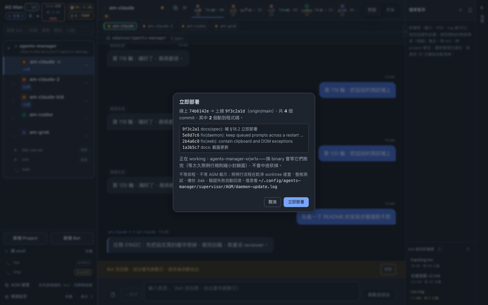
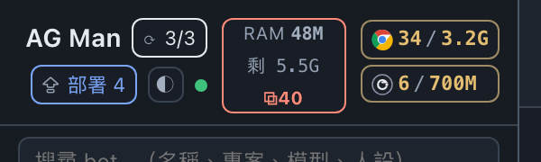
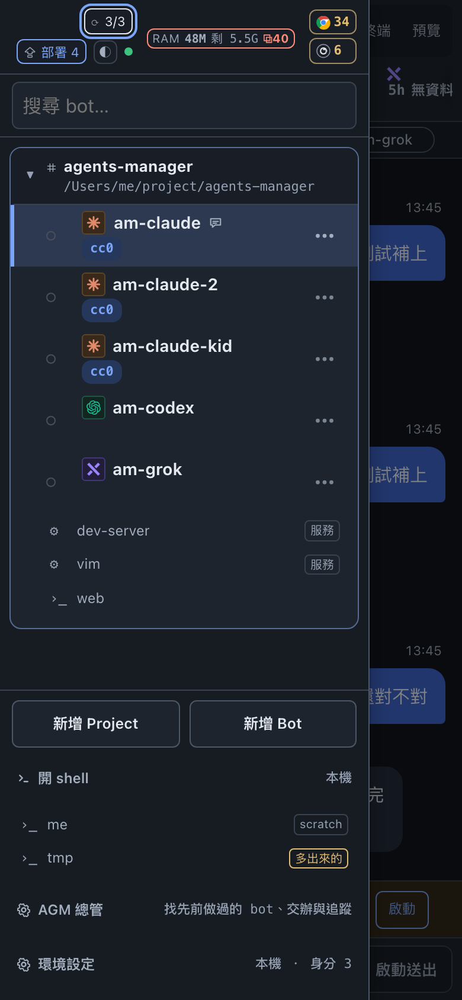
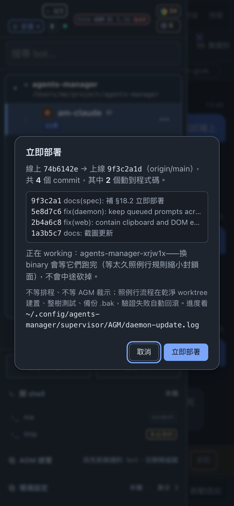

## 身份列的登出與停用（2026-09-16，使用者指定）

環境設定裡的 `ccN` 是從 `~/.zshrc` 認出來的唯讀列，先前只有「登入／切換」，所以偵測到但用不到的身份（例如 cc2）沒有任何處置方式。使用者要的是「能對它做登出登入或標為停用」。

- **每台主機一組動作**：`登入／切換`、`登出`（只在已登入時出現）、`停用／啟用`。身份是每台主機各一份（SPEC §16.2），所以三個動作都綁在那一台的晶片旁，不做全域按鈕。
- **列以 `(host, name)` 為鍵**：同名的 `cc1` 可以本機一筆、m4p 一筆。每列只查自己那台那一筆；刪除確認框寫出主機、帶那一列自己的 host；「N 個 Bot」與停用標籤只算那一台；明寫 host 的列只顯示那台的登入晶片；shell 認出來的 `ccN` 只被**同一台**的 config 同名蓋掉。
- **登出先問一次**：它會清掉那個帳號的憑證，對話框寫明有幾顆 bot 綁著它、以及「正在跑的不受影響，下次啟動才會停在登入畫面」。登入不問——登入不會弄壞任何東西。
- **停用不是刪除**：alias 還在、登入狀態不動，只是到處都不再出現它。列上掛一枚「停用」晶片，按鈕翻成「啟用」。
- **「不再出現」是字面意思**（使用者 2026-09-16）：標題列額度條、快速新增 Bot、Bot 設定的身份選單、側欄的身分計數、群組任務挑身分全都濾掉，連它自己那把孤兒額度 key 也不列；daemon 也不再花探測去問它的額度（還有 run 在跑的例外）。只有環境設定這一頁留著它，否則沒有地方把它按回來。額度落點（誰認領裸 `claude` key）也只在沒停用的身分裡挑，頂端與側欄吃同一份清單（`quotaClaimantsOf`），挑法不看清單順序（cc0 優先，其次名字排序第一個 env 沒設的）。
- **跟額度條上那顆「停用」不是同一件事**：額度條的停用是「這個帳號沒額度了，先把它的 bot 從側欄收起來，reset 後自動回來」（純瀏覽器偏好）；這裡的停用是「這個身份我不用了」，存在 daemon，要自己按「啟用」才回來。
- **已經綁著的那一個永遠看得見**：Bot 設定的身份選單會把停用的濾掉，但**保留這顆 bot 目前選的那一個**，否則設定看起來像沒選過，使用者會以為被改掉了。
- 狀態存在 daemon（`identity_prefs`），不是瀏覽器 localStorage：手機與桌機看到的是同一份，daemon 自己挑身分時也照這份。

## 額度格不要整圈外框（2026-09-16）

桌機 grok 選取是一圈藍框、limit_hit 的 codex 是一圈紅框，看起來像兩張卡片，旁邊的 cc0／cc1 卻沒有。

- 目前那格：桌機畫**黃色外框**（圓角 outline），名字加黑（2026-09-21 使用者：「畫面在哪個 bot，header 對應的額度條就有標示」；
  2026-09-28 使用者先說「focus 不夠明顯」，再說「不要下面藍色條，與血條搞混，黃外框好了」——底下的藍線看起來像額度條）。
  用 outline 不用 border：limit_hit 的紅框是 border，兩個同時出現各畫各的。手機仍用上下邊框量表。截圖 `docs/screenshots/quota-focus/`。
- 擋住／沒額度：**紅框要留、不用紅圓點**。只有這一格用圓角外框，隔壁格 `border-radius: 0`。

## shell 的鍵盤同步（2026-09-16，使用者指定）

shell 面板本來只有「打一行、Enter 送出」：TUI（`top`、`vim`、互動式安裝程式）根本沒辦法用，只能靠下面那排 ctrl+c／Esc／Tab 按鈕慢慢按。

- ~~開關而不是預設~~ → **預設開，叫「鍵盤直通」**（2026-09-17 使用者）：打開 shell 就是要打字；只想看一眼的人點別處焦點就離開，不會誤送。開關還在，localStorage 只記「被關掉的」pane。
  **手機預設關**（#931）：手機沒有實體鍵盤，點 `<pre>` 也叫不出軟鍵盤，直通開著又不畫輸入列，等於一個字都打不進去——每次登入／開 shell 都是新的 pane id，不能要使用者每次先去關。所以初值＝這顆 pane 記著關→關、記著開→開、都沒記就看裝置（桌機開、手機關；`initialKeySync`）；localStorage 另記 `am.shellKeySyncOn`（手機上明確打開過的 pane）。手機的提示改講「關掉鍵盤直通改用下方輸入框」。
- **拿掉下面那排虛擬鍵（ctrl+c／Esc／Tab／↑／Enter／清畫面）**（2026-09-17 使用者）：直通時實體鍵盤就是那排鍵。輸入框只在關掉直通時出現（手機沒有實體鍵盤靠它）。
- **閃爍游標**（2026-09-17 使用者）：herdr 0.8.2 讀 pane 不回游標位置，從畫面推——最後一行有字的行尾，提示字元（`%`、`$`、`#`、`>`、`❯`）後補一格（`lib/termCursor.ts`）。焦點在終端上才閃，不在時是淡色靜止塊；`prefers-reduced-motion` 不閃。只在「畫面」檢視畫，「含捲動歷史」的最後一行不是游標所在。
- **面板上不再有「關閉」（只關畫面）**（2026-09-17 使用者）：留下「結束 shell／關閉 pane」一顆；要離開面板點側欄別的東西就好。
- **焦點就是開關的第二層**：鍵只在終端有焦點時送出。點別處就停，不必找「離開」快捷鍵；沒有焦點時下面那行提示會直說「點一下畫面才會收你的鍵盤」，不然使用者會對著沒反應的畫面打字。
- **⌘ 系列不攔**：`herdrKeyFromEvent` 對 metaKey 回 `null`，所以 ⌘C 複製、⌘R 重整、⌘V 貼上照常。herdr 不收的 Delete／Home／End／PgUp 也一樣留給瀏覽器（送了只會拿到 `invalid_key`），提示裡明講。
- **貼上不拆成鍵**：一段多行貼上如果拆成 `enter`，會直接被執行。改走 `text` + `enter:false`，跟真終端的括號貼上一致。
- **順序 > 批次**：每一下按鍵一個 POST 會同時在路上，抵達順序不保證。同一時間只送一個請求，飛的期間累積、下一輪一次送完（`keyQueue`）；一批失敗就丟掉後面排著的，不要接在一段沒進去的輸入後面。
- **同步時輪詢 0.25 秒**：自己打的字要等一秒才看得到的話，使用者會以為沒送出去而重打。

## 檔案暫存的下半段＝bot 給你的檔案（outbox）（2026-09-16，使用者指定；同日改讀 outbox）

一開始是「scratchpad 讓我可以在檔案暫存裡點選下載」，當天就暴露了私鑰與正式 DB 複本——scratchpad 是 bot 的工作桌，什麼都有。使用者裁示：**scratchpad 不再給使用者**，改成專用的 outbox（`$AM_OUTBOX`，SPEC §6.5f）。

- **只讀 outbox，不讀 scratchpad**：bot 要交給使用者的檔案自己放進去，放進去的就是要給人的，所以不再做「對話裡提過才列」那層過濾（那是為了在 scratchpad 的雜物裡挑出成品，outbox 用不到）。
- **同一個托盤、兩個方向**：上半段是拖進來、要**送進**對話的暫存；下半段是**從** bot 拿出來的檔案。所以下半段點一下是下載，不是放進對話。
- **每個檔案標剩多久**（`剩 42 分鐘`）：outbox 只保留 1 小時，由 AGM 清掉。剩不到 10 分鐘改用警告色（清理每 10 分鐘跑一次，下一輪可能就不在了）；到期講「即將清除」。倒數從讀清單那一刻往下扣，手機時鐘偏了也不會算錯。
- **唯讀**：不刪檔、不改檔、沒有上傳。
- **跟著選取的 bot 走**：換 bot 在 render 當下就清空清單，不然中間那一格會先畫出上一顆 bot 的檔名。子 pane 繼承母 bot 的 `AM_OUTBOX`，所以子 agent 放的檔案也在母 bot 這裡。
- **不自動輪詢，給一顆重整**：bot 放檔的時機不可預測，每秒去掃目錄只是白費。倒數字 30 秒自己走一次。
- **但 bot 的回合一結束就重讀一次**（2026-09-16 使用者：「為何沒有馬上出現／要切換頁面後才看見」）：放檔一定發生在回合裡，bot 回「放好了」的同時清單就該出現。這是跟著回合結束的事件，不是輪詢；↻ 仍然留著，給回合外手動放進去的檔案用。
- **讀不到清單不是「還沒有檔案」**（#234）：`GET …/outbox` 失敗（網路、500、404）以前被當成 `reason: null` 的空清單，畫面叫使用者「把檔案放進 `$AM_OUTBOX`」——bot 明明放了。現在 `readOutbox` 回 `reason: 'load_failed'`，空白處用警告色講「讀不到這顆 bot 的檔案清單…不代表沒有檔案，按 ↻」。**不跳 toast**：每個回合結束都會重讀，toast 會變成連珠炮；這一段本來就是附加資訊，不該讓整個暫存區看起來壞掉，但要跟「沒有檔案」分得開。截圖：`docs/screenshots/234-outbox-load-failed/`。
- **資料庫、金鑰一律不列也不給下載**：規則本來就禁止放進 outbox，daemon 還是看檔名與檔頭擋第二道。
- **一律附件下載**：`Content-Disposition: attachment` + `nosniff`，白名單外的型別一律 `application/octet-stream`。
- **最高佔暫存欄的 60%**：檔案一多整欄會被它吃掉，上半段的暫存就看不到。超過就在清單裡捲。641–1024px 的底部暫存條只有 `max-height: 46vh`（不是確定高度，百分比失效），改用 `46vh × 60%`；≤640px 本來就不顯示暫存區——**手機的去處（#929）**：整個托盤在手機是 `display: none`，outbox 沒有別的入口就等於拿不到（bot 說「放好了」，1 小時後檔案被清掉）。所以手機的標題列 Git 鈕（彈窗標題與 `aria-label` 改叫「Git / 專案資訊 / 檔案」）打開的彈窗裡，在狀態列後面畫同一個 `OutboxFiles`；彈窗內 `.modal .outbox-files` 不設高度上限，由彈窗自己捲。

### 手機的帳號警告（#930）

手機把狀態列的帳號欄（email）收掉，因為最長也最不急；但**帳號警告**（`⚠ 未登入，用的是預設帳號`，花的是別人的額度）不能跟著藏：CSS 只收 `.sl-account:not(.sl-warn)`。警告畫在「Git / 專案資訊 / 檔案」彈窗的狀態列裡；彈窗要點開才看得到，所以有警告時標題列的 Git 鈕帶 `warn` class（右上一個 6px 警告色點）並在 `aria-label` 加「（帳號警告）」。

## 選單裡的 shell pane 點得進去（2026-09-16，使用者裁示）

使用者：「這 shell pane 要在 menu 可點選進入」。專案頁已經有「其他 pane」區塊（看細節、聚焦、關閉），但它的「聚焦」是 herdr `pane.focus`——只動得了跑 daemon 那台機器的 TUI，手機上按了什麼都看不到。

- **掛在側欄專案的 Bot 清單底下**，點一下在 app 裡打開（沿用主機 shell 面板，不另做一個看 pane 的畫面）。跟專案頁那塊分工：這裡只負責「進去」，細節與關閉留在專案頁。字比 Bot 列小一號、沒有燈號——它是交代，不是主角。class 用 `side-pane*`，不跟專案頁的 `project-pane*` 撞。
- **名字**：用途 > 前景程式執行檔名 > cwd 最後一段 > pane id，永遠有字——空字串的按鈕點不到。路徑、port、是不是你手開的放在滑過去的提示。
- **有 port 的 pane 只能看**：看 daemon 給的 `read_only`（舊 daemon 沒這欄時退回看 `listen_ports`），**不看 `kind`**——掃描一看到 vim／less／sudo 就把 pane 分成 service，照 kind 鎖會讓人卡在 vim 裡出不來。進去後輸入框鎖住、鍵盤同步不算數（localStorage 記著「開」也一樣）、按鍵列整列拿掉並寫明原因。送一個 Ctrl-C 給 dev server 就是把它關掉；讓人按下去才被 403 更糟。打到一半 daemon 才回 403（`read_only_pane`／`agent_pane`）時，面板當場鎖成唯讀、關掉同步，顯示 daemon 的說明。按鍵列用條件渲染而不是 `hidden`——`.keypad{display:flex}` 會把 `hidden` 蓋掉，按鈕照樣按得到（實走時抓到的）。
- **側欄與專案頁是同一份清單**（store 的 `sidePanes`，`GET /api/panes` 一次讀完依 `project_id` 分，30 秒重讀）：專案頁關掉的，側欄同時不見；點到已經不在的 pane（面板讀到 404）收掉面板並講一聲「這顆 pane 已經關掉了」，不是閃一下就沒了。
- **沒歸屬的不掛在專案底下**：放側欄底部「開 shell」正下方一組。scratch 由 daemon 標（`GET /api/panes?unowned=1` 的 `scratch: true`），固定第一列、標「scratch」；其他標「多出來的」。舊 daemon 沒這欄就全部列、一個都不標——前端不自己猜哪顆是 scratch。
- **關閉時才發現是服務 pane**：清單讀到時還是 shell、之後才跑起 dev server，daemon 回 409 並附上最新那列；專案頁拿那一列直接跳確認框，不是只顯示「關閉失敗 (409)」。
  mock 實走：`docs/screenshots/side-panes-unowned/`（側欄底部那組、跑 vim 的 pane 打得進去、dev server 唯讀）。
- ~~不給「結束 shell」~~ → **給「關閉 pane」**（2026-09-17 使用者：直接在面板裡關 pane）。當初不給是因為面板那顆只認面板自己開的 shell；後來「結束 shell」不在清單裡會改走 `POST /api/panes/{id}/close`，原因已經不成立。按鈕叫「關閉 pane」（不是這裡開的，叫「結束 shell」會誤導），一樣二次確認；服務 pane 由 daemon 先 409，第二道確認框列出 port；pane 已經不在（例如裡面打了 `exit`）當作關好、面板收起。
- **重整回得來、唯讀照現況**：`shellView` 連 `readOnly` 一起存；深連結查不到自己開的 shell 就查 daemon 的 pane 表。原本會直接丟回首頁。從 `/` 進來（只走 `restoreShellView`）時一樣照 daemon 當下的 pane 列重算 `readOnly`／`traced`，不沿用 localStorage 的舊值。

## 「結束 shell」遇到服務 pane 要再問一次（2026-09-16，AGM 驗收 9f05b03）

第一個確認框只講「裡面正在跑的指令會結束」，沒講「裡面是 dev server」。所以前端**不預設帶 confirm**：daemon 對在 listen 的服務 pane、或讀不到它在跑什麼的 pane 回 409 `service_pane`，面板接著跳第二個確認框，寫出 port（或「讀不到狀態」），按「仍要關掉」才帶 `confirm=true` 重送。這一步不是錯誤，不跳紅字、面板也不收掉。

## 識別列的「進 herdr」一行指令（2026-09-17，使用者指定；**2026-09-30 隨識別列一起拿掉**：使用者說展開的識別列實際上用不到，標題列改成點 pane id 直接複製）

使用者：「在 pane name show 出一行字，可以 resume 後進去至該 pane 的 herdr shell」。點標題列的 pane id 展開識別列，最後一顆是
`herdr --session <session> agent focus <pane> >/dev/null && herdr --session <session>`，點一下複製。

- **先 focus 再開 TUI**：herdr CLI 的 `pane focus` 只收方向，沒有「focus 某個 pane id」；`agent focus <target>` 收 pane id，
  而且會連 workspace 一起切過去（0.8.2 隔離實測）。所以先把 server 的焦點移到那顆 pane，接著開 TUI，一進去就是它。
  `agent focus` 會印整段 JSON，丟進 `/dev/null`。
- **全文顯示、不截斷**：其他識別晶片 280px 就截；這一顆是要貼進終端執行的指令，看不到全文就不知道會跑什麼。放得下一行，放不下才折行。
- **只給本機**：遠端要先 ssh 過去、focus 得在那台跑，這裡組不出保證對的指令，不給。
- 注意：focus 會移動 server 的焦點——同時有別的 herdr TUI 接著時，它的畫面也會跟著跳到這顆 pane。

## 子 bot 用別的帳號的標示（2026-09-18 使用者）

使用者：「以這圖我分不清 cc1 表示 child，讓字更小且 cc2 不要有 border」。母 bot 的身分徽章原本會描一圈琥珀色，
看起來像另一種狀態；真正要說的是它後面那個小字＝**子 bot 用的帳號**。

- 母 bot 的身分徽章不再描邊（`.identity-diverged .identity-badge` 的 border 透明）。
- 子帳號那顆從 10px 縮到 9px：它是附註，不是第二個身分。顏色維持琥珀（額度分開算的提醒），完整說明留在滑鼠提示。
- 截圖 `docs/screenshots/identity-diverged/`。

## 額度見底那一列的 ⋯ 選單被蓋住（2026-09-18 使用者截圖）

額度 critical 的列會把 `.bot-actions` 調淡（`opacity: 0.5` + `filter: saturate(0.35)`）提醒它快不能用了。但這兩個屬性會**開一個 stacking context**：
⋯ 選單的 `z-index: 40` 只在那一格裡算數，下面幾列照 DOM 順序畫在選單上面，選單自己也跟著半透明——看起來就是一個空白框卡在列中間。

- 選單開著時那一格不調淡（`.bot-actions:has(.head-menu-pop)`），列本身抬到 `z-index: 40`（`.bot-row` 本來就是 `position: relative`）。
- 調淡本身保留：它是「這顆 bot 快沒額度」的提示，只有在選單開著的那一刻讓位。
- 驗法：`document.elementFromPoint` 取選單中心，修好前回下面那列的 `model-tag`，修好後回 `head-menu-item`。截圖 `docs/screenshots/row-menu-overlap/`。

## 回合中的「插隊」「補充」放在鎖條上（2026-09-18，issue #103；2026-09-27 使用者改）

回合還在跑時輸入框那條鎖條：`ESC 中斷`、`插隊`、`補充`、`解除卡對話`。**2026-09-27 使用者裁示**：
- 拿掉「中止並取代」——要換題會先按 `ESC 中斷`，不需要一顆「先中止再送」。
- 「立刻送出」改名 `插隊`（桌機手機同名）：claude 2.1.275 的 send-now 鍵，CLI 自己收掉那一輪再收下這句。
- 「併行送入」改名 `補充`：不建新回合，直接打進 pane，併進目前這一輪。
- `補充` **只給 claude**（codex／grok 不畫）；`ESC 中斷`、`解除卡對話` 每種都有。
- **`插隊` 依 bot kind 分兩種**（2026-10-02，issue #748；文案在 `store/sendNowCopy.ts`）：
  - claude：`插隊`——send-now 鍵，打斷目前那一輪、改開新回合。
  - codex：**`插入`**——不打斷、不開新回合，字打進忙碌的 TUI，由 codex 的 `instant_interrupt`（0.159 起）併進**同一輪**；對話裡記成「補充」。
    按鈕照樣**不看旗標與版本就畫**（理由同下面的「不擋」）：`[codex] instant_interrupt` 預設關、codex 自己那側也要開，不合資格時 daemon 回 409＋中文原因
    （旗標關是 `send_now_unsupported_kind`、版本不足／不明是 `send_now_codex_too_old`／`..._version_unknown`），前端原樣顯示。
  - grok／shell 不畫。
  - 成功 `send_now: "steered"` 顯示「已插入進行中的回合」；bot 閒著時被閘門拒絕（200 帶 `send_now_*`）依 kind 講原因，**不再一律說「claude 還沒有 send-now 鍵」**。

- **預設仍是排隊**：送出鍵不變（`排隊送出`），插隊是次要動作，要多按一顆才會打斷別人的回合。
- **不擋**：這顆不看版本就顯示。前端猜不準 pane 跑的是哪一版（statusLine 才知道），猜錯會變成「按鈕明明在卻不能用」；
  不合資格時 daemon 回 409 並附中文原因，前端原樣顯示，比灰掉一顆沒有說明的按鈕清楚。
- **手機也要有插隊**：把插隊藏在手機外更糟，使用者本來就常從手機插話（`docs/screenshots/send-now/`）。
- **灰字不模擬**：CLI 自己會把 sent／queued 的訊息畫成灰色直到模型收到，前端不重畫一份。
- **插隊、補充都留在對話窗右邊（2026-09-28 使用者：「因為也是一種發出的訊息」）**：兩種都是使用者的藍泡泡，meta 上多一個小標
  `插隊`／`補充`（`SentViaTag`，讀 `messages.sent_via`）。補充的泡泡掛在當時那一輪下面（它沒有自己的回合，回覆併在那一輪），
  由 daemon 打字成功後寫、`message_added` 推來；前端不先畫一顆樂觀泡泡——打字失敗時會留下一顆沒送出去的字。
  插隊只有真的打斷了一輪才標，閒著時按插隊就是一般送出，不標。

## 沒在跑的 bot 按送出：訊息先交給 daemon（2026-09-19，issue #122）

- **輸入框上方一條，說實話**：交給 daemon 之後顯示「啟動中，起來後自動送出：<那一則>」＋「取消」；啟動失敗改成
  「沒能啟動（原因），還沒送出：」＋「重新啟動」「取消」。狀態從 daemon 的 turn 推出來，重整、換裝置看到的一樣。
- **不重複**：有這一條時不再顯示對話底下那條「Bot 未在執行中＋啟動」——同一句話兩條、兩顆啟動鈕，按第二顆只會撞上正在進行的啟動。
- **取消＝放回輸入框最前面**（跟取消排隊同一個規則，附件要重加）；已經送出去的撤不回來，照實說「撤不回來」，不把字塞回輸入框。
- **再打一則**：排在它後面（瀏覽器那一格），提示寫「bot 起來、前一則送出後才輪到它」，不寫「這回合還在跑」。
- 截圖：`docs/screenshots/start-send-122/`（啟動中、沒能啟動、手機 390px、重新啟動後送出）。
- **沒在跑的 bot 的輸入框與送出鍵不借用「回合還在跑」的字**：`composerState` 的 `queued` 有三種來源（回合在跑、已有一則在等 bot 起來、bot 沒在跑），
  字分開（`lib/composerLabels.ts`）。沒在跑：輸入框「輸入訊息…（bot 沒在跑，送出會先啟動它）」、送出鍵「啟動並送出」（手機「啟動送出」）；
  對一顆停著的 bot 說「這回合還在跑」「排隊送出」是說謊。截圖：`docs/screenshots/composer-stopped-labels/`。

## 送出結果「欠著／不明」時前端怎麼說與怎麼收（2026-09-19，#161 #162 #173 #176）

daemon 這幾天把「寫不進 DB」改成 fail closed：外面的副作用做了、DB 那一半欠著，回 503 而不是假裝成功或失敗。前端的判準是**字有沒有進 bot**，不是 HTTP 成不成功：

- **`503 delivery_state_uncommitted`／`send_now_state_uncommitted` 且 `sent` 不是 `false`＝已送出**：`sendPrompt` 回 `true`（輸入框清掉、排隊的不放回去）、鎖上那一回合、通知「已送出…不要重送」。回 `false` 會讓輸入框留著同一段字、flush 又用新的 client_request_id 送一次（API.md §5）。`sent:false`（herdr 拒收）才維持沒送出。「請 AGM 現在重建」同理，落在「已送出但送達不明」，不說「送給 AGM 失敗」。
- **插隊送出 200 的 `send_now`**：`interrupted`／`idle` 是成功；`not_sent`＝送出鍵沒生效，這一則沒送出、字可能還留在終端輸入框（輸入框保留、通知指向終端）；`unknown`＝不知道生效沒有，說結果不明、先別重送，不記進行中的本地回合（那一則已是 failed，沒有回合可「放棄」）。不再一律說「claude 太舊、照一般方式送出」。
- **409／503 顯示人話**：`composer_busy`／`resume_unverified`／`transcript_*`／`host_unreadable` 等打字前擋下的 409 有固定說法（沒送出、怎麼辦）；帶人話 `message` 的（維護窗口、`interrupt_unconfirmed`、`identity_login_unavailable`、`default_session`…）直接顯示 daemon 的 `message`，不顯示 `reason` 代碼——**不論有沒有 `retryable`**：`reason` 是機器 key、`message` 才是給人看的（API.md），以前只有 `retryable:true` 才用 `message`，登入找不到 CLI、default session 的 bot 不給開關這兩條只剩代碼（#233）。
- **外部 Cargo「測試連線」先存再測**：`POST /api/build/remote/test` 測的是已儲存的設定；表單有沒存的改動就先存，結果寫明測的是 `user@host`。
- 截圖：`docs/screenshots/remote-cargo-test-saves-first/`。

## 輸入框卡著草稿：輸入列上方常駐一條，送出框裡那段／清掉再送我這則（2026-09-26）

bot 的終端輸入框裡留著一段沒送出的字（claude 的「Edit prompt and retry」最常見），網頁每送一則都 409 `composer_busy`；以前只跳一句「清掉或送出之後再送一次」的 toast，網頁上卻沒有地方能清或送，使用者只能自己去終端。

- **常駐，不是 toast**：409 帶了 `draft`（SPEC §4.4a「框裡卡著草稿」）就在輸入列上方放一條（`ComposerDraftBar`，黃底），顯示框裡那段（等寬、最多約四行可捲，daemon 截過 500 字時註明），留到使用者選了動作、按「取消」、或之後任何一則送成功為止。有這一條就不另跳 toast；舊 daemon 沒帶 `draft` 照舊只跳那一句。
- **三個動作**：「送出框裡那段」（主按鈕；daemon 對 pane 按 Enter、照一般 prompt 開回合，自己輸入框裡的字不動，之後照常送）、「清掉再送我這則」（輸入框裡沒有自己的字時停用）、「取消」（只收起這一條，框裡的字不動）。daemon 沒給的動作不顯示（沒驗過的 kind、讀不出字）；一個都沒有時說明要到「終端」分頁處理。
- **按下去之後**：按鈕鎖住、主按鈕顯示「送出中…」／「清除中…」。框裡換了字（`draft_changed`）＝這一條換成新的內容並說一聲、等使用者再確認，不會替使用者送出或清掉沒看過的字；清不掉（`draft_uncleared`）＝這一條留著剩下的字、通知指向終端；框已經空了（`draft_gone`）＝收掉這一條。
- 草稿動作遇到 `503 delivery_state_uncommitted` 時也要解鎖：`sent:false` 保留草稿列並清掉 busy，`sent:true`／`null` 則收掉草稿列，避免使用者對已送出或送達不明的字再按一次。
- 截圖：`docs/screenshots/composer-draft/`（mock：`__amMock.composerDraft('<bot>', '<字>')`）。

## claude 的「建議下一句」：輸入列上方一行，點一下 Tab＋Enter 送出（2026-10-03，使用者：「加入 claude 的建議下一步的 prompt，要一模一樣 tab + enter 送出」）

claude（2.1.280 起）回合結束後在終端輸入框畫一句灰字建議，終端按 Tab 收下、Enter 送出。網頁看得到這一句、能一鍵送出，而且**送出方式跟終端一模一樣**：daemon 對 pane 送 Tab 再送 Enter（SPEC §4.4a「建議下一句」），不是把字打進去。

- **位置與長相**：輸入列上方一行（`SuggestionBar`），灰色虛線框的整條按鈕：左邊小字 `Tab ⏎`（提示這等於終端的兩個鍵），右邊是建議（單行、過長截斷，完整內容在 tooltip）。不另佔一塊版面；手機同一行、整條都是點擊區（至少 36px 高），沒有第二顆按鈕。
- **什麼時候顯示**：claude、run 在跑且 `agent_status` 是 idle、daemon 給了 `run.prompt_suggestion`，**而且**輸入框沒字、沒附件、沒有回合在跑／排隊、沒有「框裡卡著草稿」那一條。使用者開始打字就收起來（不跟他的字搶位置）。回合一開始（不再 idle）daemon 就把它清成 `null`。
- **按下去**：按鈕禁用、文字換成「送出中…」；成功＝照一般網頁 prompt 的樣子開一個回合、對話窗出現一則使用者訊息（內容是 CLI 實際收到的原文），輸入列鎖成回合進行中。失敗＝跳通知講原因（`suggestion_gone` 建議已被用掉或終端輸入框有字、`suggestion_changed` 換成別句了、`tab_not_accepted`、`composer_unreadable`…），而且按了 Tab 的情況要明講終端變成什麼樣（「已按 Tab，框裡那句也清掉了」／「那句還留在終端的輸入框裡」）；框裡是使用者自己打的字時沿用「框裡卡著草稿」那一條讓人處理。
- **不翻案**：不自動送、不預先填進網頁輸入框（使用者要的是終端那兩個鍵）；`CLAUDE_CODE_ENABLE_PROMPT_SUGGESTION=false` 的全域覆蓋拿掉（SPEC §4.4a），個別 bot 要關在 bot env 設 `false`。
- 看畫面：`VITE_MOCK=1` 下 `__amMock.suggestion('<bot>', '<字>')`（`am-claude` 啟動後預設就有一句）。

## herdr 版本顯示在 hosts 面板（2026-09-19）

升級 herdr 時使用者要能在 UI 確認結果，所以每台主機（含本機）的那一列多一行小字 `herdr 0.9.1 · protocol 22`（等寬、`text-dim`）。

- **CLI 與 server 版本不同**：整行改警告色並展開一句說明（「CLI 是 0.9.1，但跑著的 herdr server 還是 0.8.2：bot 的 herdr 指令會回 protocol_mismatch，要重啟 herdr server」）。
  這是升級最容易踩的洞（#242 審查），只看 CLI 版本會誤以為升好了。
- **protocol 不在實測清單**：同樣警告色，寫「未驗證」。
- **讀不到**（主機沒連上、舊 daemon 沒這欄位）：寫「herdr 版本：未知」，不用別的欄位去猜。
- 不放狀態列：版本是低頻資訊，狀態列每個字都要跟額度、context 搶位置；hosts 面板就是使用者驗收升級會去看的地方。
- 文字組合在 `lib/herdrVersion.ts`（有單元測試）。截圖：`docs/screenshots/herdr-version/`。

## 主機工作環境一致性顯示在 hosts 面板（2026-10-02，issue #719）

每台主機（含本機）在工具徽章下面多一行「一致性：…」（11px、`text-dim`），資料是 `hosts[].baseline`（SPEC §16.7，只讀檢查）。

- **與基準一致**：「一致性：與基準一致」，淡色。**有差異**：「一致性：N 項不一致（M 項嚴重）」，嚴重紅、只有提醒黃；下面逐項列缺什麼（嚴重的排前面），滑過去看穩定 id。
- **未知不是全缺**：還沒量過（剛連上、舊 daemon）寫「尚未檢查」；探測沒跑完（`issues: null`）寫「未知」並在 tooltip 說明——一次 ssh 逾時不能在每台主機喊一排缺漏。兩者都不上色。
- 只報告，面板上沒有「修復」按鈕：自動安裝／同步要使用者另行同意。Mac 專用項在 Linux 主機根本不會出現（daemon 端就不列）。
- 文字組合在 `lib/hostBaseline.ts`（有單元測試）。

## 預覽分頁：頂層 bot 的 vite dev server 內嵌在右半面板（2026-09-19，issue #253）

- **只給頂層 bot**：tablist 在「對話／終端」後多一個「預覽」，`parent_bot_id` 為空且 `managed_by='user'` 才出現（`routeSync.isTopLevelBot`）。
  子 agent、team 成員看不到；網址 `/bots/<id>/preview` 對它們退回對話。
- **四種狀態**（`PreviewPanel.tsx`）：`off` 一顆「啟動預覽」＋會在哪個目錄找 vite；`starting` 進度條＋取消；`running` iframe＋工具列（重新整理、在新分頁開、停止）；
  `failed` 顯示 daemon 給的最後 40 行輸出＋「重試」「關閉」。狀態由 `preview_changed` 即時更新，進面板時再 GET 一次補 `dir`／`error`。
- **iframe 網址 `http://${location.hostname}:${port}/`，不帶 token。** 現行 dev UI 拿 token 的方式是啟動時打一次 `GET /api/session`（只存記憶體，不讀網址）；
  vite dev 的 `/api` proxy 從 loopback 打 daemon，所以被預覽的若是 AG Man 自己，iframe 是另一個 origin 也不需要我們遞 token。
  不用 `?token=`（會進網址列、歷史、log）、不用 `postMessage` 遞 token（多一條要維護的信任路徑）。
  取捨：預覽的是別的專案而它自己要 UI token 時，這裡不代辦——那是它自己的認證。
- **重新整理是換 iframe 的 key**：跨 origin 拿不到 `contentWindow.location.reload()`；代價是會丟掉頁面內的暫存狀態（預期如此）。
- **手機**：一樣有這個分頁，iframe 滿版（去掉左右框線與圓角）。截圖：`docs/screenshots/preview/`。
- **mock**（`VITE_MOCK=1`）：三個端點與 `preview_changed` 都演；iframe 用 `srcDoc` 放一頁說明，因為沒有真的 vite。

## 環境設定的「Jev 第二意見」（使用者 2026-09-19，issue #240）
- API key 用 `type="password"` 的輸入框，存檔後清空；daemon 不回 key，所以這裡只顯示「已設定／未設定（原因）」，沒有「顯示 key」。留空存檔＝不更換。
- 「啟用」那一行直接寫出會送什麼出去（專案撞限畫面最後 60 行、遮罩後、送到 TypeSafe），不收進說明或 tooltip——這是會讓內容離開這台機器的開關。
- 沒有可用的 key 時開關不能勾；專案名單沒勾任何一個＝不送（兩層都要開，SPEC §4.3c）。專案區在開關關著時整塊 disabled。
- 舊 daemon 沒有端點時整塊只顯示一句「需要更新 daemon」，不顯示壞掉的表單。
- **v2：先接既有的 vite（2026-09-20，#253）**：running 的工具列標明來源（「已接上既有的 vite（port N）」／「由 AG Man 啟動」）。
  接上的預覽停止鍵改叫「中斷連接」並提示只斷開、不關對方的 server。`off` 時 `candidates` 多於一個給下拉選目錄；
  `others`（別份 checkout 的 vite）列出 port＋目錄並註明「看到的不是這顆 bot 的程式碼」，「還是接這個」送 `{mode:"attach", port}`。
  手機列寬不夠，網址讓給來源說明。
- **v3：桌機改成 `.app` 最右邊獨立一欄（2026-09-20，#253）**：使用者要「檔案暫存的右邊再長一塊大區域」，所以預覽不再是主面板的分頁。
  `.app` grid 變 `側欄 | main | 檔案暫存 | 預覽`（`PreviewColumn.tsx`，第四軌用 `auto`、欄寬由元件 inline 決定；手機預覽也開著時它的 213px 軌照舊）。
  - **掛在 `main` 外**（同 ImageShelf）：換 bot 不 unmount，同一顆的 iframe 不重載；切對話／終端分頁也不動它。換到另一顆 bot 才換 iframe（`PreviewPanel` 以 bot id 為 key）。
    選到子 agent／team 成員或專案群聊時整欄不存在（預覽只屬於頂層 bot）。
  - **寬度可拖**：欄左緣 8px 的 `role="separator"` 手柄（Pointer capture，拖曳中 iframe 關 pointer-events，不然會被 iframe 吃掉事件），也可用 ←／→ 鍵每次 24px。
    下限 320px、上限視窗 50%（再寬主面板擠得沒法用）、預設視窗 40%；放開才寫 localStorage（`am.previewCol.width`），視窗縮小時只在顯示端夾限、不改存的值。
  - **可收合**：預設收合，原位置留一條 36px 的窄條與「◧」開關。預設收合是因為不是每個人每顆 bot 都要看預覽，別預設吃掉主面板的寬。
    **展開狀態後來改成每顆 bot 各記一份，見下面 v5**（這裡原本寫的全域旗標 `am.previewCol.open` 已經不是現況）。
  - **≤1024px（抽屜版面與手機）沒有這欄**，維持 ChatPanel 的「預覽」分頁：沒有空間開第四欄。桌機因此不再顯示那個分頁。
  - **直接挑本機已開的 vite**：`others` 列出本機所有 listen 中的 vite，依 `relation` 分三組——這顆 bot 自己的目錄（`same_dir`，按鈕「接這個」）、同一個 repo 的其他 checkout（`same_repo`）、其他專案（`other`）；
    後兩組標黃字「不是這顆 bot 的程式碼」，按鈕都叫「還是接這個」，送 `{mode:"attach", port}`。缺 `relation` 的舊回應照 `same_repo` 看。off 與 failed 兩種狀態都列。
- **偵測不到 vite 設定檔時，清單才是主角（2026-09-20，#253）**：使用者實測 wits-ops 只看到紅字「找不到 vite 設定檔」。`off`／`failed` 一律畫 `others`（依 relation 分組，顯示 port＋目錄＋repo），
  即使 `candidates` 是空的、偵測失敗。`no_vite_config` 降為次要灰字（「AG Man 沒辦法自己起」），試過的路徑收進 `
`（可能十幾條會洗版）；
  「由 AG Man 另起一顆」收進摺疊，本機有 vite 在跑時自己起是次要路徑。面板容器改成可捲（原本 `margin:auto` 置中，清單一長上下會同時被切掉又不能捲）。
  進面板與狀態變化時都重打 GET：`DELETE` 只回 `{status:"off"}`，不重打的話清單會在停止後消失。
- **v4：從「vite 預覽」擴大成「本機 dev server 預覽」（2026-09-20，#253）**：使用者的 :3200 是 Next，偵測寫死 vite 就看不到。UI 字眼全面改「dev server」（端點路徑 `/preview` 不變）。
  清單每筆前面一顆 kind 標籤（Vite／Next.js／webpack／…，沒見過的名字首字大寫，`unknown` 顯示「其他」；舊 daemon 沒有 `kind` 就當 vite）。
  「啟動預覽」旁一行小字寫清楚「會在 <目錄> 跑 <指令>」：目錄與指令取自選中的 `candidates`（v4 每筆可帶 `command`），沒有候選時用 daemon 回的 `command`；
  兩者都沒有就只說「指令由 daemon 依專案決定」，不猜。`candidates` 同時吃字串與 `{dir, command}`。
- **v5：預覽欄的開／關是 by parent bot（2026-09-20，#253）**：A 開著、切到 B 不跟著開，切回 A 還原。每顆 bot 各記一格，存 localStorage `am.previewCol.openBots`（`{botId: true}`，沒記＝收合），重整照舊。
  欄寬維持全域一份（調一次就好）。收合條的開關位置不變，按下去只影響當下這顆。舊的全域旗標 `am.previewCol.open` 不遷移：升級後每顆 bot 預設收合。
  （mock 的 bot id 每次載入都重新產生，所以 mock 下重整看不到還原；真 daemon 的 id 是穩定的。）
- **v6：清單一筆一行、認得出的排前面、unknown 收起（2026-09-20，#253）**：原本每筆印完整絕對路徑、折兩行，八筆洗掉整個面板。現在
  `[kind chip] :port 短路徑 ……接這個`，一行、超出省略、完整路徑與 pid 放 `title`。短路徑（`lib/previewList.ts`，有測試）：在這顆 bot 的專案根底下＝相對於根（根本身取最後一段），
  不在底下（`other` 那組）取最後兩段；repo 標記跟短路徑重複就不印。組內排序：kind 不是 `unknown` 的在前、照 port；同目錄的多個 port 排在一起並各標一顆「同目錄」小標。
  `kind=unknown`（多半是 hono BFF、ffi-server 之類的後端）預設收起，最底一行「顯示其他 N 個服務」展開／收起；分組順序與 `other` 的警語不變。
  整列就是一顆按鈕（鍵盤與讀屏可聚焦，`aria-label` 寫明要接哪一個），右邊的「接這個」只剩次要文字；手機把它拿掉、列高加到 32px 好點。
  列高 26px：桌機預設欄寬下含分組標題八筆不用捲動。
- **v6：連不到的預覽不給空白 iframe（2026-09-24，issue #527）**：`allow_lan` 關著時 daemon 把自己起的 dev server 釘在 loopback（#434／#452），所以從手機或別台機器開的頁面一定連不到那個 port（走 tailscale serve 的 https 頁面更是連請求都不會發：http 的 iframe 算混合內容）。daemon 的預覽狀態多回一格 `lan`（＝`allow_lan`），前端在 `lan === false` 且 `location.hostname` 不是 loopback 時把 iframe 換成說明（哪一台、為什麼、要開 `allow_lan`），並停用「在新分頁開」。`lan` 不存在（舊 daemon）＝不知道，照舊嵌 iframe。「手機一樣有這個分頁」不變——變的是連不到的時候講出來。

## 主力那列（★）固定順序、可拖曳，不再照未讀／忙碌跳位（2026-09-20，#344）

使用者：「不要這優先序排了，改為固定式且可 drag & drop 調整。」原本 `UnreadChip` 組內照「需要回答＞有未讀＞在等子 agent＞目前選中＞其餘」排，主力那幾顆會因為未讀或狀態變化自己換位，手指剛要點的晶片被擠走。

- **不再排序，狀態只用顏色與角標表示**：主力組照 daemon 的 `primary_position`（同值＝未拖過，照原順序）；其餘組（在跑、剛完成、要回答）照側欄順序。未讀出現／消失、bot 開始跑或卡住，主力晶片的位置都不動。
  拿掉優先序也就拿掉「要回答的自動排最前」這個提示效果；補償是本來就有的紅色 needs-reply 樣式與角標，且那類晶片在其餘組裡仍會出現。
- **順序存 daemon（`POST /api/order` 的 `primary`），不進 localStorage**：手機與桌機追同一組。前端送**完整**的主力順序（含側欄收起來、沒畫成晶片的），不是只送看得到的那幾顆。
  樂觀套用，失敗就回捲並提示「主力順序沒存起來」。
  同一排序範圍（主力／專案／某專案的 bot）的存檔**依序送**：前一個 POST 結束才送下一個（`store.ts::saveOrderTracked`）。每個 POST 都是整份順序、後到的贏，
  並行送時先發的舊順序可能晚到、蓋掉已存的新順序，且兩個都 200、不會有提示（#391）。晚到的舊失敗照舊不回捲較新的樂觀順序（#275）。
  依序送就要有逾時：transport 本身不設逾時，卡住的一個會讓後面的存檔排到重新整理為止。每個 order POST 從真的送出起算 15 秒，
  逾時就中止 fetch（不中止的話它晚到一樣會蓋掉新順序）、照一般失敗回捲並提示，下一個接著送。逾時只加在這條，不是整個 transport。
- **拖曳用 pointer events**（`components/usePinnedDrag.ts`），不用 HTML5 DnD——後者在觸控上不會動。滑鼠按住移動超過 5px 才開始拖，避免吃掉單純的點擊；
  觸控要**長按 350ms** 才拖（之前手指動超過 10px 視為在捲動、放棄），因為手機那排本來就是橫捲；拖曳中用非 passive 的 `touchmove` 擋住捲動。拖完那一下 click 會被吞掉，不會順便選到那顆 bot。
  落點（`lib/pinnedOrder.ts::dropBefore`，有測試）：晶片會換行，所以先看游標在哪一行、再在那行裡找第一顆中心點在游標右邊的——插在它前面，都沒有就接在行尾。放置位置用一條主色線標在目標晶片左緣（放最後面時標在最後一顆右緣）。
- **鍵盤替代**：聚焦主力晶片後 `Ctrl+←／→` 移一格（不動的頭尾會說「已經在最前／後面」），移完焦點留在原晶片，並用 live region 報「X 移到主力第 n 位，共 m 位」。
  每顆主力晶片 `aria-describedby` 指到一段畫面上看不到的說明（可拖曳、Ctrl+方向鍵、觸控長按）。
- 截圖：`docs/screenshots/primary-order/`（拖曳前、拖曳中、拖曳後、手機）。
- **拖曳動畫（2026-09-20 使用者要求強化）**：抓起來時晶片浮起（放大 1.06、陰影＋主色外框）並**跟著游標**（inline `transform`，不吃游標事件，落點靠座標算）；原位留空，旁邊的晶片在落點讓出 14px 缺口（`margin` 過渡 0.16s，後面的自然滑開）加一條主色線；放開時同一次渲染（`flushSync`）收起拖曳並套用新順序，`components/useChipFlip.ts` 用 FLIP 讓每顆晶片從舊位置滑進新格（0.22s，被拖的那顆從放開的地方滑進去）。**`prefers-reduced-motion: reduce`：不位移、不縮放、不做缺口，落點只剩主色線，換位瞬間完成。**
- **落點判定與標示（2026-09-20 第二輪，使用者：「drop 點放開大一點，顯標示欲落點」）**：判定改成 `lib/pinnedOrder.ts::pickSlot`——每顆晶片之間（與行首、行尾）各一個插入點，游標選**離它最近的插入點**，
  命中區從縫隙往兩邊各延伸到相鄰晶片的中線（不必對準縫隙；游標離開列上下很遠也鎖最近那一行），再加 **16px 遲滯**（離目前鎖定的落點不比離新落點遠超過 16px 就不換，交界不抖）。
  量位置時扣掉晶片目前實際的 translateX（讓位的位移），否則讓位一開位置就變、落點會來回跳。
  標示：落點之後同一行的晶片往右讓出**一個被拖晶片的寬度**，空位畫一個**虛線＋淡底、會脈動的膠囊**（放在行尾則畫在最後一顆右邊），一眼看得出放開會落在哪。
  **減少動態**：不讓位、不脈動，但標示還在——目標晶片外圍虛線框＋一條 4px 的主色落點線。
  失敗的通知帶 daemon 的原因（舊 daemon 不認得 `primary` 會回 400），不只說「沒收到」。截圖：`docs/screenshots/pinned-drag/`（`scripts/pinned-drag-shots.mjs`，mock 模式）。
- **手機主力區：4 顆一排的 grid、收合時最多三排、不橫捲（2026-09-20，#344 追加）**：手機（≤720px）的主力區不再是橫捲列，改成 `grid-template-columns: repeat(4, 1fr)`、往下換行、收合時三排——前幾顆由使用者用拖曳決定（`lib/pinnedOrder.ts::PIN_GRID_MAX`）。
  **超過 12 顆時第 12 格是「+N」**（2026-09-23 使用者：「手機版 header 主力只兩排，多的呢」——原本多的直接不畫，完全找不到）：
  收合時畫前 11 顆＋「+N」，點了展開全部（多幾排），最後一格變「收合」；+N 是虛線框，藏起來的有要回答／未讀時吃同一組狀態色，
  tooltip 照桌機 `+N` 的規則寫出藏了什麼（`pinGridLayout`）。截圖：`docs/screenshots/pin-3rows/`（舊的兩排版本：`docs/screenshots/primary-order/grid-more-*.png`）。
  名字長用省略號、4 顆等寬；星號、未讀數、狀態點不縮。其餘那組維持橫捲。桌機不變。
  被藏起來的主力仍在完整順序裡：拖到可見的最後面（或鍵盤 Ctrl+→ 移到第 11 位）會插在被藏起來的第一顆**前面**（`endBefore`），不會跳到它們後面去。
- **主力到三排 12 個才收（2026-09-23 使用者：「調整主力區可以到三排 12 個，超過才要」）**：手機收合上限從兩排 8 格改成三排 12 格（≤12 全畫、>12 畫前 11 顆＋第 12 格「+N」）；
  桌機主力那一組收合時最多三行（原本兩組都在時一行、只有主力時兩行）。沒釘的那組規則不變，主力行數再多也不佔它的額度。
  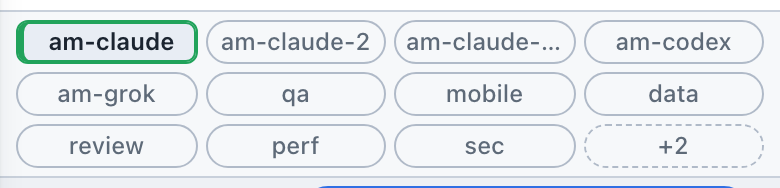 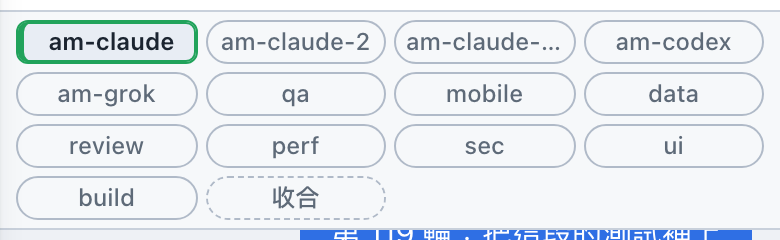 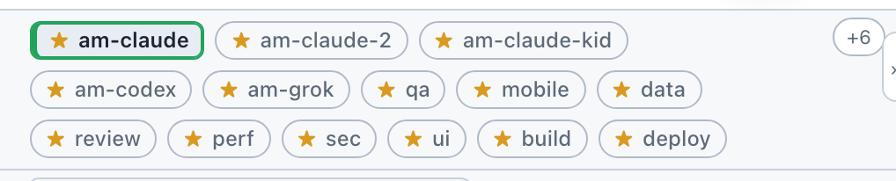 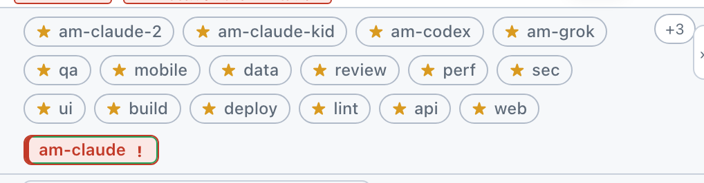
- **手機主力晶片：★ 換成狀態燈（2026-09-20，#344 再追加）**：那一區全是釘選的，★ 每顆一樣、只佔寬度。空出來的位置放跟側欄同一顆的燈（`botLamp`，語意與顏色照 SPEC §2.2）：
  idle 綠、working 藍且脈動、blocked 紅（加一圈光暈，並保留晶片本來的 needs-reply 樣式與 `!`）、unknown 黃灰、離線空心圈、斷線灰。原本晶片右側的狀態點是同一件事，在這一區隱藏。
  未讀數字照舊並存；有未讀的晶片是 accent 底，藍色 working 燈會融進去，所以那種晶片的燈加白邊。燈是 `role="img"` 帶狀態文字，讀屏聽得到。桌機那列不變（★ 是分兩組的依據）。截圖：`docs/screenshots/primary-order/lamp-1-mobile-mixed.png`。
- **手機主力晶片的燈只在「值得注意」時才畫（2026-09-20，#344 補充 3）**：idle（綠）是常態，每顆都亮是雜訊。只畫 working、blocked、unknown、斷線；idle 不畫，離線與啟動／停止中也照字面不畫（補充只列了那四種）。
  沒燈的晶片名字置中，未讀數字照舊。截圖 `lamp-1-mobile-mixed.png` 已換成這個樣子（idle 那顆與離線的 w3、w4 沒有燈）。
- **主力晶片標示「子 agent 在跑」（2026-09-20，#344 補充 4）**：條件沿用 `waitsKids` 的定義——`parent_bot_id` 指到這顆、且 `working` 或 `blocked` 的子 bot；但**數量**另外記（`kidsRunning`），而且不受自己狀態影響
  （舊的 `waitsKids` 在自己要回答時會被壓掉，這個不會）。符號是一個小的分叉圖示（形狀跟燈、狀態點都不同，不是同一顆燈換色），多顆時帶數字（>9 顯示 `9+`），畫在晶片最右；桌機與手機都畫。
  自己 idle 時只有這個圖示（idle 燈照補充 3 不畫），自己 working 又有子在跑就兩個都看得到。`title` 與 sr-only 文字都加「N 個子 agent 在跑」（`lib/chipStateText.ts::kidsText`，有測試）。
  有未讀的晶片是 accent 底，圖示改跟字同色。截圖：`docs/screenshots/primary-order/kids-1-desktop.png`、`kids-2-mobile.png`。

## 對話倒回：每則使用者訊息上常駐的「↶ 倒回這裡」（2026-09-23，issue #405；2026-09-28 使用者改）
- **綁在那則訊息上，桌機手機都一樣、常駐**（`components/RewindButton.tsx`）。使用者 2026-09-28：「rewind 還是綁在對話上比較合適，而不是多一個倒回鍵」——
  取代 09-24 做的輸入列旁「⟲ 倒回」＋挑一則的清單（那顆與 `RewindBar` 已拿掉）。09-24 的起因是桌機「滑過才出現」找不到，所以這次桌機也常駐、不靠 hover。
  codex／grok、default session、回覆、群組發言不畫（子 agent 有）。不能按時照樣畫但 disabled，title 講原因（沒在跑／正在跑／卡提問）。
- **一定先確認**（`RewindConfirm`）：倒回會拿掉這則之後的問答，按錯代價大。確認框寫出會拿掉幾則、在終端用 claude 的 /rewind（不重啟）、檔案不還原；確認鈕用 danger 樣式。
- **被倒掉的不藏、收成淡色＋「已倒回」**：紀錄要能回頭看（例如想起來那一輪其實有用的一段）；藏起來會讓人以為訊息不見了。
- **原文接回網頁輸入框最前面**，不覆蓋原本打到一半的字（沿用 `prependDraft`）。CLI 也會把原文放回終端的輸入列，那一份 daemon 清掉——兩邊都留會讓下一則接在它後面；清不掉時通知叫人去終端清。
- 截圖：`docs/screenshots/rewind/`（`scripts/rewind-shots.mjs`，mock 模式；`MOBILE=1` 出手機那組）。
   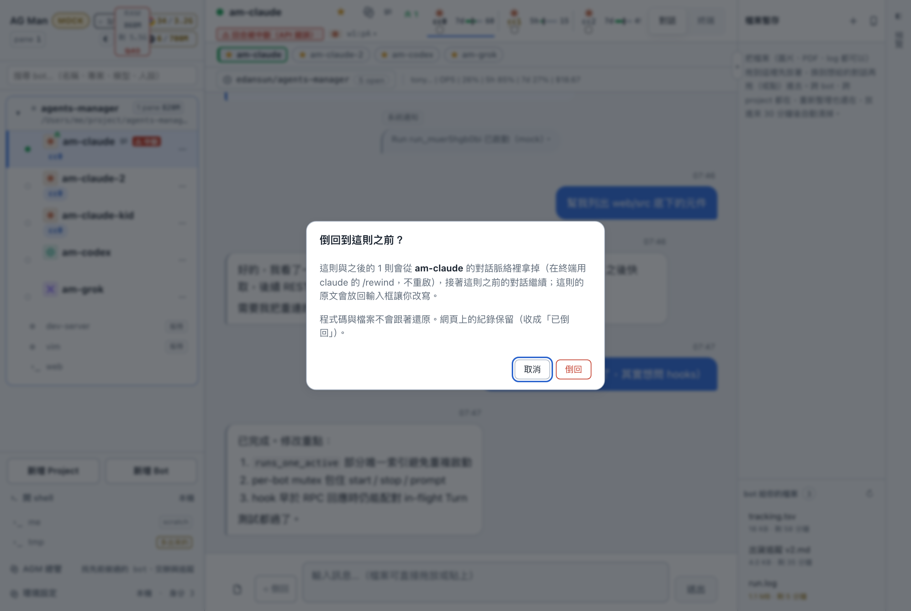 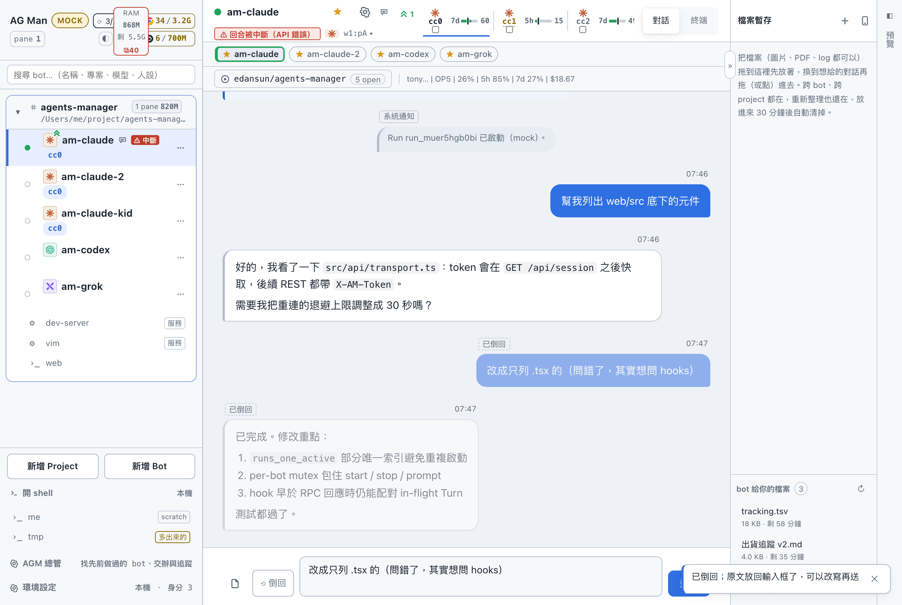 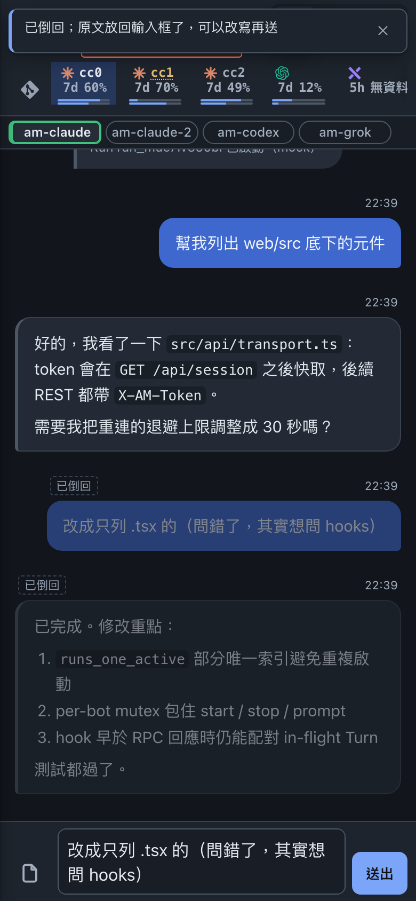

## 刪 AGM 的 bot 要第二次確認（2026-09-24，issue #406）

daemon 對 AGM 的 bot（總管／角色本身、它們的 child、總管專案裡的工人）的刪除回 409 `supervisor_owned`，要帶 `?confirm=supervisor` 才刪。
網頁不能因此變死路（09-23 13:28Z 那兩刀很可能就是從網頁按的），所以一般的「刪除 Bot」確認之後若收到這個 409，**不跳錯誤通知**，改跳第二個確認框
「這是 AGM 的 Bot」：寫名稱與 daemon 給的角色（`role`），說明「刪了 AGM 可能會壞」。焦點照確認框慣例落在「取消」；取消什麼都不送，
「仍要刪除」才帶參數重送，成功後照常是帶「復原」的通知。判斷集中在 `lib/agmDelete.ts`，框是 `AgmDeleteConfirm`（掛在 App 根層，側欄 ⋯ 與 Bot 設定兩個入口共用）。
不在第一個框就先問：前端不知道哪些 bot 算 AGM 的（那是 daemon 查 supervisor 表才知道的），照 409 走才不會兩邊規則分岔。
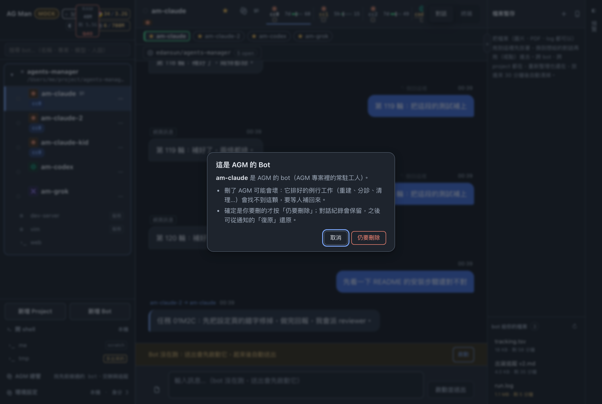 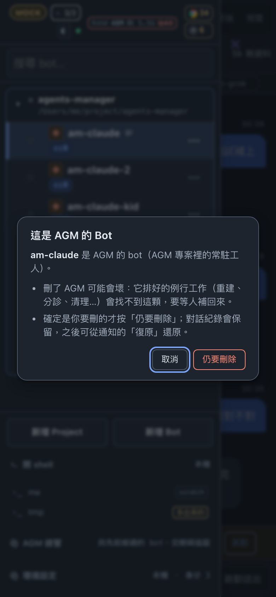

## 附件上傳的進度、中止與重試（2026-09-24，issue #435）

使用者：「上傳中該要有 progress」——上限放寬到 50 MB 之後，卡片只寫「上傳中…」，傳很久也看不出還要多久、有沒有卡住。

- **上傳走 XHR，不走 fetch**（`api/transport.ts::xhrUpload`）：fetch 拿不到 request body 的進度。token header、錯誤格式（非 2xx 照樣丟 `ApiError`）不變；
  **不設逾時**（跟原本一樣）——慢網路上 50 MB 本來就要很久，卡住時卡片上看得到進度停住，× 會真的中止。
- **卡片第二行**：壓縮中寫「壓縮中…」（圖片先在瀏覽器縮，`lib/imageCompress.ts`）；上傳中寫 `3.2 / 12.6 MB · 25%`（單位跟著總大小、百分比往下取整），
  底下一條 3px 的 accent 細條。**文字是主體、條是輔助**，不靠顏色；條是 `role="progressbar"` 帶 `aria-valuenow`／`aria-valuetext`，沒有 aria-live（每 50ms 念一次是噪音，失敗另有通知）。
- **× 是真的中止**：移除、清空、換對話、元件卸載都 `abort()` 那一次上傳；使用者自己拿掉的不算失敗，不記錯、不跳通知。
- **失敗**：卡片紅框、寫「失敗：原因」（全文在 tooltip）＋「重試」；壓過的重試直接傳壓好的那份。壓完仍超過上限的不給重試（再傳一次也一樣）。
- 送出鍵照舊：還有卡片在壓縮／上傳就擋著（「上傳中…」）；有失敗的卡片也擋（issue #917）：送出鍵 disabled、字樣「有附件上傳失敗」，Enter／插隊送出會跳「有附件上傳失敗：按卡片上的「重試」或把它移除，再送」；原本不擋，結果訊息少了那個檔案、送成功後還把失敗卡片與重試鈕一起清掉。單一 bot 與群組一樣。
- 手機的 × 是 44px 觸控目標，卡片右側留白跟著放大、重試鍵 28px 高，才不會跟 × 疊在一起。
- **那行字的精度同時是重繪的節流門檻**（issue #438）：XHR 的上傳進度事件最密約每 50 ms 一次，而卡片的 state 住在 `ChatPanel`，
  每一次都重繪會把整個訊息列一起帶下去。`attachmentUpload.ts::progressGate` 只在**這行字真的會變**時才 dispatch
  （50 MB 實測 6000 個事件變成 601 次，少 90%，而且一階都沒少）。要改文案的精度就是在改重繪頻率，兩者刻意綁在一起——
  用畫出來的字當門檻，而不是固定時間或固定百分比，才不會出現「字會變但畫面沒更新」的落差。
- mock 模式下檔名帶 `stall`（停在 25%）、`fail`（傳到 40% 回 502）、`slow` 可以重現這幾種畫面。
  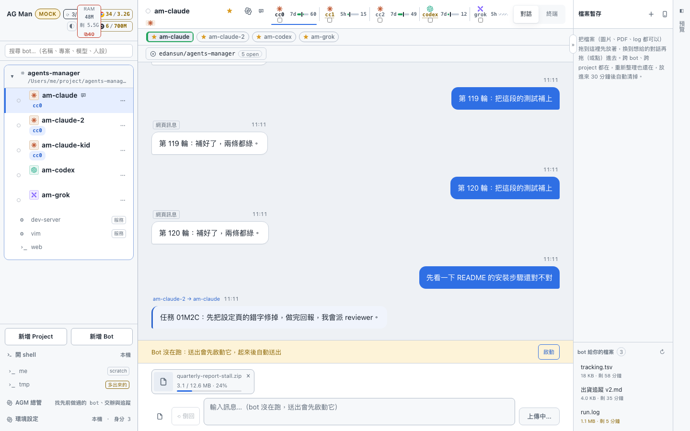 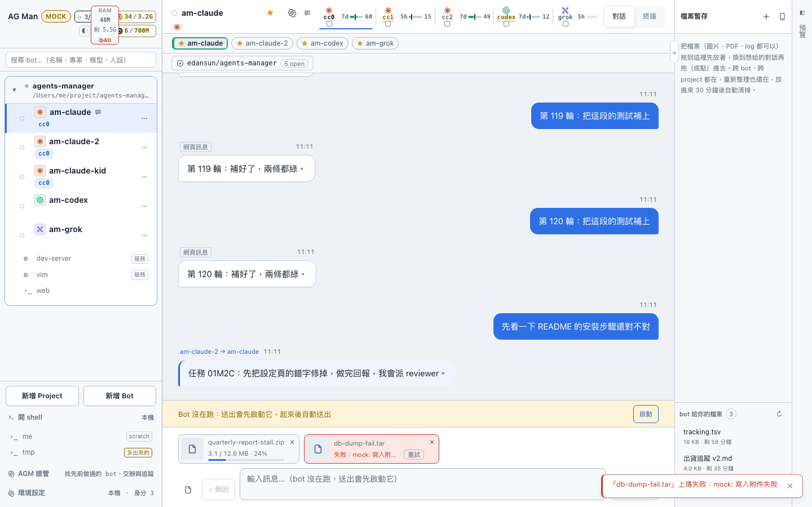 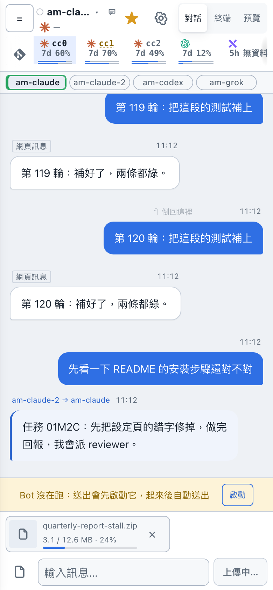 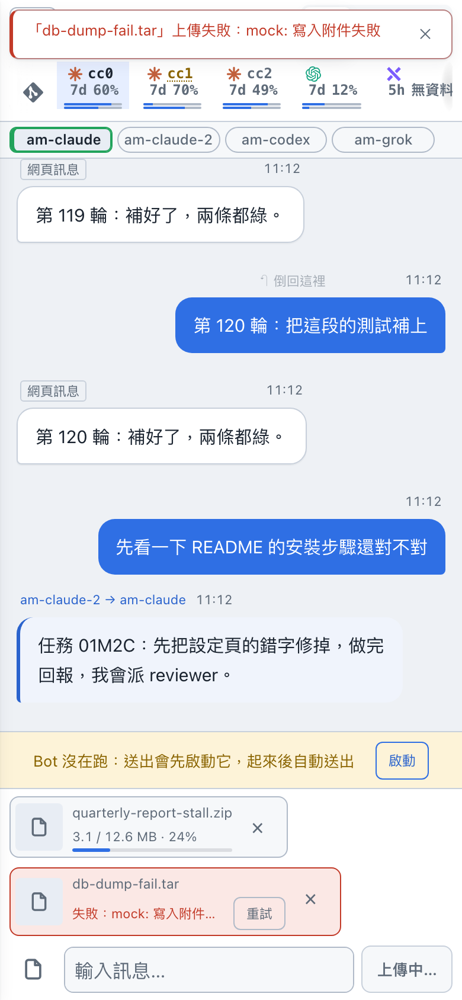

## claude 用 CLI 登入、不佔 bot 的 pane（2026-09-25，使用者：「抓到 auth fail 要能快速登入，用 cli 的方式而不是卡著」）

cc1 的 bot 好幾個回合都收在 `authentication_failed`，對話只寫「這一回合失敗收尾（帳號或授權）」，沒有能按的東西；而 Bot 設定與額度 popover 的「登入」是把 `/login` 送進那顆 bot 的 pane——
它本來就卡在 `Not logged in`，再送一個登入流程進去只會讓它更卡，完成之前送給它的訊息也全卡住。

- **新增身份的 env 文字框不靜靜丟掉打錯的行**（2026-10-02 審查）：少打 `=`、key 帶空白或數字開頭、重複的 key，逐行列出錯在第幾行並鎖住「新增身份」——丟掉的話身份的 env 變空的，悄悄用了預設帳號。身份列與 tooltip 顯示 env 時，名字含 KEY／TOKEN／SECRET／PASSW／CREDENTIAL 的值遮成 `••••••`（會被截圖、被旁人看到）。⟳ 重啟徽章在 `needs_restart` 為真、但改的是已知落差欄位（model／effort／fast／identity）以外的東西（人設、args、env）時也留著，顯示「設定已改需重啟」，不只在設定面板開著時才看得到。
- **主機與外部 Cargo 表單的欄位檢查跟 daemon 同一條規則**（2026-10-02 審查，`lib/hostForm`、`lib/remoteCargoForm`）：ssh 目標（不能空、不能 `-` 開頭、`@` 後面也不行、不能有空白）、herdr_session（1–64 字英數開頭）、port（1–65535 的整數）、外部 Cargo 的主機／帳號（`A-Za-z0-9._-`，主機可有 `:`，不能 `-` 開頭）、工作目錄（`A-Za-z0-9._-/`，不含 `..`）、cargo jobs（1–64，daemon 會把更大的悄悄截成 64）。不合就在欄位下講原因、鎖住送出，**不再把打錯的數字悄悄收斂成預設值**（以前 port「2222x」變成 22，連到別的埠、也沒有任何提示）。
- **關分頁／重整的 `beforeunload` 確認**（`hooks/useUnsavedGuard`）：Bot 設定面板有未儲存變更、外部 Cargo 表單改了沒存（比對「按儲存會送出的值」，初始讀取失敗則比對表單預設值）、新增主機／新增身份的任何欄位打了一半（也包含名稱仍空白的進階欄位／env）、專案改名打到一半時，瀏覽器會問一聲；存了、改回原樣、面板關掉就不攔。儲存請求等待期間較晚輸入的欄位不被舊回應清掉。面板自己的「放棄未儲存？」只擋得住面板內的關閉。
- **claude 一律在獨立的主機 shell 跑 `claude auth login`**（SPEC §16.3a），不送 `/login` 進 bot 的 pane：有身份走 daemon 的 `…/identities/{identity}/login`（env 由 daemon 照主機偵測到的設定組、`$HOME` 在那台展開，登完重驗、收 pane），沒綁身份開 shell 打不帶 env 的那行。
  入口三個：auth 失敗那則訊息、Bot 設定的「登入 / 切換帳號」、額度 popover「未登入」列。grok 這次不動，仍把 `/login` 送進 bot（使用者要改的是 claude）。
- **auth 失敗那則訊息底下兩顆鍵**：「立即登入」（primary）與「登入好了，重試」。重試＝重新偵測身份，確定還沒登入就只提示；否則重送上一則使用者訊息。
  不做自動重送：登入要人到瀏覽器授權，什麼時候好只有人知道；按一下的成本很低，自動重送猜錯會多燒一個失敗回合。
- **只掛在最後一則 auth 失敗**，之後出現正常回覆就收起來——一顆連錯五次的 bot 不該長出五排按鈕。agent 回覆只認「整則就是 `Not logged in · …/login`」那一行，引用那句話的回報不算（同 SPEC §18 協調者登入偵測的教訓）。
- **被登出就主動提示登入**（2026-10-04，使用者：「應該要偵測到有被登出就提示我登入，而不是去身份裡面點」，#838 補充）：主畫面最上面（連線條、主機離線條之後）一條黃底提示，每個被登出的 claude 身分一行：「⚠ **cc1（m4p）已登出**　1 顆 bot 在用它，剛才有回合因為登入失效失敗」＋主按鈕「立即登入」（走 `loginIdentity`＝直接打開上一條的登入協助面板）＋「先關掉」。
  只在**有 bot 綁著那個身分**、那台主機連得上時出現（沒人用的身分登出不吵人；主機離線有離線條）。來源是身分探測說未登入，或 daemon 記的回合授權失敗（`login_needed`；遠端 claude 探測問不出未登入，這是 m4p 的唯一訊號）。手機：整條在內容區頂端、文字一行、按鈕 ≥36px，「立即登入」撐滿。
  **同一次登出不重複洗版**：「先關掉」以那一次的識別（daemon 的 `since`；探測來源用固定字）記在這一頁的記憶體——不存 daemon、不用 localStorage（關掉是這個畫面的事，不是跨裝置的事實；重整或換裝置會再看到還登出著的身分）。登入成功（探測回已登入或 daemon 清掉記號）提示自動消失並清掉關掉記錄，之後再被登出會再提示。
- **手機版直接給「打開登入網站」與 code 輸入框**（2026-10-04，使用者：「手機版重新登入已失效的 claude，應該要更容易地跳出登入網站、輸入 token，用 m4p 的 cc1 驗證」，#838）：claude 身分按「登入」開出的 shell 面板最上方多一條協助條（`ClaudeLoginAssist`）——
  主按鈕「打開登入網站」（`<a target="_blank" rel="noopener noreferrer">`，網址是 daemon 從登入畫面取出的 OAuth 網址；CLI 還沒印出來時停用）、一個 code 輸入框（`autocapitalize/autocorrect` 關、等寬字）＋「送出 code」。送出鈕只在 daemon 說畫面**正在等 code**、格式合 OAuth code 時才能按；
  下面一行說明隨階段換字（等網址／去登入網站／貼 code／已送出／失敗）。CLI 說失敗就把 `Login failed: …` 顯示在輸入框下面、輸入框保留可再貼；CLI 結束、pane 被收掉後，條上改顯示重驗後的結果（已登入（帳號）／還是未登入／這台問不出登入狀態），附「重新偵測」。
  手機：條放在終端上方、按鈕與輸入框 ≥40px 高、窄螢幕一欄（打開網站整列、輸入框＋送出一列），不必捲到終端或選取任何字。桌機照舊看得到下面的終端。一般 shell、別種 CLI 的登入 pane 不畫這條（第一次問 404 就不再輪詢）。網址與 code 不存 store／localStorage。
  mock：`loginIdentity` 對 claude 會開出這樣的登入 pane，送 `bad…` 開頭的 code 演失敗，其他當成功。
- 截圖：`docs/screenshots/auth-cli-login/`（`scripts/auth-login-shots.mjs`，`MOBILE=1` 出手機那組；mock 模式：`__amMock.loggedOut('am-claude', 'cc1')` 後送含 `authfail` 的訊息）。
  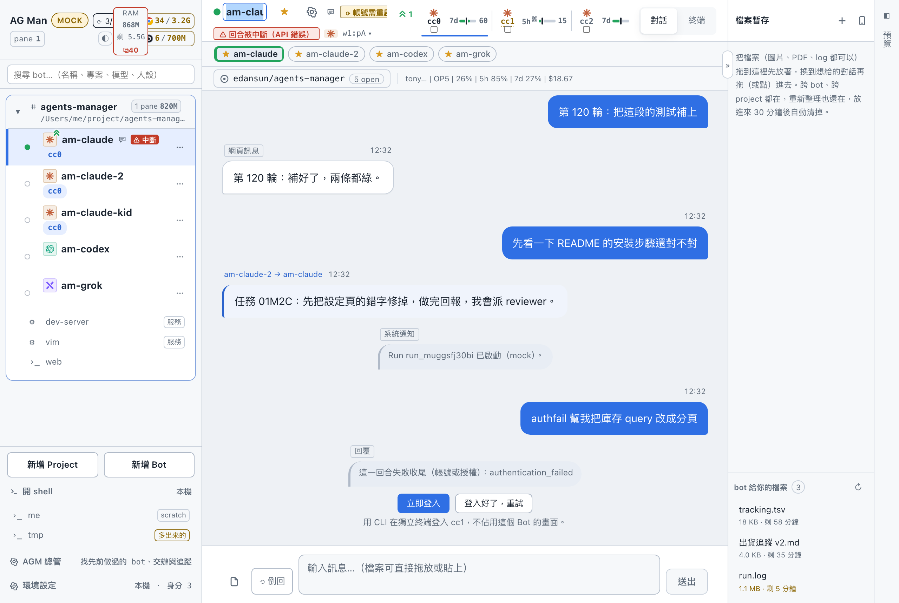 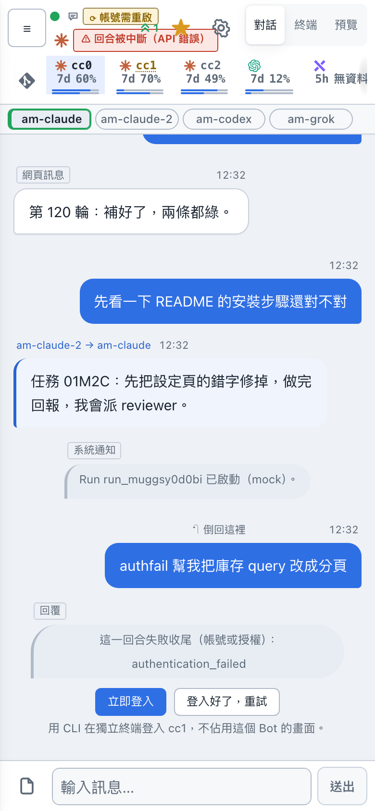

## 「需要回應」框：手機上第一屏一定是能點的選項（2026-09-25 使用者，issue #559）

使用者：「A 各種 手機版根本無法回應」。兩題的 AskUserQuestion、終端太矮：從對話紀錄補回來的原題卡整張攤開在框的最上面、
又在唯一的捲軸外面，把選項擠到只剩半列；iOS 上框本身又比可視區高，標題與底部按鈕一起出畫面。

- **選項優先**：原題卡在認得出選單時預設收成一行「▸ 原題（N 題）」，放進同一條主捲軸、排在選項**後面**；展開也不會把選項推走。
  認不出選單時（只剩終端快照＋按鍵）才預設攤開、排在終端上面，那時它是唯一讀得懂的題目；它自己捲，不把底部按鍵擠出去。
- **原題是唯讀摘要，不是第二份選項區**：作答要照畫面送鍵（送前重讀、對不上就不送），游標、`Type something`、`Submit` 列都只有畫面知道，
  transcript 不知道；把它做成可點等於繞過這條規則。所以選項寫成散文清單（不編號、不加粗、不畫框），畫面上正在答的那一題不再列一次選項，
  卡頭寫「只供閱讀；作答用上面的選項」。
- **畫面沒畫出的東西從原題補到選項上面**：題目被裁掉時 `bc-question` 用原題的題目；分頁列被裁掉但原題有好幾題時，給「← 第 N／M 題 →」
  （送 ←／→，跟分頁列同一條路）。第幾題是比對出來的（先比問句，沒有問句時比選項，兩題都對得上就不猜）。
- **手機是全螢幕 sheet**：跟其他對話框一致（`.modal.blocked-modal` 的特異性原本蓋掉了通用 sheet 規則）。底部「鍵盤直通」的長說明在直通關著時講的是實體鍵盤，
  手機上藏起來；開關本身照舊常駐（#545）。
- 回歸檢查：`node scripts/verify-blocked-mobile.mjs`（mock `__amMock.twoAsk()`，量 390×844／390×640／1440×900 第一個選項整列可見且點得到，並在手機上真的點完兩題＋送出）。
  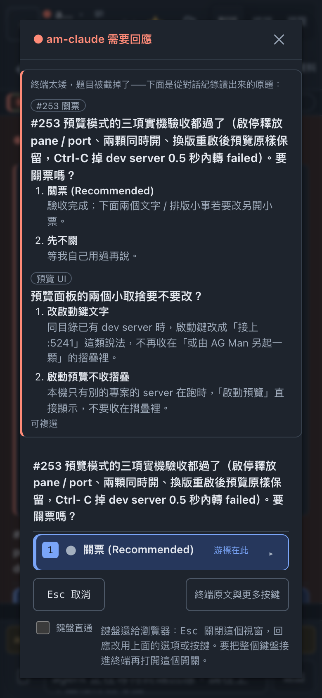 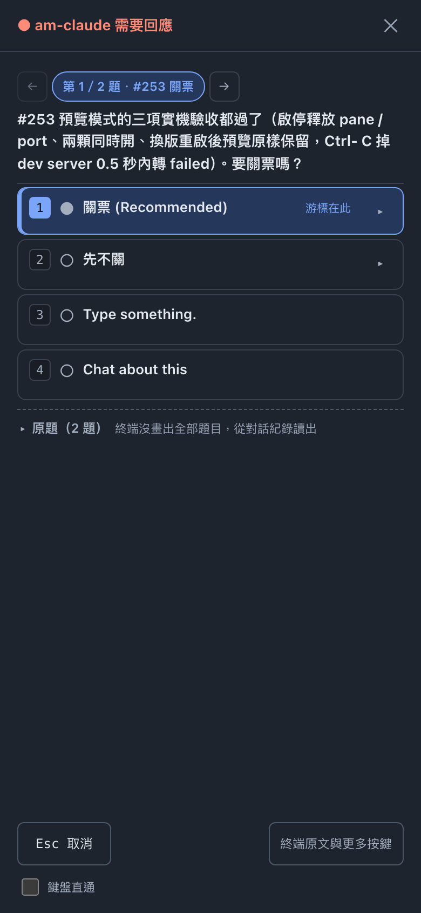 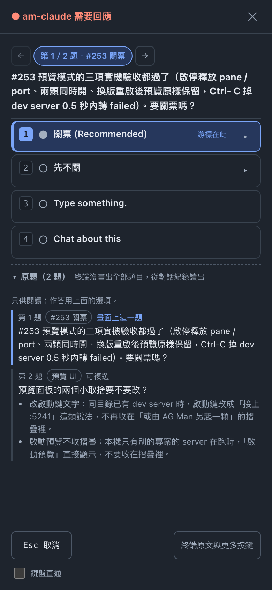 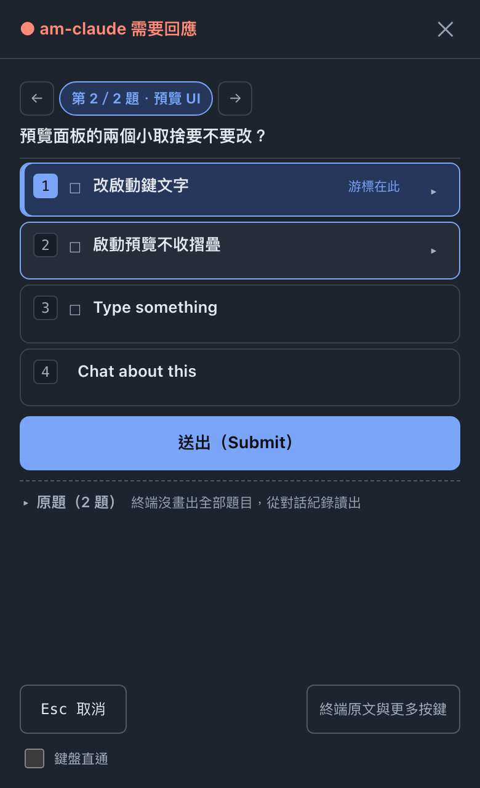 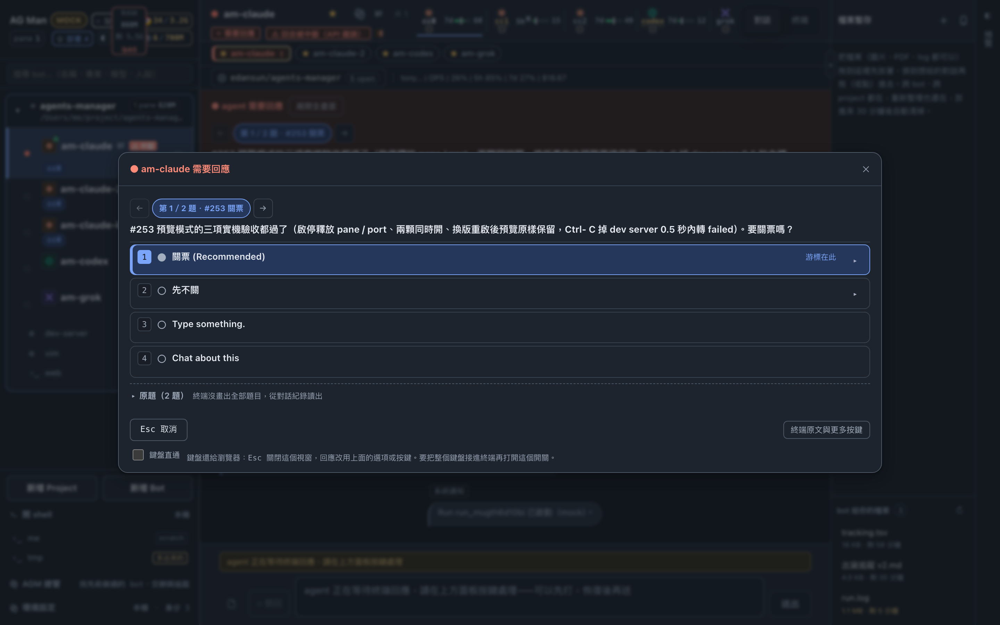

## 更新框的「分析」：先攤已分診的結論，codex 也能請 AGM 解析（2026-09-25，issue #561）

使用者：「codex 的更新能抓到在 header show 出來了嗎？要跟 claude 一樣分析是否有對系統的優化」。

- **先給看得到的結論**：上游分診帳本（SPEC §18.2c）早就逐條分析過 claude／codex 每一版，只是網頁沒讀。更新框右半邊的「分析」
  把 `(跑著的版本, 新版]` 每一版攤開：提防（琥珀）／採用（綠）／值得早升（accent），一律帶文字標籤；已寫成提案的條目只列提案標題與
  issue 連結，不逐條重複（0.157.0 那種五條提防三張提案，逐條列會把框撐爆）。
- **提防不用紅**：紅只給「要你本人動手」（通用原則）；提防是給排升級的人看的風險，不是現在要按的東西。
- **沒有就明講「尚未分析」**，指向框底同一顆「請 AGM 解析」。不另做一顆框內按鈕：框底那顆 claude 本來就在，兩顆會搶焦點。
- codex 與 claude 同一個區塊、同一顆按鈕；codex 的版本區間從 `update_notice` 讀（新版還沒裝，磁碟是舊的）。

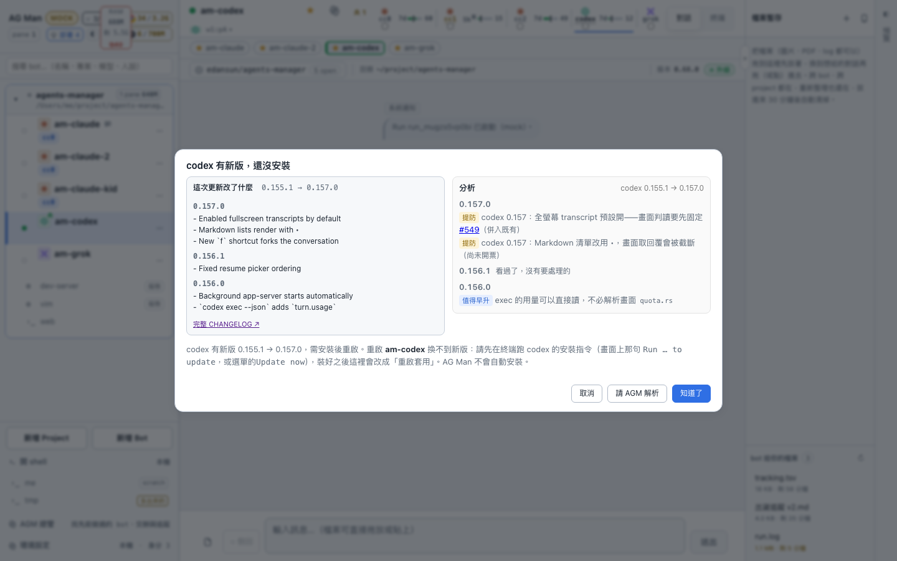 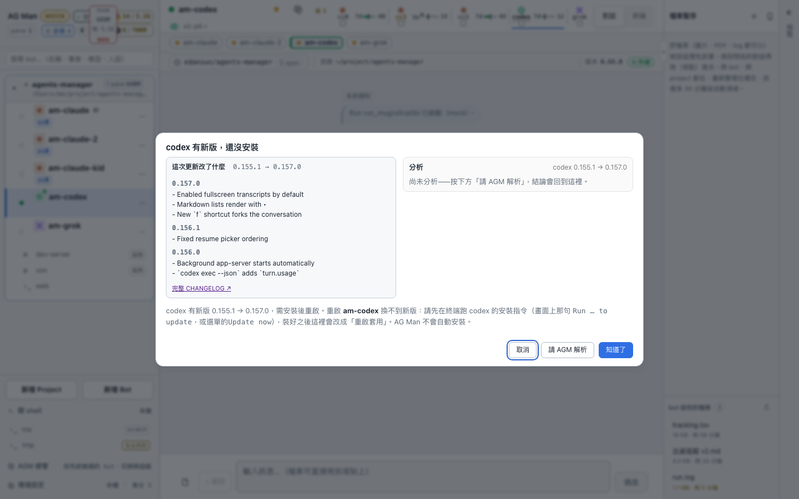
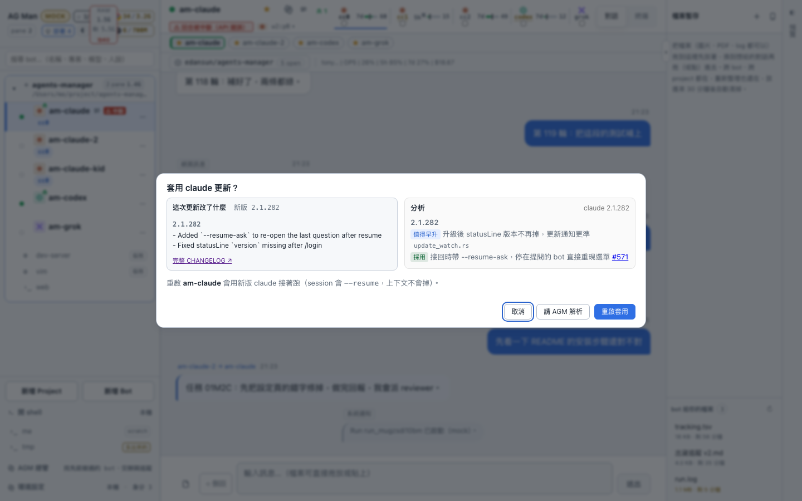 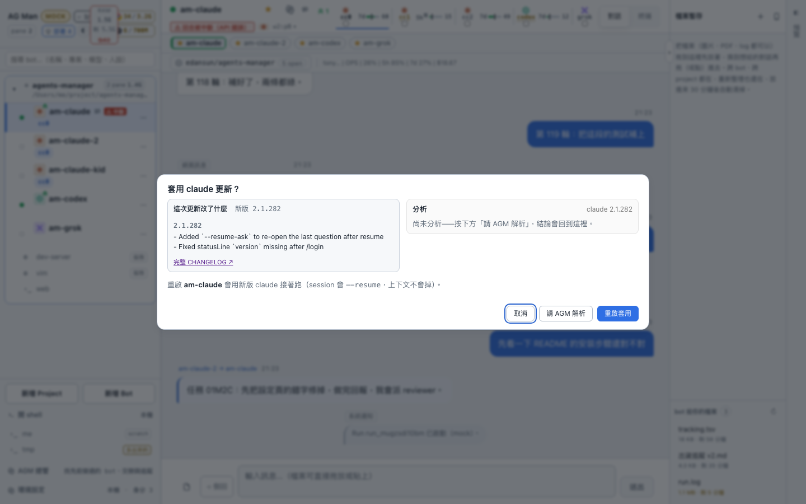
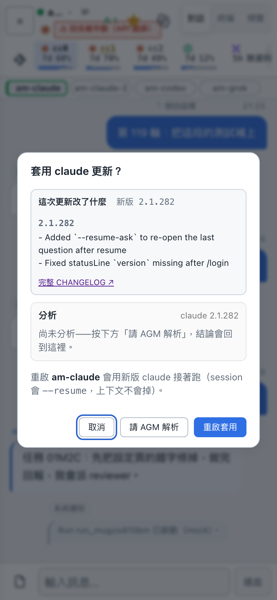 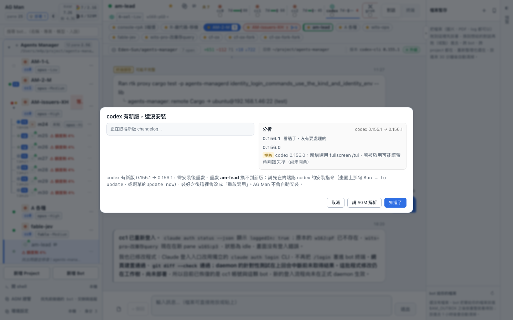

## Claude fleet 安裝提示持續留在 header（issue #725）

使用者：「應該也要有提示，而不是只幫她安裝」。Claude 有新版或主機版本不一致時，提示是主要入口，toast 只是補充。

- **Claude 安裝 chip 持續顯示**：npm 上游版更新、任一主機落後、版本不一致或目標已知但版本讀取失敗時，header 顯示警示色 ⌃⌃ N。tooltip 與確認框都逐台寫目前版本（或錯誤）→共同目標；只有 fleet 全部到目標才消失。狀態取自 `upstreamUpdates.claude` 快照，不由 toast 或 active run 決定。
- **安裝與重啟分開確認**：確認框列出所有已安裝 Claude 的主機，只對落後或讀不到版本的主機執行固定的 `claude install <target_version>`。只有按「安裝到 N 台」才送請求；已到目標的不重裝。daemon 精確驗證版本後，run 轉成既有「已安裝，重啟套用」，再由一般的重啟 ⌃⌃ 開另一個確認框；安裝流程不自動重啟。
- **帶「知道了」**：純資訊通知 4 秒就消失，這則是要人去處理的，帶一顆動作鈕讓它停 15 秒（同刪 bot 的「復原」）。
- **每個新版本每個瀏覽器一次**：daemon 只推一次（跨重啟也記得）；推的當下沒開網頁會錯過，開機再讀快照補上，看過的版本記在 localStorage。
  抓不到上游的錯誤通知只在 daemon 推的那一次跳，重整不重跳。
- **手機**：重啟、Codex 安裝、Claude fleet 安裝有兩項以上同時出現時合成單一 ⌃⌃ 圖示選單；選單每項仍各自打開原本的確認框。
- 驗證：mock 提供 `latest_version`、`target_version` 與多台 `hosts`；截圖在 `screenshots/claude-install/`。

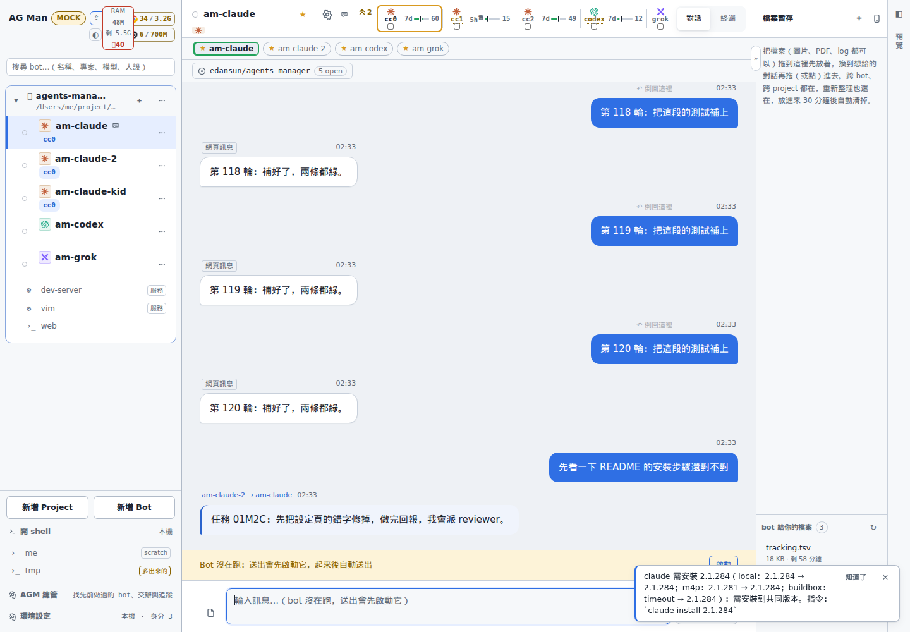 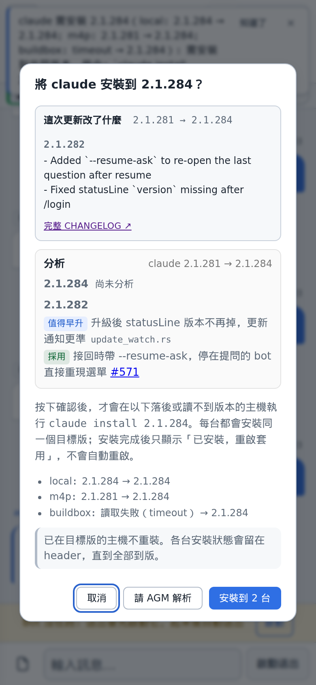

## header 的 herdr 一鍵更新：同一個樣子，但警告擺最前面（2026-10-01）

使用者：herdr 的更新要跟 claude／codex 一樣「header 出現徽章 → 確認框（左 changelog、右 AGM 解析、下面列會重啟的）→ 一鍵更新」。採完整重啟版（SPEC §6.9）。

- **同一組 chip，數字位置寫 `herdr`**：外觀跟 codex／claude 那兩顆一樣（警示色 ⌃⌃，並排不畫分隔線），但三顆可能同時出現，數字分不出是哪一種；
  herdr 這顆改寫小一號的 `herdr`。更新中是 `⌃⌃ herdr…`（tooltip 寫目前階段，等閒下來那段會講「最多 30 分鐘」），跑完換 ✓／⚠ `herdr`，
  點開才看名單、按「知道了」才收起——結果有「誰沒接回」「哪些子 agent 沒了」，4 秒的 toast 不夠讀。
- **確認框的重點是後果**：changelog／分析之下第一行是危險色的「**所有 Bot 會中斷約 1 分鐘**」；接著一段流程（先下載驗證、等全部閒下來、
  起不來會換回舊版），再列「重啟後接回這 N 顆」與「這 N 個子 agent 會被結束、不會自動接回，由母 Bot 視需要重開」。名單是前端照
  「那台在跑的頂層／子 agent」估的，實際以 202 回的 `will_resume`／`children_lost` 為準（進度 tooltip 用的是 daemon 回的）。
  確認鈕是 danger 樣式：這顆按下去影響的是全部 Bot，不是一台的一種 CLI。
- **遠端或 shared 主機：徽章照樣出現、按鈕停用並講原因**：只有遠端落後時 chip 退成灰（`waiting`），點開框底只寫原因（「遠端主機：這版只支援
  更新本機」或「共用 session：別的 daemon 也在用」），確認鈕「無法從這裡更新」。不藏起來：落後是事實，藏了就沒人知道要去那台手動升。
- **手機**跟 codex／claude 一樣併進合成的 ⌃⌃ 選單（第四項），各自打開原本的框。
- 狀態放自己的 store（`store/herdrUpdate.ts`），不塞進 `useStore`：同時只會有一次，結果要留到人看完，跟快照替換無關。重整後靠
  `GET /api/state` 的 `herdr_updates` 接回進度；daemon 說沒在跑就清掉漏掉 done 留下的進度。
- 驗證：`VITE_MOCK=1` 下 `__amMock.herdrUpdate()`（`{failOne: true}` 演一顆沒接回、`{reason: 'busy_timeout'}` 演整次沒做、`{reason: 'restart_failed'}` 演換回舊版、`{hold: 'waiting_idle'}` 停在那一步）。
  失敗的說明用 daemon 的 `detail`；按鈕被 409 擋下時直接顯示 daemon 寫好的 `message`。herdr 沒有分診帳本，分析區塊只有「AGM 解析」那一段（沒派過就寫尚未分析）。

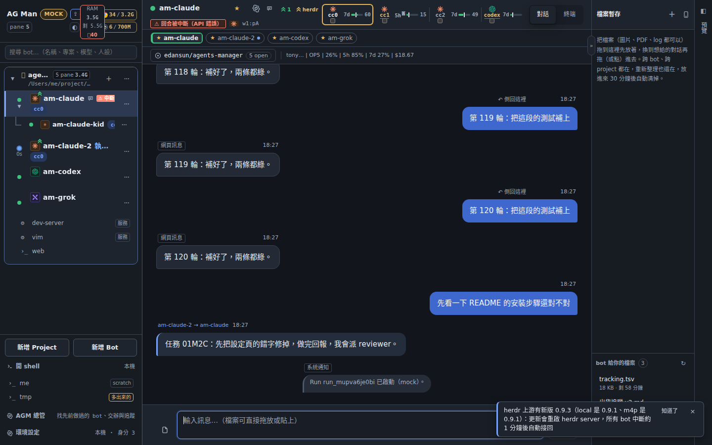 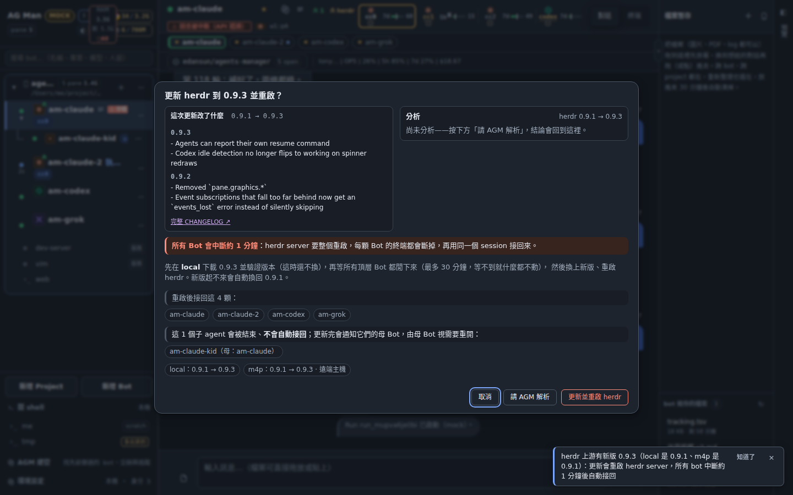 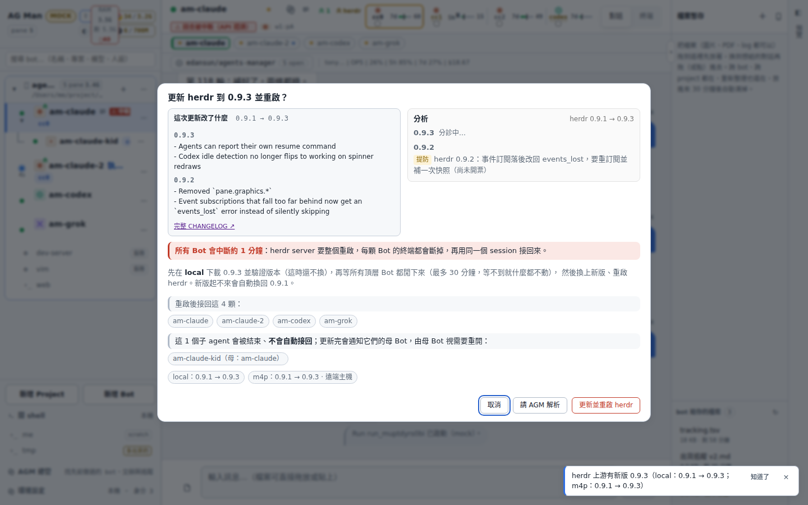
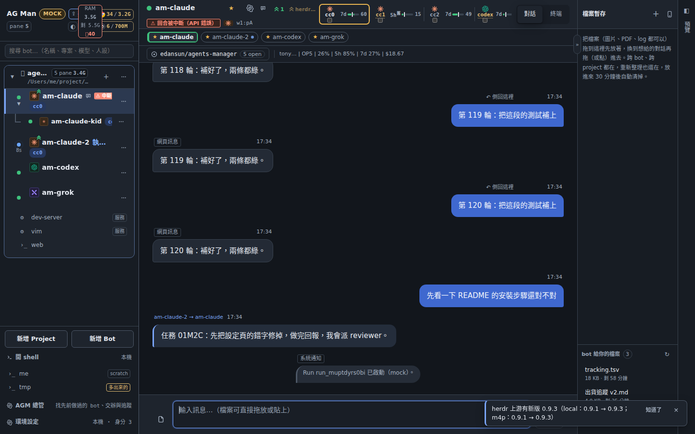 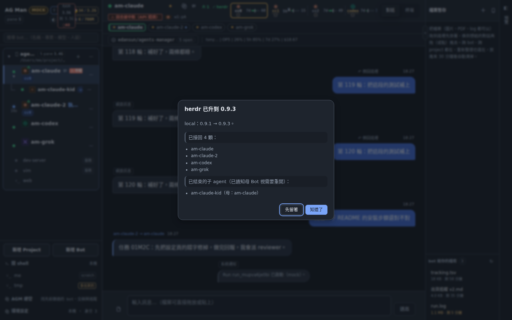 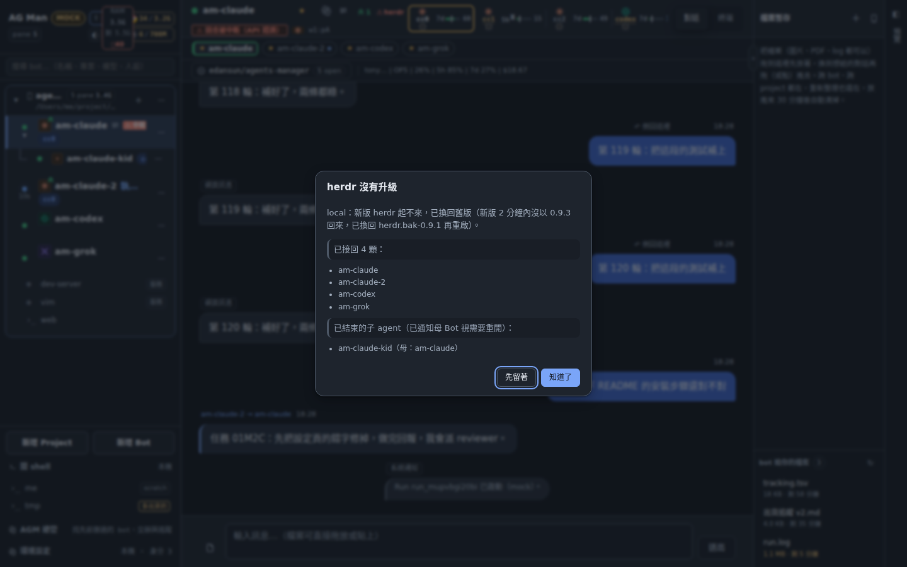
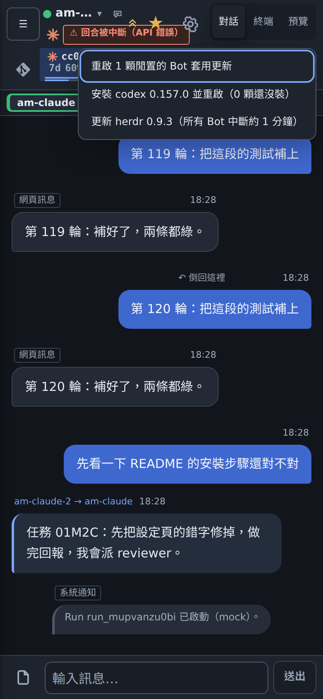 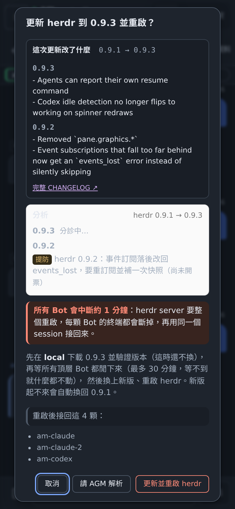 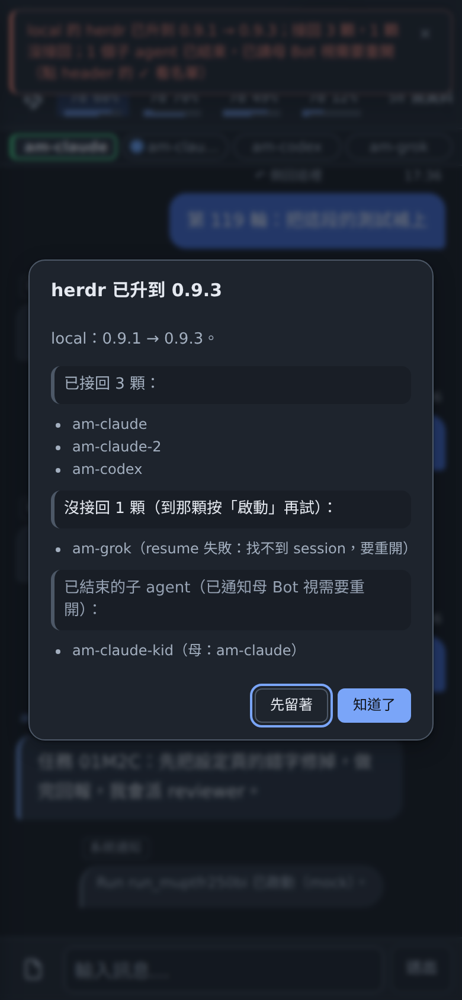

## 已移交的專案：標「由 <host> 管理」、輸入框鎖住（2026-09-28，issue #708）

使用者要把專案交給另一台主機的 daemon 接手；這顆 daemon 對它的 bot 一律不動（SPEC §6.5h）。

- **專案標題一個徽章**「由 agm-host 管理」，跟 RAM 徽章同一種外觀、放在它前面；hover 說明這裡不啟動、停止或送訊息。
- **bot 列照最後的狀態凍結顯示**，不另外灰掉整列：run 還是那時候的樣子，是事實，不是錯誤。
- **輸入框鎖住**，理由列寫「由 <host> 管理：這裡不送訊息，也不啟動或停止這顆 Bot」；不提供「送出＝啟動」。
  「啟動」鈕（bot 選單、停著那一條、終端空畫面）一律停用。daemon 本來就回 409 `handed_off`，UI 先擋是為了不讓人按了才被拒。
- 設定／收回旗標目前只走 API（`PATCH /api/projects/{id}`），不另做開關：這是一次性的搬家動作，按錯的代價是兩顆 daemon 搶同一批 pane。

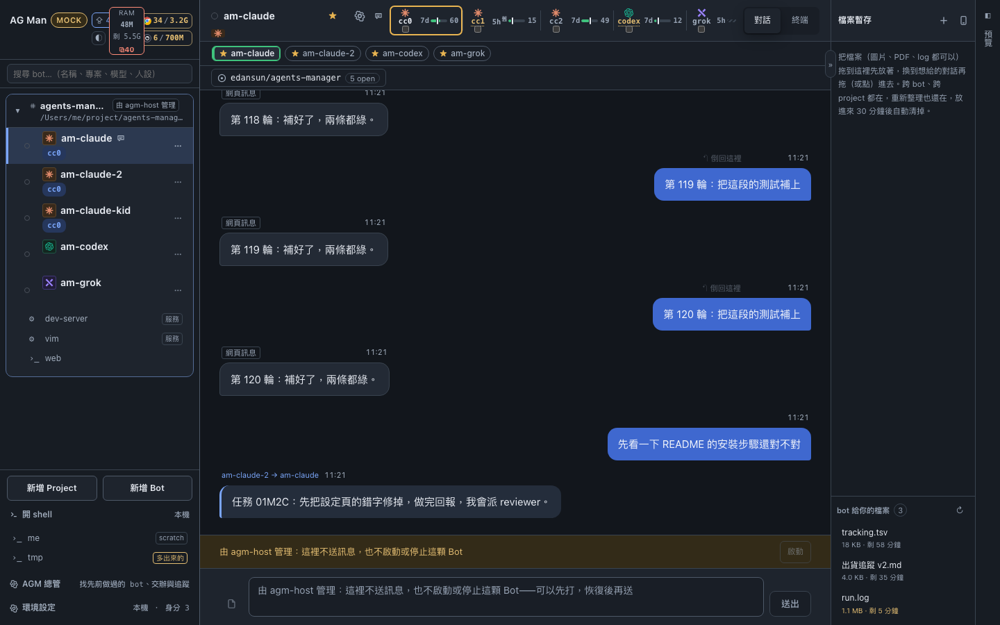 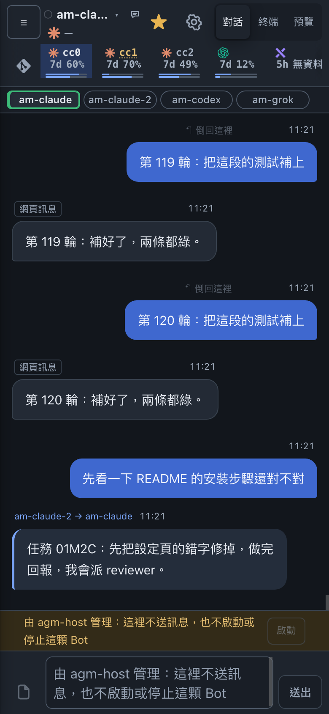

## 回合結束、背景還在跑：「背景執行中（N）」（2026-09-28，issue #714）

使用者：child 把遠端 cargo 丟到背景後回合結束，UI 顯示閒置，「沒看到在動」。

- **只在閒著時標**：run `running` 且 `agent_status = idle` 才畫；回合中燈號已經是「執行中」，不重複。
- **不當成出錯**：用 accent 色＋慢速脈動圓點（還在動），不用 warn／danger；`prefers-reduced-motion` 不動。
- **兩個地方看得到**：側欄那格「閒置」換成「背景 N」（那格原本只放兩個字，「背景執行中（N）」會被截成「背景執」；名字很長的列
  連數字也會被擠掉，完整說明在 tooltip）、輸入框上方一條說明（標題列不放：2026-09-28 先拿掉手機的、2026-09-30 使用者桌機也不要——側欄與輸入框上方已經講了）（claude 說 shell、codex 說終端，
  並講明現在也可以照常送訊息）。
- **所有顯示 bot 狀態的燈都一致**（2026-10-01 使用者：「不要只有側欄看得到，其他地方還寫閒置」）：標題燈、手機 BotSwitcher 列、群組成員、手機主力晶片、側欄燈
  一律走 `botStateLabel`／`StatusLamp` 的 `background`（文案同一來源）——idle 的綠點外圈多一圈 accent 呼吸環，tooltip／aria-label 寫「背景執行中（N）」，
  主力晶片平常不畫 idle，有背景工作時畫。標題列仍**不畫文字徽章**（上一條 2026-09-30 的決定不翻案），只有燈與 tooltip 一致。
- 驗證：mock 起前端，把 run 的 `background_jobs` 設成 1／2。
- hook 報了明細（`run.background_tasks`，claude ≥ 2.1.287）時，輸入框上方那條多兩段小字：最多三行 `type：描述`（沒有描述用命令）、超過折成「另有 N 個」，以及 `session_crons` 的「另有 N 個排程會叫醒它」。側欄「背景 N」不變。沒有明細（舊版 claude、codex）整條跟以前一樣。

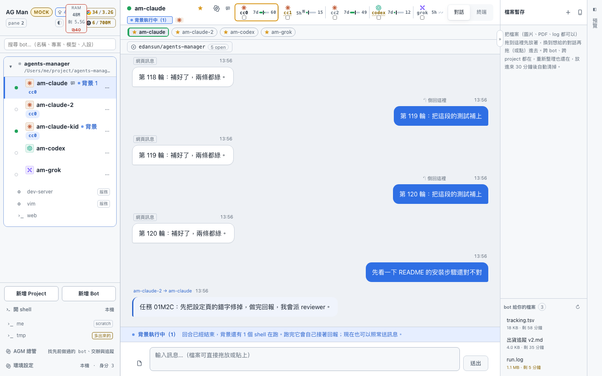 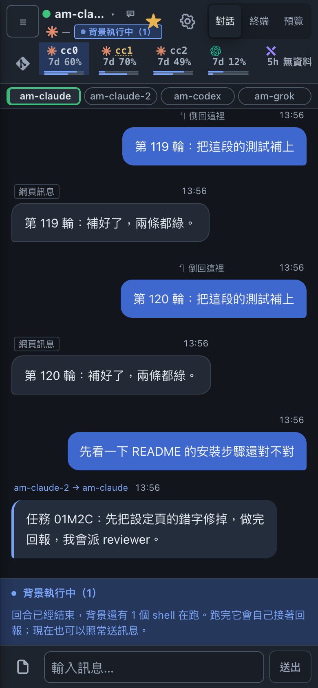

## 輸入框草稿跨瀏覽器同步（2026-10-01）

- **以 daemon 為準，不存 localStorage**：手機打了一半，到電腦開頁就在輸入框裡（SPEC §16b）。游標位置仍留在各瀏覽器本機。
- **不蓋正在打的字**：別的瀏覽器的改動只在「這個輸入框沒有焦點，或本機自上次同步後沒改過」時套用；正在打字就繼續打，本機那次寫入照送、最後寫入者贏。自己的回音（同 `client_id`）不重套，所以不會在打字時被自己的舊版本拉回去。
- **送出馬上清**：送出清空不走 debounce，別的瀏覽器的框也跟著清，不會留著同一句被再送一次。
- 倒回把原文放回輸入框、退回排隊中那則、`queue_slot_taken` 退回，都走同一個 `setDraft`，自動同步；輸入列上方那條 `ComposerDraftBar` 是終端 pane 裡的字，跟網頁草稿無關。
- 離線不丟字：PUT 失敗留在本機重試，連回來先拉再補送。
- **重送去重鍵（`client_request_id`）只活一小段（2026-10-02 審查）**：回應遺失（連線斷在 daemon 收下之後）時，同一句話的重試要沿用同一個 crid，daemon 才認得是同一件事。
  但它不能永遠留著（sessionStorage 連重整都在）：daemon 其實收下了、之後送完或被撤回，使用者再打同一句，沿用舊 crid 會被當成重送、回舊回合的結果——新的這一則沒送出去，輸入框卻清空了。
  所以 `sendPrompt`／群組送出的 crid 只沿用 5 分鐘（`SEND_RETRY_WINDOW_MS`），而且本機已經看到那個 crid 對應的回合是終態就當場作廢。建 bot 那類靠 daemon 去重的鍵不受影響（不帶時間窗）。
- **「排隊中」以 daemon 快照為準**：分頁在背景／斷線時漏掉那一則的 `turn_updated`（被送出、撤回、run 結束），`refreshState` 在快照沒落後本機已看到的幀時，會清掉快照沒列出的 queued 回合，
  不然這個分頁會一直顯示「排隊中」（#733 的 7788 與 5173 不一致）。快照落後時不清（那一則可能正好是快照之後才排進去的）。
- 真畫面（兩個分頁連同一個 daemon，A 打字、B 沒操作就出現；CJK 在 headless 缺字型顯示成方框）： 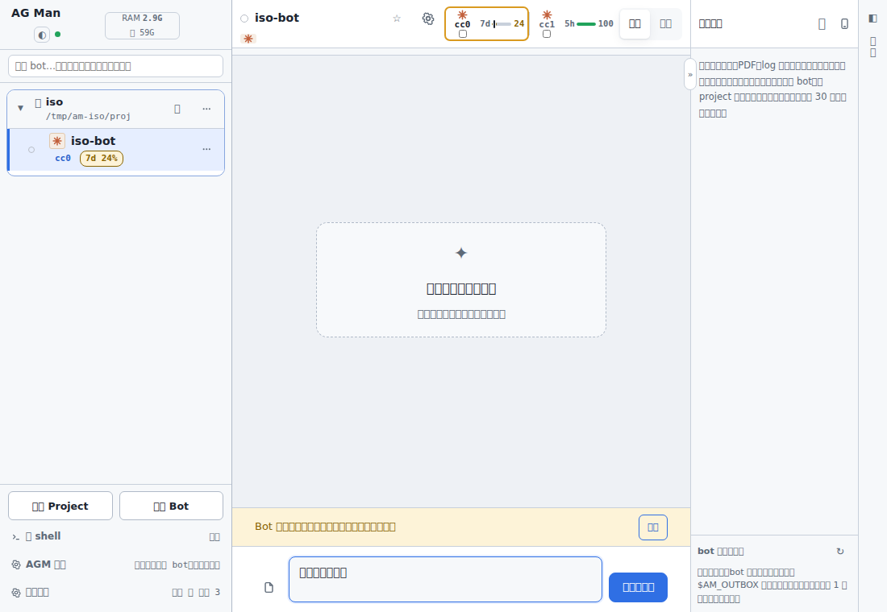

## 刪除 bot 之後怎麼救回來（2026-10-01，#757）
- 刪除當下 15 秒的「復原」通知保留，但它只活在那個分頁：過了、重整、換裝置就沒了。軟刪的 bot 與對話其實都還在，所以**環境設定裡加一區「最近刪除」**（`DeletedBotsPanel`），
  列 `GET /api/bots/deleted`：名稱、kind、專案、刪除於幾天前、最後對話時間，每列一顆「復原」。放在環境設定而不是側欄：它是低頻的救援入口，不該佔側欄的位置。
- 復原走 store 的 `restoreBot`（通知上的「復原」與這份清單共用）：成功後重抓 state；失敗（撞名 409 等）用錯誤通知顯示 daemon 的說法。清單在 `bots` 變動時重抓，所以別的分頁刪／復原也會同步。
- 只列 user bot 與專案還活著的；child 由父 bot／AGM 管。真畫面（mock；CJK 用補裝字型）：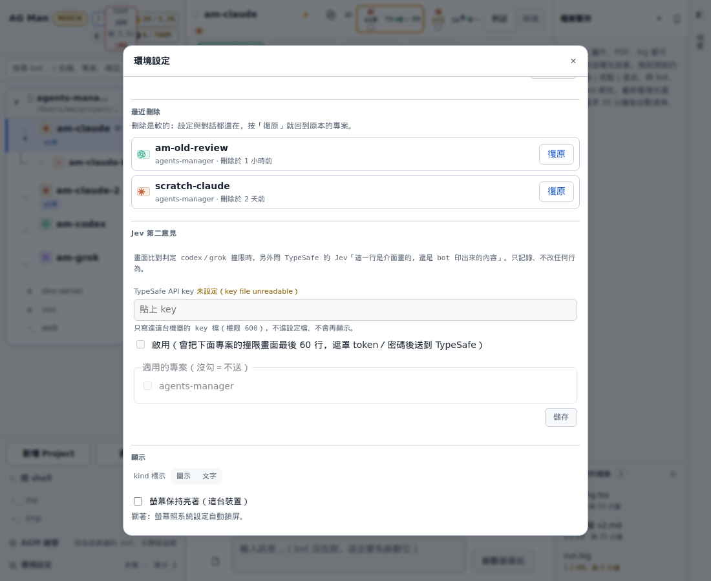 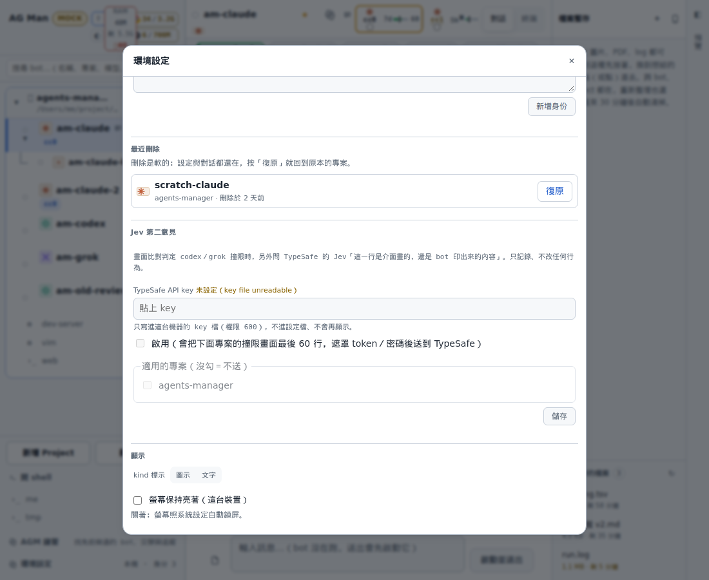

## 重啟一律接回原對話（2026-10-02 使用者）

console-rpa 撞額度、換身分後按標題列的 ⟳「需重啟才生效」重啟，起了全新的 session，整個失憶。daemon 的規則是重啟沒帶
`?resume=native` 就開新對話，而網頁以前只有設定面板「換過身分」那次才帶；⟳、單顆「重啟套用」、改模型等其他設定後的重啟都不帶。
現在 `store.restartBot` 預設一律帶 `resume=native`，daemon 回 `cannot_resume`（沒有記錄的 session）才退回不帶、開新對話。
要刻意開新對話不走重啟。

## 遠端主機離線要一眼看得到（2026-10-02 使用者：「m4p offline，要更明顯一點」）

以前只有小小的灰色刪除線 `@m4p` 徽章與灰燈，很容易漏看。現在三處（`HostOffline.tsx`，判斷在 `lib/hostOffline.ts`）：
- **頂端紅條**（`main` 最上面、ConnBanner 下）：每台離線主機一行——主機名、離線多久（daemon 的 `disconnected_since`，舊 daemon 沒這欄就不寫時間）、
  「影響 N 顆 bot」點開列出那些 bot（點一顆就選它）與 ssh 錯誤原因、「立即重連」。紅色跟 ConnBanner 的黃分開：黃＝daemon 自己的連線在重試，
  紅＝某台主機上的 bot 收不到你的訊息。**只列有專案掛著的主機**：設定了但沒有專案用到的離線主機沒東西受影響，常駐紅條只是雜訊，狀態看「環境設定 → 主機」。
  紅條不給關閉：主機回來就自己消失，能關的話跟以前的小徽章一樣容易漏看。
- **側欄**：該專案左側一條紅線、專案名與 bot 名轉灰、燈號／kind／身份淡掉（不對整列 opacity，理由同額度見底那一列：會讓 ⋯ 選單半透明被蓋住）；
  bot 的狀態字換成紅色「主機離線」，不再顯示「閒置／執行中」這種斷線前的舊狀態。徽章改成紅色 `@m4p 離線`（拿掉刪除線）。
- **聊天區**：打開離線主機上的 bot，訊息列表上方有橫幅說明訊息送不出去、字會留在輸入框、主機回來後 daemon 自動對帳並補進離線期間的回覆，再按送出即可；
  輸入框 placeholder 是「主機 m4p 離線，訊息送不出去——可以先打，恢復後再送」（ssh 錯誤字串移到紅條與橫幅，placeholder 放不下）。

## 提問與回答要留在對話裡（2026-10-02 使用者：wits-pro 問了三題、答完，對話窗完全看不到）

claude 的 `AskUserQuestion`（網頁或終端答的都一樣）答完之後，以前對話裡只剩使用者那句 prompt 與後面的工作，題目跟答案整段消失，回頭看不知道為什麼這樣做。
現在 daemon 記一則 `ask:` 系統訊息（SPEC §6.7a），網頁畫成**「Claude 問／你答」卡**（`AskAnswersCard.tsx`，`lib/askAnswers.ts` 認內容）：
- 靠左、左邊一條 accent 線、方角在左下，跟使用者自己的泡泡（靠右、實心）和 claude 的回覆（Markdown 泡泡）都分得開；標頭一個「提問與回答」標籤加時間（答完那一刻，排在回合中間）。
- 每題一組：「Claude 問」＋ header 小標籤＋題目，下一行「你答」＋答案（粗體，自訂文字照原文、保留換行）。有備註（annotations.notes）另起一行。
- 取消（Cancel／Esc）或沒答的題目寫斜體「沒有回答」；整組都沒答，標頭改成「提問（沒有回答）」。
- **只讀**：沒有倒回鍵、來源標、送達標、重送入口，不是使用者的 prompt，不碰任何送出或排隊；點一下複製問答純文字。答案用文字節點畫，不解析成 HTML／Markdown。
- 只有 `id` 以 `ask:` 開頭、`role=system`、`content.type=ask_answers` 的訊息才畫成這張卡；使用者自己打一樣長相的 JSON 仍是使用者泡泡。

## bot 輸出的 Markdown 是不可信內容（對抗式審查，2026-10）

- 一律走 `SafeMarkdown`：react-markdown 不開原始 HTML（不用 rehype-raw）、網址走 `markdownUrlTransform`（`javascript:`／`data:`／`vbscript:` 清成空字串；只對 `` 放行 `file:`）。
- **連結一律 `target="_blank" rel="noopener noreferrer"`**；被清掉網址的連結不留 `<a>`，字還在。以前沒有，bot 給的連結一按就整個 app 換頁。
- **太長（> 2 萬字）或巢狀太深（引用 > 20 層、行首縮排 > 80 格）預設純文字**，附「以 Markdown 顯示」讓使用者自己展開：remark 對某些輸入是平方時間（`*a` 重複 2 萬次卡 22 秒），巢狀引用 6000 層卡 87 秒、更深遞迴爆 stack；即使手動展開也不快取。轉換或輸出元件 render 真的丟例外由 boundary 退回純文字並淘汰壞樹（整個 app 沒有其他 error boundary，沒接住就白畫面且重新整理也白）。
- 不是 Markdown 的欄位（bot／專案名、檔名、通知）一律文字節點，不用 `innerHTML`；`document.title` 只帶未讀數；沒有用 Notification API。
- 放進 `<a href>` 的外來網址（遠端入口、交付 PR、issue）先過 `safeHttpUrl`，只收絕對 http／https；daemon 端 `POST /api/supervisor/remote` 也擋。

## 主機一致性過期（2026-10-02）

偵測失敗或太久沒量時，主機面板那行「一致性」改成「上次檢查於 MM-DD HH:mm，目前無法連線」（黃字），舊的差異淡色（0.55）照列、不再說是現況，連「與基準一致」也不說；
tooltip 寫最後一次失敗的原因。主機一直離線時沒有任何事件，所以超過 6 小時 15 分（daemon 的 `RECHECK_EVERY + STALE_GRACE`）前端自己也標。從沒量過仍是「尚未檢查」。

## blocked 的原因（2026-10）

- daemon 在 run 物件帶 `blocked_reason {code, text}`（API.md `blocked_reason`）；網頁**只在 run 現在真的是 blocked 時**顯示：側欄 bot 列的狀態字旁一行小字原因（窄欄截斷，完整字在 hover），`botStateLabel`（標題燈、BotSwitcher、群組成員、手機主力晶片的 tooltip）寫成「等待回應：<原因>」。
- 沒有原因（舊 daemon、daemon 不知道）照舊只寫「等待回應」；claude 一般權限確認會寫「等待權限確認：<工具名>」（`permission_prompt`），不編原因。不認得的 `code` 照樣顯示 `text`：前端不維護代碼表。
- 清除不靠前端記：原因跟著 run 物件走，選單關掉／狀態變了／run 結束，下一個 `bot_status` 就沒有它；前端另外只在 `agent_status==='blocked'` 且 run 還活著時才顯示，所以晚一格事件也不會掛著舊字。

## 快捷鍵與高風險按鈕的審查結果（2026-10-02）

- **全域快捷鍵只有兩組**（沒有「⌃⌃」鍵盤快捷鍵——那是重啟套用晶片上的圖示）：`⌥↑/⌥↓` 換 bot（`hooks/useBotSwitchKeys.ts`）、`Ctrl+1…9` 跳專案群組（`hooks/useProjectJumpKeys.ts`）。
  兩組都不接：選字中的按鍵（`isComposing` 或 WebKit 在 compositionend 之後才送的 keyCode 229，共用 `lib/ime.ts`）、已被別人處理的事件；`⌥` 組不接 Shift（輸入框裡 ⌥⇧↑/↓ 是「選取到段落頭尾」）。
- **疊層偵測統一走 `lib/dialogOpen.ts`**：`.modal-backdrop`／`.confirm-backdrop`／圖片燈箱 `.lightbox`／任何 `aria-modal="true"`（手機側邊欄抽屜 `aside.sidebar` 自己的不算）。以前只認前兩個 class，燈箱開著時快捷鍵會在背後換 bot／專案。
- **確認框（`ConfirmDialog`）**：預設焦點在「取消」（要打字確認的在輸入框），從不在「確定」；打字確認框的 Enter 不接輸入法選字確認（用中文輸入法打完名字，選字那一下 Enter 不能把東西刪掉）；
  確認與第二選項共用一道 800 ms 的連點門，連點只觸發一次（失敗後隔一下再按照樣能重試）。
- **「停止 bot」（記憶體清單）兩段式**：第一下只武裝成「再按一次確定停止」，3 秒內再按才執行，放著自己解除；跟旁邊 TERM → 強制 同一個做法。
- **送出鍵**：桌面 Enter 送出、Shift+Enter 換行，選字中的 Enter 不送（`isImeEnter`）；手機 Enter 只換行（使用者 2026-09-09 定案，不要加回來）。
- **已知、刻意不動**：「解除卡對話」是卡死時的逃生口，不加確認；有 `aborting` 防重入。

## 手機：輸入框上方的「背景執行中」只畫一行（2026-10-03 使用者）

使用者：「手機版下方的藍色區域太佔空間」。原本說明句、工作明細各自換行，手機上佔三到四行。手機（≤640px）改成一行摘要：燈、狀態（N）、跑多久、第一個工作名（太長截掉），
說明句與排程收起來，點摘要才展開。桌機照舊一列（說明句接在後面）。

## 手機主力區排數可拖拉調整（2026-10-03 使用者）

使用者：「手機版主力目前是固定最多 12 個超過收合，變成可以調整的，用拖拉的方式調整最大 row 數」。主力區右下角一顆壓在下緣的小圓鈕（上下箭頭圖示，不佔版面；同日使用者嫌頁籤狀「太詭異」改成圓鈕；同日使用者改：「拖拉的位置在最右邊、凸出來的控制鈕，才不會佔用空間」，原本是下緣整條把手），
上下拖過半排就跳一排，範圍 1 排到「全部放得下」；放不下時最後一格仍是「+N」。排數記在這台裝置（localStorage `agm.pinGridRows`，
每支手機各自的版面偏好，不跨裝置同步），預設 3 排。鍵盤：把手聚焦後上下鍵。展開全部時不顯示把手。

## 分享 bot 的前端取捨（2026-10-03）

- **只有受限 bot 有分享區塊**，而不是每顆 bot 都有一個灰掉的開關：分享是少數 bot 的用途，給每顆 bot 都畫一塊只是雜訊。要分享就新建一顆「分享用（受限）」的。
- **完整連結隨時看得到（2026-10-04 改，取代「只看得到一次」）**：使用者說「沒看到任何地方有連結可以分享」——連結藏在設定面板深處、而且只在開的那一刻顯示一次。改成 daemon 存可還原的 token（跟 bot hook token 同一個 0600 DB、同一等級），拿可用性換「DB 外洩＝連結外洩」這一點風險；入口仍用 hash 查、常數時間比對。舊資料只有雜湊的提示重產一次，不做自動重產（會讓已發出去的連結無預警失效）。
- **分享按鈕放在聊天區頂端、⚙ 右邊**：分享用 bot 的主要用途就是分享，入口要在第一眼看得到的地方。一顆主按鈕做「開啟並複製／複製」，重產與關閉收進旁邊的 ▾（破壞性操作不跟最常用的動作並排）；未分享時沒有 ▾。側欄 🔗 讓人不點進去也知道哪顆在分享中。
- **重產與關閉各一個確認框**：`ConfirmDialog` 有 800ms 防連點，共用一個框時重產完馬上關閉會被吃掉。
- **分享頁不共用主 UI 的任何程式碼與樣式**（含 SafeMarkdown：它會打主 API 讀附件）：拿到連結的人＝網路上任何人，打包出來的東西只能有分享頁自己。代價是 markdown 與配色各寫一份。
- **分享頁的 bot 回覆不載圖片**：外部圖片會把讀者的 IP 洩給第三方；要給圖就走「bot 給你的檔案」。
- **分享頁的字以 65 歲不懂電腦的長輩為準**（使用者 2026-10-04）：畫面上不出現任何格式名稱或技術字（PNG、SVG、下載、檔案格式…），圖不顯示副檔名、不給原檔；動作只有「分享」與「存到手機」。PNG 在瀏覽器轉，不在 daemon 轉：daemon 不帶點陣化相依、受限 bot 也不能跑指令。
- **一顆按鈕，字依裝置換**：手機能分享檔案就叫「分享」（系統選單裡傳 LINE、存相簿都有），不能才叫「存到手機」；不並排兩顆，長輩只需要按一個。圖一出現就先轉好，否則點了才轉會丟掉使用者手勢、`navigator.share` 被擋。
- **bot 做的圖直接畫在那則回覆下面**，不要她自己去翻檔案區：以檔案時間對回合（加上回覆裡提到的檔名），不解析 Markdown 圖片語法——「不載外部圖片」不變，對話裡的圖都是同源的 outbox。
- **bot 還沒回完就不給送**（2026-10-03）：daemon 一段對話同時只排一則，與其讓 end user 送了才吃 409，不如在思考中就停用送出、寫「等 bot 回完再送」；輸入框不鎖，可以先打好。
- **分享頁不畫 tool 細節，也不給擁有者的訊息**（使用者 2026-10-04 取代先前「完整歷史、擁有者打的也是右側泡泡」）：分享頁只是 end user 與 bot 的對話；擁有者從 AG Man 交代 bot 的是後台的事，倒回的也不給。畫面上不出現「擁有者」「管理者」「後台」這類字。

## 信任分享（2026-10-04 使用者裁示）

- 建 bot 表單的「用途」是**三選一**（不分享／分享用（受限）／🔓 信任分享），不是兩個勾選：受限與信任分享互斥，建好都不能切換。
- 選「信任分享」當下就跳確認框，寫明「拿到連結的人可以透過它操作這台機器上的任何東西，只分享給絕對信任的人」，**要勾選**才能確認；取消就留在原本的選項。daemon 另外要 `confirm_trusted:true`，前端繞不過去。
- 信任分享只用既有資料夾（預設帶專案目錄），沒有「開新資料夾」：它本來就是拿來操作專案的。
- 側欄與聊天頂端：受限是 🔗（accent 色），信任分享是 🔓（警示色），設定裡的分享區塊多一行黃底警告。不另做一個開關或徽章，沿用同一個位置換圖示與顏色。

## 受限 bot 以資料夾為單位（2026-10-03 使用者裁示）

- 建 bot 表單在勾了「分享用（受限）」之後才出現資料夾選擇，兩個選項並排：「開一個新資料夾」（預設，名稱空著＝bot 名，前面固定顯示 `~/shared-bots/`）與「用一個既有的資料夾」。
  既有資料夾的警示一直顯示在路徑下面（黃底），不是確認框：選的那一刻就要看到「資料夾裡的所有檔案（含 .env 之類）拿到連結的人都可能透過 bot 讀到」。
- 路徑可以打也可以「瀏覽…」用專案用的那個目錄選擇器挑；危險位置（家目錄、`~/.ssh`、AG Man 資料目錄…）由 daemon 擋、錯誤訊息直接顯示，前端只檢查是不是絕對路徑。
- 模型不另做「分享用」的選單，沿用表單本來的模型選擇；沒選時說明裡寫「模型沒選＝最新的 Opus」。

## 部署等換版窗口的調度（2026-10-04 使用者：「等待部署超過 3 分鐘，馬上通知 user 調度」）

- **放在側欄標題列「⇪ 部署」旁邊的琥珀色 chip「⏳ 部署等 N 分」**，點開才有細節與按鈕：跟部署同一個位置，看得到「部署」就看得到它卡著；不另開橫幅擋住對話。
- 第一次通知跳 toast（紅），擋的人換了只更新 chip、不再跳；拿到窗口、換好、放棄各跳一則。不洗版是使用者的明確要求。
- 兩顆按鈕：「現在換版」（主要動作，只放寬這次部署）與「先等」（收起 chip，部署照樣等、照樣在 30 分鐘自動放寬）。被擋的 bot 名字可點、直接跳過去，讓人決定要不要先處理那顆。

## 手機選單標題列：兩顆部署標籤上下疊（2026-10-04 使用者）

「部署中」與「部署等 N 分」並排時把手機選單的標題列擠出畫面（使用者：「這個超版，部署可以一上一下」）。兩顆包在 `.head-deploy`，≤720px 改成直排；桌機照舊並排。

## 背景執行中的燈：綠點外圈轉藍色載入弧（2026-10-04 使用者）

回合結束、背景還有 shell 在跑時，燈原本是綠點加一圈淡淡呼吸的 accent 細環，使用者：「這種 icon 不夠明顯表達執行中」（看起來像靶心）。改成綠點外圈一段旋轉的藍色弧（藍＝跟 working 燈同一個「在動」的顏色）；減少動態時留一段靜止弧。

## 子 agent 精簡列：身分＋模型拼成一顆、強度縮寫（2026-10-04 使用者）

使用者：「改用緊湊的方式表示這些資訊」（子列 kind 方框、身分、模型＋全名強度並排，模型被截成 `opus –`）。精簡列：身分用小字放在 kind 圖示正下方、模型標籤一行（同日使用者先說「身分可以在 model 下方小字標」，再改「在 kind 下就好了」；先前拼成一顆 `cc0│opus-M` 與拿掉 kind 方框都撤回——codex 圖示縮成一個點，「長得有點怪」）；強度寫縮寫（Medium→M、High→H、Xhigh→XH，全名在 tooltip）。分隔符仍是使用者指定的 `-`。一般列不變。

## 主力晶片的快取倒數＝晶片底色（2026-10-04 使用者）

- 先提的是另一條細倒數條，使用者改口：**不加元素，晶片原本的底色就是倒數**。兩層色調（`background-image` 加 `background-size`）：整顆一層淡的表示等級，
  剩餘那段（由左往右「剩餘／TTL」那麼寬）再疊一層深的表示還剩多少。只有比例的話，紅色那級只佔晶片寬度 8% 以下、ego 截圖裡幾乎看不見，所以加整顆那一層。
  色調綠（> 15 分）→ 黃（5–15 分）→ 紅（< 5 分）；已涼回到一般底色，只在 tooltip 寫「已涼」。不改晶片尺寸、不佔位，手機主力格同一套。
- 色調是 `--lamp-green`／`--lamp-yellow`／`--lamp-red`：淡層 10%、深層 20%（疊起來約 28%）；未讀實心藍、要回答的淡紅底只疊 6%＋9%（約 15%），字是反白或紅的。
  量過對比：閒置晶片的淡字疊色後在淺色模式掉到 4.5:1 以下，字往 `--text` 靠一半、hover 時用 `--text`（深色 hover 的黃那級否則 4.3:1）；
  要回答的紅字往 `--text` 靠四分之一，深淺兩種模式都在 5:1 以上。
- **保溫過的主力（2026-10-04 使用者：「cache 至 58 分鐘時，下一個 prompt "any updates"…cache 時間照樣上數」）**：tooltip 的「上次活動」與年齡數字照真實的算（保溫不算活動，照樣往上數）；
  底色的顏色與剩餘從保溫那一刻起算（`cache_kept_warm_at`，SPEC §6.5k），所以 60 分不會誤變冷。tooltip 寫成「快取約 N 分後到期（上次活動 HH:MM，已保溫 HH:MM）」。
- **熱壓之後晶片顯示涼（2026-10-05 使用者）**：熱壓（110 分，context 用量 claude > 30%、codex > 50% 才做）之後視為 cache 已涼：daemon 的 `cache_kept_warm_at` 不含熱壓、也不含熱壓之前的保溫，晶片就從 `last_api_at` 的真實年齡算，已超過 TTL＝涼（回一般底色、tooltip 寫「快取已涼」）；
  真的活動之後重新計時、新的保溫才又讓它變熱。用量不超過門檻時到 110 分不熱壓也不再保溫，同樣讓它涼掉。網頁沒有自己的規則，照 daemon 給的欄位算。
- **名詞（使用者 2026-10-05）**：58 分那則＝「保溫」、bot 對它的回覆＝「保溫回覆」、110 分的壓縮＝「熱壓」、過 TTL＝「涼掉」。畫面文字一律用這幾個詞，不再寫「續命」「強制壓縮」。
- 只畫主力：沒釘的晶片是「在跑／剛跑完／要回答」才出現，倒數對它們沒有用、還會跟未讀藍搶顏色。

## 主力 bot 的狀態卡（2026-10-04 使用者）

使用者先說「手機版主力長按說明顏色意義」，接著更正：「我是要 hover 至主力的 bot 時，就說明目前 context 狀態」。
所以是**那一顆 bot 現在的狀態**，不是色票。**2026-10-08 使用者：桌面版不要 hover 就跳出狀態卡**——電腦滑鼠停留不再開卡（晶片回到原生 tooltip）；
手機長按 350ms **一到就**底部彈出同一張卡（輕震一下）；手指接著移動超過 10px＝收卡、改拖曳排序，不動放開＝卡片留著。以前等放開才判斷是說明還是拖曳，兩個手勢搶同一個放開（使用者：「長按與 drag 相衝」）。暗底只在「在暗底上按下去」時才關，放開手指那一下的 click 不算。卡片：燈號＋一句狀態（跟晶片顏色同一個優先序：要你回答 → 未讀 → 等子 agent → 燈號字）、
正在做（live activity 或 agent 標題）、背景工作、子 agent 數、context 用量（% 與 tokens）、模型·強度·身分、快取倒數。手機那張卡底下有「顏色代表什麼？」連到色票說明
（`ChipLegend`，範例套晶片與燈號的真 class）；電腦版沒有狀態卡，色票說明改由晶片列右下角一顆「?」（`.unread-bar-help`，絕對定位不影響換行測量）直接開。

點選左邊 menu 的專案標題（`ProjectTitle`／`.project-head`）＝選取後側欄把那個專案捲到頂端（`lib/scrollProject.ts`，與 Control+1…9 共用；2026-10-08 使用者）。

## 燈號轉圈只給子 agent（2026-10-04 使用者）

使用者：「沒有 child 也在轉，轉個毛」（包括協調者自己）。轉圈原本給「回合結束、背景還有 shell」；但那多半是 sleep／等待之類，不值得轉。改成：燈號外圈的藍色轉圈**只在自己閒著、底下有子 agent 在跑（working／blocked）時**出現；只有背景 shell 就是一般綠點，旁邊照舊寫「背景 N」。各處燈號（側欄、標題、主力晶片、群組、狀態卡）同一套。
## context 旁的「壓縮」鈕（2026-10-04 使用者）

使用者：「可以對某個 bot 下 compact，按鈕做在 context 旁邊」。對話頁狀態列的 context 用量旁一顆小「壓縮」鈕，送 `/compact`（`POST /api/bots/{id}/compact`，claude／codex；grok 沒有這個指令所以不畫）。只有 bot 在跑而且閒著才能按；被擋時用人話說原因（回合中、忙著、沒在跑）。不等壓縮完成，新的用量由 statusLine 回報。

## 「不用保溫」鈕與保溫回覆的晶片框色（2026-10-05 使用者）

- **「不用保溫」鈕**（`KeepWarmSkipButton`）：緊貼在「壓縮」鈕右邊，只主力（`primary`）的 claude／codex 畫，非主力、grok、沒有 run 都不畫。
  按下＝這顆 bot「這一輪閒置」跳過保溫與熱壓（`POST /api/bots/{id}/keep-warm/skip`，`run.keep_warm_skip`）；有真的活動（使用者或 bot 新回合，不含保溫／熱壓）daemon 自動清掉，鈕跟著回復。再按一次取消。
  **狀態用文字＋樣式講，不只靠顏色**：沒開是外框鈕「不用保溫」；開著是實心 accent 底「不保溫中・取消」（`aria-pressed`）。按完先在本機套一份，不等廣播。
- **手機版也能設定不用保溫（2026-10-08 使用者：「手機版 也要能 設定不保溫」）**：手機（≤640px）的狀態列收在標題列 git 鈕開的「Git / 專案資訊」彈窗裡，context 旁 16px 高的小鈕點不到，所以手機**不在狀態列畫**這顆鈕，
  改在彈窗最上面一整列「快取保溫 ｜ 不用保溫」（`MobileKeepWarmRow`，觸控目標 ≥ 40px）；同一個 `KeepWarmSkipButton`、同一支 `setKeepWarmSkip`，資格（主力 claude／codex、有 run）與狀態文字都沿用。
- **保溫回覆到了，主力晶片框換洋紅（`keep-warm-replied`，`keepWarmChip.css`），維持一個快取 TTL 或直到使用者送出新 prompt 才恢復（2026-10-06 使用者）**：
  原本一直掛到使用者送出新 prompt（實例 ops-web 掛了 18 小時）。改成保溫的效果只有一個 cache TTL（照 `cacheClock` 既有的 TTL 與 `cache_kept_warm_at`／`last_api_at` 判斷）：快取一涼掉（`level === 'cold'`）洋紅框與 ♨ 記號隨之消失；使用者若在 TTL 內送出新 prompt，仍照舊由 daemon 在使用者 prompt 時將 `run.keep_warm_replied_at` 清成 null 立即清除恢復。
  只動框（邊框＋2px inset 環），不動底色與字，所以快取倒數的底色、未讀實心藍、要回答的紅底全部照舊疊在上面。
- **按了「不用保溫」就不畫快取倒數（2026-10-06 使用者）**：主力 `run.keep_warm_skip === true` 時晶片不加 `cache-*` class、不填底色（回一般樣式），hover 狀態卡／tooltip 的快取那行改寫「不保溫中（不顯示快取倒數）」；取消（daemon 廣播 `keep_warm_skip=false`）或有新活動讓 daemon 自動清掉後立即恢復倒數。判斷在 `cacheClock.chipCache`（其餘照既有 `cacheState`），網頁不另有規則；不影響輸入框旁的快取欄位。
- **為什麼是洋紅**：這列已經用掉綠（快取新鮮／正在看）、黃（快取剩不多／等子 agent）、紅（快取快沒了／要回答）、藍（未讀），洋紅（`--keep-warm`，淺 `#a21caf`／深 `#e879f9`）離它們色相都夠遠，淺色深色模式對白底、深底都在 4.5:1 以上。
  藍（未讀）與洋紅在實心藍底上相鄰時，靠 ♨ 記號與框形分得出來。
- **手機也看得出**：2px 框在手機主力格（無星號、只有燈）一樣畫；另有一顆非顏色的 `♨` 記號放在名字後面，sr-only 另寫「保溫回覆已到，送出新 prompt 前維持這個框色」，狀態卡（hover／長按）多一行「保溫」，顏色說明（`ChipLegend`）多一列。
  「正在看」那顆保留左側 3px 條（你在這裡），只有框換洋紅。
- **保溫回覆不算未讀**：保溫那一回合的訊息（使用者那則與 bot 的回覆）帶 `keep_warm: true`，`completesTurn` 不計；`turn_updated` 與 working→idle 邊緣補記也認得保溫回合
  （`client_request_id` 前綴 `keep-warm:`，DB 舊資料的 `keepalive:` 照認，`lib/keepWarm.ts`），但仍標記 hook 已報過完成，免得接著的 idle 邊緣補記一筆。

## 快取狀態：狀態列常駐、輸入框只在冷時警示（2026-10-04 使用者）

- 先做的是輸入框上方常駐一行 context＋快取，使用者看了現有畫面更正：**聊天區上方的狀態列已經有 context（`81% · 811k/1M`），不要在輸入框旁再做一份。**
  現況：
  - **狀態列**（`StatusCache`，接在 context 那段後面）：`快取 熱（剩 23 分）`／`快取 已冷`；回合進行中寫「熱」。
    codex 是 rollout 推估，字面加「約」（`熱（約剩 23 分）`、`已冷（約）`），tooltip 說明依 rollout 推估；codex 沒有 statusLine，context 也在這裡補成同一段格式（`context 6.8% · 18k/258k`）。
  - **輸入框**（`ComposerCostHint`）：平常完全不顯示；**只有快取已冷、而且不在回合中**才在輸入框上方出一行警示色（`--warn`、粗體）：
    `快取已過期，送出這則會重寫約 811K`（N＝`recache_tokens_if_cold`，codex 用最近一次 `input_tokens` 近似；沒有數字寫「整段 context」）。
    不擋送出、不跳確認框、不加按鈕；窄視窗單行截尾，完整句在 `title`。
- 只做 claude 與 codex，grok 完全不顯示。
- 資料以 daemon 的 `run.prompt_cache` 為準（claude＝statusLine 的 `prompt_cache`，codex＝rollout 最近一筆 `token_count` 推算）；`warm`＋`expires_at` 判熱冷，
  閒置時 `warm:true` 過了 `expires_at` 也算冷。舊 daemon／舊版 claude／codex 還沒讀到 rollout 才退回 `last_api_at`＋`cache_ttl_secs` 推算（`lib/cacheClock.ts`）。
  token 數以 daemon 算好的為準（statusLine 的 `total_input_tokens` 是累計值，最後才用）。

## 外部 Cargo 沒勾選就收起來；側欄拿掉「AGM 總管」（2026-10-04 使用者）

- **外部 Cargo 主機**（環境設定→主機）：「啟用外部 Cargo verification」沒勾時，只顯示標題、說明、勾選框與「儲存」（取消啟用也要能存）；主機／帳號／port／jobs／工作目錄／密碼與「測試連線」勾選後才展開。隱藏不等於清空：欄位 state 與已存值原樣保留，取消勾選再儲存只送 `enabled:false`，host／user 等照舊、沒打密碼就不帶 `password`。表單有不合法值時，錯誤清單照常顯示（即使欄位收起來），以免儲存鍵被擋卻看不到原因。
- **「AGM 總管」入口**：使用者說這個功能沒用、從來沒點過，側欄的按鈕與 Modal 拿掉。`SupervisorPanel`、`api/supervisor.ts`、daemon 端點都留著（元件只是不掛載）；AGM bot 本身與它的對話照常。原本只有這裡能做的操作改走 CLI：`agm supervisor`（狀態、遠端入口、交辦）、`agm supervisor-{setup,start,stop,fallback}`、`agm responder …`、`agm health`（故障）。

## shell 裡自己跑的 agent 照樣能打字（2026-10-04 使用者）

使用者在本機 shell pane 手動跑 agy，面板變「正在跑 agent，請走 bot 對話」、鍵盤直通灰掉，登入選單、貼授權碼、選主題／條款都打不進去。現在 daemon 只對**屬於 bot 的 pane**（有 active run、或 bot 剛起出它的 spawn hint）回 403 `agent_pane`；使用者自己在 shell 裡跑起來的 agent（herdr 認得出來但沒有 bot 的 run）照常可打字、可開鍵盤直通。受管 bot 的 pane 維持「走 bot 對話」。前端不用改：它只照 daemon 的 403 鎖面板。

## 額度欄 agy 那格可以登出（2026-10-05 使用者）

額度 popover 裡 agy 那格底下有「登出 agy」（已未登入就不畫）；手機點一格只看那一格時同一顆鈕照樣在。按下去先跳確認：說明會刪掉該主機 agy 的登入憑證，有 agy bot 在跑時多寫「不會被停掉，但憑證清掉後會失去授權」。確認後打 `POST /api/hosts/{name}/agy/logout`（daemon 直接刪憑證檔，不開 pane——agy 沒有 `logout` 子命令），成功後前端把該主機唯一的 Gemini `agy` 額度清成 null、`tools.agy.logged_in=false`，那格立刻顯示「未登入」並出現原本的登入提示。確認框的開關放在 `QuotaStrip` 外層，不在 popover 裡：popover「點外面就關」會把裡面的元件卸掉，框會跟著消失。

## 額度欄 agy 那格未登入時的登入入口（2026-10-05 使用者）

agy 沒有 `login` 子命令也沒有 `/login`（`canLoginInSession('agy')` 是 false），所以未登入那格比照 Codex：`QuotaLoginShell` 在該主機開 shell、打 `cliLoginCommand('agy')`＝`AGY_CLI_DISABLE_AUTO_UPDATE=true agy` 並切過去。確認框的說明換成 agy 版：TUI 會引導登入（SSH 底下印授權網址，瀏覽器授權後把授權碼貼回），登好後輸入 `/quit` 離開。
daemon 這一側：探測腳本（`tools::PROBE_SH`）多問一件事——憑證在不在（檔案 `~/.gemini/antigravity-cli/antigravity-oauth-token`，或 macOS 的 Keychain 項目 `gemini`／`antigravity`——macOS 沒有那個檔）——印 `AM_LOGIN agy 1／0`，`tools.agy.logged_in` 才有值（以前永遠是 null，那格不會顯示「未登入」）。登出立刻寫 false 並推 `host_changed`；`quota_agy::spawn_agy_login_watcher` 每 20 秒對「裝了 agy、記成未登入」的主機看一次憑證檔（遠端是一個小 ssh），一出現就翻成已登入、清探測冷卻並探測一次 Gemini 的 5h／7d 額度，不必重啟、不必等 5 分鐘輪詢；已知未登入的主機輪詢不再跑 `agy -p /usage`（那會停在登入畫面等到逾時）。

## Bot 設定面板：儲存中不出「重啟後生效」橫幅（2026-10-05 使用者）

claude 改 effort／model 由 daemon 在跑著的 session 裡當場套用（`/effort`、`/model`），不用重啟。daemon 先寫 config 推 `bot_changed`、再套用，這段時間 state 的 `bot.needs_restart` 暫時是真的，面板以前一儲存就跳黃色「已儲存，重啟 Bot 後生效」。現在儲存中（PATCH 還沒回）只顯示「套用中…」，等 PATCH 回應：`needs_restart:false` → 「✓ 已套用，不用重啟」，`true`（要重啟的欄位或套用失敗）才出黃色橫幅與「立即重啟」。規則仍只在 daemon，前端不複製。

## 沒裝 agy 的主機：先問要不要自動安裝，再登入（2026-10-06 使用者）

遠端主機（例如 m4p）沒裝 agy 時，額度 popover 的 agy 格不再永遠寫「背景查詢中」、也**不開 shell 打 agy**（那只會得到 `zsh: command not found: agy`）：改寫「<主機> 尚未安裝 agy，要自動安裝嗎？」，入口鈕叫「安裝 agy 並登入」（`QuotaLoginShell` 發現 `tools.agy.installed === false` 時換成這個版本）。按下去跳確認框（說明：從官方下載約 50 MB、驗 sha512、放到 `~/.local/bin/agy`、不跑官方 install.sh、不改 shell 設定、裝好後接著開 shell 登入），**使用者按確認才打** `POST /api/hosts/{name}/agy/install`；成功後才開 shell 送 `AGY_CLI_DISABLE_AUTO_UPDATE=true agy`，失敗只出錯誤通知、不開 shell。取消什麼都不做。
新 bot 的 kind 選單（`NewBotForm`，缺的 kind 灰掉並帶 `InstallToolButton`）、缺少 CLI 提示與主機徽章的 agy 安裝鈕是同一個 `AgyInstallButton`：按了先跳同一個確認框，確認才裝（不需要先有一顆在跑的 bot，跟其他 CLI 的「用現有 agent 安裝」不同）；裝好後 daemon 重新偵測並推 `host_changed`，kind 鈕自己解鎖、安裝鈕消失。已經裝了就走原本的「開 shell 登入」。登入指令固定帶 `AGY_CLI_DISABLE_AUTO_UPDATE=true`（版本由 AG Man 管）。

## agy 額度格顯示較緊的窗口（2026-10-05）

agy 額度格只顯示 Gemini 的 `agy` key：桌機完整列出 `5h` 與 `7d`，low／critical 沿用 daemon 旗標；手機和桌機空間不足時直接沿用 claude 格的窗口縮合規則。popover 顯示 Gemini 的 5h／7d 與撞限訊息，登出按鈕仍在。舊版 `agy:claude-gpt` 額度快照由 daemon 啟動時清除，不再投影到 UI。

## 對話裡的遠端圖片預設不載入（2026-10-01，issue #764，提案分支，等使用者拍板）

bot 會讀外部內容；被 prompt injection 後只要輸出 ``，瀏覽器一渲染就替它把資料送出去。

- **http(s) 圖片先畫佔位、點了才載入**：「🖼 外部圖片（網域）— 載入圖片」；網址帶很長的 query／fragment 或帳密時多一句警告（正常圖片網址很少那樣）。
  daemon 自己的 `local-image`（專案目錄裡的檔）與 `data:` 圖片（行內資料、不會發請求）照常直接顯示。輸出中的氣泡（`LiveBubble`）與完成的訊息走同一個 `MarkdownImage`。
- **載入方式＝瀏覽器 `fetch`→blob**（不帶 cookie、不帶 Referer；只收 png／jpeg／gif／webp／avif／bmp，blob 用白名單型別重包；上限 10 MB，Content-Length 先看、串流邊讀邊數）。**不收 SVG**：blob 繼承 app 的 origin，點圖在新分頁開 blob 時 SVG 裡的 `<script>` 會在 app 的 origin 執行、拿得到 UI token（審查時真瀏覽器重現）。本機／內網位址（localhost、127/8、10/8、172.16/12、192.168/16、169.254/16、`.local`、ULA／link-local）的佔位多一句警告，失敗就改成「在新分頁開啟」的連結（使用者自己點的連結）。
  不做 daemon 代理：代理要在使用者機器上替任意網址發請求，得另外擋 SSRF（內網／loopback／DNS rebinding／轉址），攻擊面比這個問題本身還大；代價是對方沒開 CORS 的圖只能新分頁看。
- **不跟轉址**（`redirect: 'error'`）：佔位只寫原網址的網域，跟轉址＝請求送到使用者沒看到的主機。CORS 下 `manual` 讀不到 Location、事後比對最終網域也來不及，所以被轉址的圖算失敗、改走「在新分頁開啟」；代價是會 302 的圖床要多點一次連結。
- **`index.html` 加 CSP `img-src 'self' data: blob:`**：之後新增的渲染路徑就算又用 `` 也載不了。CSP 不能對單張放寬，所以「點了才載」必須走 blob，而不是把 `src` 換成網址。
- 取捨：bot 常貼 GitHub／shields.io 的圖，每張多一次點擊；之後若要「這個網域一律載入」，是使用者設定、而且要寫進 CSP 之外的白名單邏輯（blob 路徑），不能放寬 CSP。
